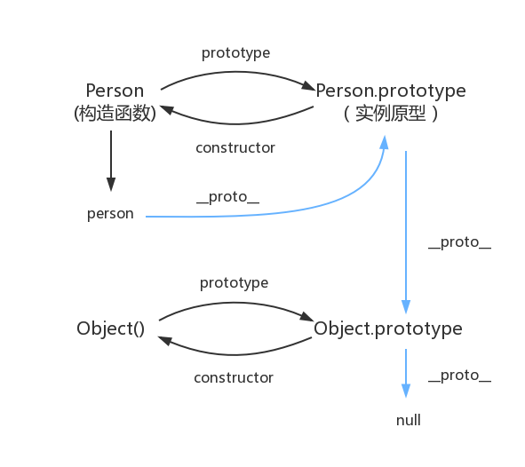
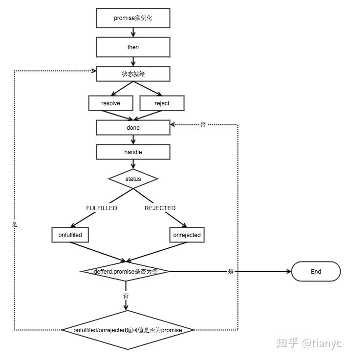

梳理JS知识

<!--more-->

# 前端学习指南_JavaScript

## 类型

### 基本类型

undefined

null

boolean

string String 的意义并非“字符串”，而是字符串的 UTF16编码，最大长度是 2^53 - 1

number 有18437736874454810627(即 2^64-2^53+3)个值

```
console.log( 0.1 + 0.2 == 0.3);//false
//浮点运算带来精度问题console.log( Math.abs(0.1 + 0.2 - 0.3) <= Number.EPSILON);//true//检查等式左右两边差的绝对值是否小于最小精度
```

symbol

#### symbol

### 引用类型

object

### typeof

#### 装箱拆箱

把基本数据类型转换为对应的引用类型的操作称为装箱，把引用类型转换为基本的数据类型称为拆箱。

在《javascript高级程序设计》中有这样一句话：

```
`每当读取一个基本类型的时候，后台就会创建一个对应的基本包装类型对象，从而让我们能够调用一些方法来操作这些数据。`
```

```
var s1 = "some text";
var s2 = s1.substring(2);
```

如上所视，变量s1是一个基本类型值，它不是对象，所以它不应该有方法。但是js内部为我们完成了一系列处理（即我们称之为装箱），使得它能够调用方法,实现的机制如下：

（1）创建String类型的一个实例；

（2）在实例上调用指定的方法；

（3）销毁这个实例；

这个过程也可以用代码来展现：

```
var s1  = new String("some text");
var s2 = s1.substring(2);
s1 = null;
```

拆箱：

将引用类型对象转换为对应的值类型对象，它是通过引用类型的valueOf()或者toString()方法来实现的。如果是自定义的对象，你也可以自定义它的valueOf()/tostring()方法，实现对这个对象的拆箱。

```
var objNum = new Number(123);  
var objStr = new String("123");  

console.log( typeof objNum ); //object
console.log( typeof objStr ); //object

console.log( typeof objNum.valueOf() ); //number
console.log( typeof objStr.valueOf() ); //string
console.log( typeof objNum.toString() ); // string 11 console.log( typeof objStr.toString() ); // string
```


## 内存空间

在学习内存空间之前，我们需要对三种数据结构有一个直观的认知。他们分别是**堆(heap)，栈(stack)与队列(queue)**。

### 变量对象与基础数据类型

JavaScript的执行上下文生成之后，会创建一个叫做变量对象的特殊对象，JavaScript的基础数据类型往往都会保存在变量对象中。

> 严格意义上来说，变量对象也是存放于**堆内存**中，但是由于变量对象的特殊职能，我们在理解时仍然需要将其于堆内存区分开来。

基础数据类型都是一些简单的数据段，JavaScript中有5种基础数据类型，分别是`Undefined、Null、Boolean、Number、String、Symbol`。基础数据类型都是按值访问，因为我们可以直接操作保存在变量中的实际的值。

### 引用数据类型与堆内存

与其他语言不同，JS的引用数据类型，比如数组Array，它们值的大小是不固定的。引用数据类型的值是保存在堆内存中的对象。JavaScript不允许直接访问堆内存中的位置，因此我们不能直接操作对象的堆内存空间。在操作对象时，实际上是在操作对象的引用而不是实际的对象。因此，引用类型的值都是按引用访问的。这里的引用，我们可以理解为保存在变量对象中的一个地址，该地址与堆内存的实际值相关联。

为了更好的搞懂变量对象与堆内存，我们可以结合以下例子与图解进行理解。

```javascript
var a1 = 0;   // 变量对象
var a2 = 'this is string'; // 变量对象
var a3 = null; // 变量对象

var b = { m: 20 }; // 变量b存在于变量对象中，{m: 20} 作为对象存在于堆内存中
var c = [1, 2, 3]; // 变量c存在于变量对象中，[1, 2, 3] 作为对象存在于堆内存中
```


上例图解

因此当我们要访问堆内存中的引用数据类型时，实际上我们首先是从变量对象中获取了该对象的地址引用（或者地址指针），然后再从堆内存中取得我们需要的数据。

引用类型的复制同样也会为新的变量自动分配一个新的值保存在变量对象中，但不同的是，这个新的值，仅仅只是引用类型的一个地址指针。当地址指针相同时，尽管他们相互独立，但是在变量对象中访问到的具体对象实际上是同一个。

#### 深浅复制

##### 浅拷贝

> 浅拷贝是会将对象的每个属性进行依次复制，但是当对象的属性值是引用类型时，实质复制的是其引用，当引用指向的值改变时也会跟着变化。

```
let obj = {    
	name: 'Yvette',    
	age: 18,    
	hobbies: ['reading', 'photography']
}
let obj2 = Object.assign({}, obj);
let obj3 = {...obj};
obj.name = 'Jack';//基本类型不改变
obj.hobbies.push('coding');//引用类型改变console.log(obj);
//{ name: 'Jack', age: 18,hobbies: [ 'reading', 'photography', 'coding' ] }
console.log(obj2);//{ name: 'Yvette', age: 18,hobbies: [ 'reading', 'photography', 'coding' ] }
console.log(obj3);//{ name: 'Yvette', age: 18,hobbies: [ 'reading', 'photography', 'coding' ] }
```

##### 深拷贝

> 深拷贝复制变量值，对于非基本类型的变量，则递归至基本类型变量后，再复制。 深拷贝后的对象与原来的对象是完全隔离的，互不影响，对一个对象的修改并不会影响另一个对象。

> 1.深拷贝最简单的实现是: `JSON.parse(JSON.stringify(obj))`

`JSON.parse(JSON.stringify(obj))` 是最简单的实现方式，但是有一些缺陷：

1. 对象的属性值是函数时，无法拷贝。
2. 原型链上的属性无法拷贝
3. 不能正确的处理 Date 类型的数据
4. 不能处理 RegExp
5. 会忽略 symbol
6. 会忽略 undefined

> 2.实现一个 deepClone 函数

1. 如果是基本数据类型，直接返回
2. 如果是 `RegExp` 或者 `Date` 类型，返回对应类型
3. 如果是复杂数据类型，递归。
4. 考虑循环引用的问题

```
function deepClone(obj, hash = new WeakMap()) { //递归拷贝 
	if (obj instanceof RegExp) return new RegExp(obj);   
	if (obj instanceof Date) return new Date(obj);    
	if (obj === null || typeof obj !== 'object') return obj;         //如果不是复杂数据类型，直接返回        
	if (hash.has(obj)) {        
		return hash.get(obj);    
	}    
/**     
* 如果obj是数组，那么 obj.constructor 是 [Function: Array] 
* 如果obj是对象，那么 obj.constructor 是 [Function: Object] 
*/
	let t = new obj.constructor();    
	hash.set(obj, t);    
	for (let key in obj) {        //递归        
		if (obj.hasOwnProperty(key)) {//是否是自身的属性 
			t[key] = deepClone(obj[key], hash);        
		}    
	}    
	return t;
}
```

### 内存空间管理

#### 垃圾回收

**标记清除**

这是最常见的垃圾回收方式，当变量进入环境时，就标记这个变量为”进入环境“,从逻辑上讲，永远不能释放进入环境的变量所占的内存，永远不能释放进入环境变量所占用的内存，只要执行流程进入相应的环境，就可能用到他们。当离开环境时，就标记为离开环境。

垃圾回收器在运行的时候会给存储在内存中的变量都加上标记（所有都加），然后去掉环境变量中的变量，以及被环境变量中的变量所引用的变量（条件性去除标记），删除所有被标记的变量，删除的变量无法在环境变量中被访问所以会被删除，最后垃圾回收器，完成了内存的清除工作，并回收他们所占用的内存。

**引用计数法**

另一种不太常见的方法就是引用计数法，引用计数法的意思就是每个值没引用的次数，当声明了一个变量，并用一个引用类型的值赋值给改变量，则这个值的引用次数为1,；相反的，如果包含了对这个值引用的变量又取得了另外一个值，则原先的引用值引用次数就减1，当这个值的引用次数为0的时候，说明没有办法再访问这个值了，因此就把所占的内存给回收进来，这样垃圾收集器再次运行的时候，就会释放引用次数为0的这些值。

用引用计数法会存在内存泄露，下面来看原因：

```
function problem() {
	var objA = new Object();
	var objB = new Object();
	objA.someOtherObject = objB;
	objB.anotherObject = objA;
}
```

在这个例子里面，objA和objB通过各自的属性相互引用，这样的话，两个对象的引用次数都为2，在采用引用计数的策略中，由于函数执行之后，这两个对象都离开了作用域，函数执行完成之后，因为计数不为0，这样的相互引用如果大量存在就会导致内存泄露。

## 执行上下文（execute context，EC）

每次当控制器转到可执行代码的时候，就会进入一个执行上下文。执行上下文指代码正式执行之前进入的执行环境，它会形成一个作用域。JavaScript中的运行环境大概包括三种情况。

- 全局环境：JavaScript代码运行起来会首先进入该环境
- 函数环境：当函数被调用执行时，会进入当前函数中执行代码
- eval（不建议使用，可忽略）

因此在一个JavaScript程序中，必定会产生多个执行上下文，在我的上一篇文章中也有提到，JavaScript引擎会以栈的方式来处理它们，这个栈，我们称其为函数调用栈(call stack)。栈底永远都是全局上下文，而栈顶就是当前正在执行的上下文。

当代码在执行过程中，遇到以上三种情况，都会生成一个执行上下文，放入栈中，而处于栈顶的上下文执行完毕之后，就会自动出栈。全局上下文在浏览器窗口关闭后出栈。

创建流程：

 1.创建变量对象（变量提升）
	1）变量
	2）函数及函数参数

 2.确认this指向（VO->AO）
	1）全局 this->window
	2）局部 指向调用它的对象

 3.创建作用域链
	父级作用域链+当前变量对象

执行流程：

变量赋值 函数引用 执行代码

出栈

### JS执行上下文栈

简称执行栈，也叫做调用栈，具有 **LIFO** (后进先出) 结构，用于存储在代码执行期间创建的所有执行上下文。

> 规则如下：

- 首次运行JavaScript代码的时候,会创建一个全局执行的上下文并Push到当前的执行栈中，每当发生函数调用，引擎都会为该函数创建一个新的函数执行上下文并Push当前执行栈的栈顶。
- 当栈顶的函数运行完成后，其对应的函数执行上下文将会从执行栈中Pop出，上下文的控制权将移动到当前执行栈的下一个执行上下文。

### 作用域

作用域是变量以及通过名称访问这些变量的规则的集合

#### 变量提升

变量只提升声明

let 导致 TDZ

函数整体提升

#### 作用域链

作用域链就是从当前作用域开始一层一层向上寻找某个变量，直到找到全局作用域还是没找到，就宣布放弃。这种一层一层的关系，就是作用域链。

**作用域链，是由当前环境与上层环境的一系列变量对象组成，它保证了当前执行环境对符合访问权限的变量和函数的有序访问。**

### 变量对象（Variable Object）

变量对象的创建，依次经历了以下几个过程。

1. 建立arguments对象。检查当前上下文中的参数，建立该对象下的属性与属性值。
2. 检查当前上下文的函数声明，也就是使用function关键字声明的函数。在变量对象中以函数名建立一个属性，属性值为指向该函数所在内存地址的引用。如果函数名的属性已经存在，那么该属性将会被新的引用所覆盖。
3. 检查当前上下文中的变量声明，每找到一个变量声明，就在变量对象中以变量名建立一个属性，属性值为undefined。如果该变量名的属性已经存在，为了防止同名的函数被修改为undefined，则会直接跳过，原属性值不会被修改。

```javascript
// demo01
function test() {
    console.log(a);
    console.log(foo());
    var a = 1;
    function foo() {
        return 2;
    }
}
test();
```

全局作用域中运行`test()`时，test()的执行上下文开始创建。

```javascript
// 创建过程
testEC = {
    // 变量对象
    VO: {},
    scopeChain: {}
}
// 因为本文暂时不详细解释作用域链，所以把变量对象专门提出来说明
// VO 为 Variable Object的缩写，即变量对象
VO = {
    arguments: {...},  //注：在浏览器的展示中，函数的参数可能并不是放在arguments对象中，这里为了方便理解，我做了这样的处理
    foo: <foo reference>  // 表示foo的地址引用
    a: undefined
}
```

未进入执行阶段之前，变量对象中的属性都不能访问！但是进入执行阶段之后，变量对象转变为了活动对象，里面的属性都能被访问了，然后开始进行执行阶段的操作。

> 变量对象和活动对象有什么区别，他们其实都是**同一个对象**，只是处于**执行上下文的不同生命周期**。不过只有处于函数调用栈栈顶的执行上下文中的变量对象，才会变成活动对象。

```javascript
// 执行阶段
VO ->  AO   // Active Object
AO = {
    arguments: {...},
    foo: <foo reference>,
    a: 1,
    this: Window
}
```

因此，上面的例子demo1，执行顺序就变成了这样

```javascript
function test() {
    function foo() {
        return 2;
    }
    var a;
    console.log(a);
    console.log(foo());
    a = 1;
}
test();
```

```javascript
// demo2
function test() {
    console.log(foo);
    console.log(bar);
    var foo = 'Hello';
    console.log(foo);
    var bar = function () {
        return 'world';
    }//var 声明只提升var bar
    function foo() {
        return 'hello';
    }
}
test();
//ƒ foo() {
//       return 'hello';
//   }
//VM157:3 undefined
//VM157:6 Hello

// 创建阶段
VO = {
    arguments: {...},
    foo: <foo reference>,
    bar: undefined
}
// 这里有一个需要注意的地方，因为var声明的变量当遇到同名的属性时，会跳过而不会覆盖
// 执行阶段
VO -> AO
VO = {
    arguments: {...},
    foo: 'Hello',
    bar: <bar reference>,
    this: Window
}
```

### this

**this的指向，是在函数被调用的时候确定的。**也就是执行上下文被创建时确定的。除此之外，**在函数执行过程中，this一旦被确定，就不可更改了。运行后会报错**

隐式绑定<显式绑定<new绑定

**使用call，apply显示指定this**

JavaScript内部提供了一种机制，让我们可以自行手动设置this的指向。它们就是call与apply。所有的函数都具有着两个方法。它们除了参数略有不同，其功能完全一样。它们的第一个参数都为this将要指向的对象。

箭头函数不适用this的四种标准规则，而是根据外层（函数或则全局）作用域来决定this，箭头函数的绑定无法被修改（new也不行）

```
function foo()｛
    return (a) => {
        console.log(this.a);
    }
}
var obj1 = {a:2};
var obj2 = {a:3};
var bar = foo.call(obj1);//foo()内部创建的箭头函数会捕获调用时foo()的this
bar.call(obj2);//2，不是3,由于foo()的this绑定到obj1，bar（引用箭头函数）的this也会绑定到obj1
```


### 闭包（Closure）

什么是闭包

闭包是函数和声明该函数的词法环境的组合。–MDN

闭包条件

1. 函数嵌套
2. 内部函数引用外部函数的局部变量

优点

 	延长外部函数局部变量的生命周期

缺点

 	内存泄漏

解决

 	用原型代替

​	及时销毁

```
var add = (function(){
      var counter = 0;
      return function(){
             return(++counter);
      }
})()
```

- 闭包是在函数被调用执行的时候才被确认创建的。
- 闭包的形成，与作用域链的访问顺序有直接关系。
- 只有内部函数访问了上层作用域链中的变量对象时，才会形成闭包，因此，我们可以利用闭包来访问函数内部的变量。

#### 柯里化函数

函数柯里化是把接受多个参数的函数变换成接受一个单一参数（最初函数的第一个参数）的函数，并且返回接受余下的参数而且返回结果的新函数的技术。

> 函数柯里化的主要作用：

- 参数复用
- 提前返回 – 返回接受余下的参数且返回结果的新函数
- 延迟执行 – 返回新函数，等待执行

```
const curry = (fn, ...args) =>    
	args.length < fn.length        
	//参数长度不足时，递归调用柯里化，等待接受新参数       
	? (...arguments) => curry(fn, ...args, ...arguments) 	 //参数长度满足时，执行函数        
	: fn(...args);

function curry(fn,...args){
	if(args.length<fn.length){
		return function(...arguments){
			return curry(fn,...args,...arguments)
		}
	}else{
		fn(...args)
	}
}

function sumFn(a, b, c) {    
	return a + b + c;
}
var sum = curry(sumFn);
console.log(sum(2)(3)(5));//10
console.log(sum(2, 3, 5));//10
console.log(sum(2)(3, 5));//10
console.log(sum(2, 3)(5));//10
```

普通思维下我们可以这样来封装。

```javascript
function getNewArray(array) {
    return array.map(function(item) {
        return item * 100 + '%'
    })
}
getNewArray([1, 2, 3, 0.12]);   // ['100%', '200%', '300%', '12%'];
```

而如果借助柯里化来二次封装这样的逻辑，则会如下实现：

```javascript
function _map(func, array) {
    return array.map(func);
}
var _getNewArray = createCurry(_map);
var getNewArray = _getNewArray(function(item) {
    return item * 100 + '%'
})
getNewArray([1, 2, 3, 0.12]);   // ['100%', '200%', '300%', '12%'];
getNewArray([0.01, 1]); // ['1%', '100%']
```

如果我们的项目中的固定操作是希望对数组进行一个过滤，找出数组中的所有Number类型的数据。借助柯里化思维我们可以这样做。

```javascript
function _filter(func, array) {
    return array.filter(func);
}
var _find = createCurry(_filter);
var findNumber = _find(function(item) {
    if (typeof item == 'number') {
        return item;
    }
})
findNumber([1, 2, 3, '2', '3', 4]); // [1, 2, 3, 4]
// 当我们继续封装另外的过滤操作时就会变得非常简单
// 找出数字为20的子项
var find20 = _find(function(item, i) {
    if (typeof item === 20) {
        return i;
    }
})
find20([1, 2, 3, 30, 20, 100]);  // 4
// 找出数组中大于100的所有数据
var findGreater100 = _find(function(item) {
    if (item > 100) {
        return item;
    }
})
findGreater100([1, 2, 101, 300, 2, 122]); // [101, 300, 122]
```

##### 无限参数的柯里化

```javascript
// 实现一个add方法，使计算结果能够满足如下预期：
add(1)(2)(3) = 6;
add(1, 2, 3)(4) = 10;
add(1)(2)(3)(4)(5) = 15;
```

add方法的实现仍然会是一个参数的收集过程。当add函数执行到最后时，仍然返回的是一个函数，但是我们可以通过定义toString/valueOf的方式，让这个函数可以直接参与计算，并且转换的结果是我们想要的。而且它本身也仍然可以继续执行接收新的参数。实现方式如下。

```javascript
function add() {
    // 第一次执行时，定义一个数组专门用来存储所有的参数
    var _args = [].slice.call(arguments);
    // 在内部声明一个函数，利用闭包的特性保存_args并收集所有的参数值
    var adder = function () {
        var _adder = function() {
            // [].push.apply(_args, [].slice.call(arguments));
            _args.push(...arguments);
            return _adder;
        };
        // 利用隐式转换的特性，当最后执行时隐式转换，并计算最终的值返回
        _adder.toString = function () {
            return _args.reduce(function (a, b) {
                return a + b;
            });
        }
        return _adder;
    }
    // return adder.apply(null, _args);
    return adder(..._args);
}

var a = add(1)(2)(3)(4);   // f 10
var b = add(1, 2, 3, 4);   // f 10
var c = add(1, 2)(3, 4);   // f 10
var d = add(1, 2, 3)(4);   // f 10

// 可以利用隐式转换的特性参与计算
console.log(a + 10); // 20
console.log(b + 20); // 30
console.log(c + 30); // 40
console.log(d + 40); // 50

// 也可以继续传入参数，得到的结果再次利用隐式转换参与计算
console.log(a(10) + 100);  // 120
console.log(b(10) + 100);  // 120
console.log(c(10) + 100);  // 120
console.log(d(10) + 100);  // 120
// 其实上栗中的add方法，就是下面这个函数的柯里化函数，只不过我们并没有使用通用式来转化，而是自己封装
function add(...args) {
    return args.reduce((a, b) => a + b);
}
```

#### 模块化

模块是闭包最强大的一个应用场景

```javascript
(function () {
    var a = 10;
    var b = 20;
    function add(num1, num2) {
        var num1 = !!num1 ? num1 : a;
        var num2 = !!num2 ? num2 : b;
        return num1 + num2;
    }
    window.add = add;
})();
add(10, 20);
```

使用函数自执行的方式，创建了一个模块。add是模块对外暴露的一个公共方法。而变量a，b被作为私有变量。

## 面向对象

### 继承

[](https://uploadfiles.nowcoder.com/images/20190313/311436_1552431329816_BC67B14895C30FC45BA53BF8B01127BF)

构造函数的prototype与所有实例对象的`__proto__`都指向原型对象。而原型对象的constructor指向构造函数。

#### ES5

new 操作符新建了一个空对象，这个对象原型指向构造函数的prototype，执行构造函数后返回这个对象。

##### 1. 原型链继承

原型链继承的基本思想是利用原型让一个引用类型继承另一个引用类型的属性和方法。

假设我们将此方法添加到构造函数本身。 也许不是每个实例都需要这种方法。这会浪费大量内存空间，因为它们仍然具有该属性，这占用了每个实例的内存空间。 相反，如果我们只将它添加到原型中，我们只需将它放在内存中的一个位置，但它们都可以访问它！

```
function SuperType() {    
	this.name = 'Yvette';    
	this.colors = ['pink', 'blue', 'green'];
}
SuperType.prototype.getName = function () {    
	return this.name;
}
function SubType() {    
	this.age = 22;
}
SubType.prototype = new SuperType();
SubType.prototype.getAge = function() {    
	return this.age;
}
SubType.prototype.constructor = SubType;
let instance1 = new SubType();
instance1.colors.push('yellow');
console.log(instance1.getName()); //'Yvette'
console.log(instance1.colors);//[ 'pink', 'blue', 'green', 'yellow' ]
let instance2 = new SubType();
console.log(instance2.colors);//[ 'pink', 'blue', 'green', 'yellow' ]
```

> 缺点：

1. 通过原型来实现继承时，原型会变成另一个类型的实例，原先的实例属性变成了现在的原型属性，该原型的引用类型属性会被所有的实例共享。
2. 在创建子类型的实例时，没有办法在不影响所有对象实例的情况下给超类型的构造函数中传递参数。

##### 2. 借用构造函数

**借用构造函数**的技术，其基本思想为:

在子类型的构造函数中调用超类型构造函数。

```
function SuperType(name) {    this.name = name;    this.colors = ['pink', 'blue', 'green'];}function SubType(name) {    SuperType.call(this, name);}let instance1 = new SubType('Yvette');instance1.colors.push('yellow');console.log(instance1.colors);//['pink', 'blue', 'green', yellow]let instance2 = new SubType('Jack');console.log(instance2.colors); //['pink', 'blue', 'green']
```

> 优点:

1. 可以向超类传递参数
2. 解决了原型中包含引用类型值被所有实例共享的问题

> 缺点:

1. 方法都在构造函数中定义，函数复用无从谈起，另外超类型原型中定义的方法对于子类型而言都是不可见的。

##### 3. 组合继承(原型链 + 借用构造函数)

组合继承指的是将原型链和借用构造函数技术组合到一块，从而发挥二者之长的一种继承模式。基本思路：

使用原型链实现对原型属性和方法的继承，通过借用构造函数来实现对实例属性的继承，既通过在原型上定义方法来实现了函数复用，又保证了每个实例都有自己的属性。

```
function SuperType(name) {    this.name = name;    this.colors = ['pink', 'blue', 'green'];}SuperType.prototype.sayName = function () {    console.log(this.name);}function SuberType(name, age) {    SuperType.call(this, name);    this.age = age;}SuberType.prototype = new SuperType();SuberType.prototype.constructor = SuberType;SuberType.prototype.sayAge = function () {    console.log(this.age);}let instance1 = new SuberType('Yvette', 20);instance1.colors.push('yellow');console.log(instance1.colors); //[ 'pink', 'blue', 'green', 'yellow' ]instance1.sayName(); //Yvettelet instance2 = new SuberType('Jack', 22);console.log(instance2.colors); //[ 'pink', 'blue', 'green' ]instance2.sayName();//Jack
```

> 缺点:

- 无论什么情况下，都会调用两次超类型构造函数：一次是在创建子类型原型的时候，另一次是在子类型构造函数内部。

> 优点:

- 可以向超类传递参数
- 每个实例都有自己的属性
- 实现了函数复用

##### 4. 原型式继承

原型继承的基本思想：

借助原型可以基于已有的对象创建新对象，同时还不必因此创建自定义类型。

```
function object(o) {    function F() { }    F.prototype = o;    return new F();}
```

在 `object()` 函数内部，先穿甲一个临时性的构造函数，然后将传入的对象作为这个构造函数的原型，最后返回了这个临时类型的一个新实例，从本质上讲，`object()` 对传入的对象执行了一次浅拷贝。

ECMAScript5通过新增 `Object.create()`方法规范了原型式继承。这个方法接收两个参数：一个用作新对象原型的对象和（可选的）一个为新对象定义额外属性的对象(可以覆盖原型对象上的同名属性)，在传入一个参数的情况下，`Object.create()` 和 `object()` 方法的行为相同。

```
var person = {    name: 'Yvette',    hobbies: ['reading', 'photography']}var person1 = Object.create(person);person1.name = 'Jack';person1.hobbies.push('coding');var person2 = Object.create(person);person2.name = 'Echo';person2.hobbies.push('running');console.log(person.hobbies);//[ 'reading', 'photography', 'coding', 'running' ]console.log(person1.hobbies);//[ 'reading', 'photography', 'coding', 'running' ]
```

在没有必要创建构造函数，仅让一个对象与另一个对象保持相似的情况下，原型式继承是可以胜任的。

> 缺点:

同原型链实现继承一样，包含引用类型值的属性会被所有实例共享。

##### 5. 寄生式继承

寄生式继承是与原型式继承紧密相关的一种思路。寄生式继承的思路与寄生构造函数和工厂模式类似，即创建一个仅用于封装继承过程的函数，该函数在内部已某种方式来增强对象，最后再像真地是它做了所有工作一样返回对象。

```
function createAnother(original) {    var clone = object(original);//通过调用函数创建一个新对象    clone.sayHi = function () {//以某种方式增强这个对象        console.log('hi');    };    return clone;//返回这个对象}var person = {    name: 'Yvette',    hobbies: ['reading', 'photography']};var person2 = createAnother(person);person2.sayHi(); //hi
```

基于 `person` 返回了一个新对象 -—— `person2`，新对象不仅具有 `person` 的所有属性和方法，而且还有自己的 `sayHi()`方法。在考虑对象而不是自定义类型和构造函数的情况下，寄生式继承也是一种有用的模式。

> 缺点：

- 使用寄生式继承来为对象添加函数，会由于不能做到函数复用而效率低下。
- 同原型链实现继承一样，包含引用类型值的属性会被所有实例共享。

##### 6. 寄生组合式继承(一般这种)

所谓寄生组合式继承，即通过借用构造函数来继承属性，通过原型链的混成形式来继承方法，基本思路：

不必为了指定子类型的原型而调用超类型的构造函数，我们需要的仅是超类型原型的一个副本，本质上就是使用寄生式继承来继承超类型的原型，然后再将结果指定给子类型的原型。寄生组合式继承的基本模式如下所示：

```
function inheritPrototype(subType, superType) {    
	var prototype = object(superType.prototype); //创建对象    
	prototype.constructor = subType;//增强对象    
	subType.prototype = prototype;//指定对象
}
```

- 第一步：创建超类型原型的一个副本
- 第二步：为创建的副本添加 `constructor` 属性
- 第三步：将新创建的对象赋值给子类型的原型

至此，我们就可以通过调用 `inheritPrototype` 来替换为子类型原型赋值的语句：

```
function SuperType(name) {    
	this.name = name;    
	this.colors = ['pink', 'blue', 'green'];
}//...code
function SuberType(name, age) {    
	SuperType.call(this, name);    
	this.age = age;
}
SuberType.prototype = new SuperType();
inheritPrototype(SuberType, SuperType);//...code
```

> 优点:

只调用了一次超类构造函数，效率更高。避免在`SuberType.prototype`上面创建不必要的、多余的属性，与其同时，原型链还能保持不变。

因此寄生组合继承是引用类型**最理性**的继承范式。


#### ES6

##### class

##### extends

##### super

通过super()调用父类构造函数，如果有super方法，需要时构造函数中第一个执行的语句，this关键字在调用super之后才可用


##### constructor

##### static

静态方法，在类定义的外部只能通过类名调用，内部可以通过this调用，并且静态函数是会被继承的。

##### 区别

大多数浏览器的ES5实现之中，每一个对象都有`__proto__`属性，指向对应的构造函数的prototype属性。Class作为构造函数的语法糖，同时有prototype属性和`__proto__`属性，因此同时存在两条继承链。

（1）子类的`__proto__`属性，表示构造函数的继承，总是指向父类。

（2）子类`prototype`属性的`__proto__`属性，表示方法的继承，总是指向父类的`prototype`属性。

```javascript
class A {}
class B extends A {}
B.__proto__ === A // true
B.prototype.__proto__ === A.prototype // true
```

上面代码中，子类`B`的`__proto__`属性指向父类`A`，子类`B`的`prototype`属性的`__proto__`属性指向父类`A`的`prototype`属性。

这样的结果是因为，类的继承是按照下面的模式实现的:

```javascript
class A {}
class B {}
// B的实例继承A的实例
Object.setPrototypeOf(B.prototype, A.prototype);
// B继承A的静态属性
Object.setPrototypeOf(B, A);
```

Object.setPrototypeOf的简单实现如下：

```javascript
Object.setPrototypeOf = function (obj, proto) {
  obj.__proto__ = proto;
  return obj;
}
```

因此，就得到了上面的结果。

```javascript
Object.setPrototypeOf(B.prototype, A.prototype);
// 等同于
B.prototype.__proto__ = A.prototype;

Object.setPrototypeOf(B, A);
// 等同于
B.__proto__ = A;
```

这两条继承链，可以这样理解：作为一个对象，子类（`B`）的原型（`__proto__`属性）是父类（`A`）；作为一个构造函数，子类（`B`）的原型（`prototype`属性）是父类的实例。

```javascript
Object.create(A.prototype);
// 等同于
B.prototype.__proto__ = A.prototype;
```

##### 不足

1. 不支持静态属性（除函数）。
2. class中不能定义私有变量和函数。class中定义的所有函数都会被放倒原型当中，都会被子类继承，而属性都会作为实例属性挂到this上。如果子类想定义一个私有的方法或定义一个private 变量，便不能直接在class花括号内定义，这真的很不方便！

总结一下，和es5相比，es6在语言层面上提供了面向对象的部分支持，虽然大多数时候只是一个语法糖，但使用起来更方便，语意化更强、更直观，同时也给javascript继承提供一个标准的方式。还有很重要的一点就是－es6支持原生对象继承。

#### new

1. 声明一个中间对象；
2. 将该中间对象的原型指向构造函数的原型；
3. 将构造函数的this，指向该中间对象；
4. 返回该中间对象，即返回实例对象。

```
function _new(){	
	let target = {};//创建空对象	
	let  [constructor,...args] = [...arguments]
	//执行原型连接；target是 constructor的实例	
	target._proto_=constructor.prototype
	//执行构造函数，将属性或方法添加到空对象上	
	let result = constructor.apply(target，args);
	//构造函数中的this指向空对象	
	if(result&&(typeof (result)=="object"||typeof(result)=="function")){	
		return result
		//如果构造函数执行的结构返回的是一个对象或方法，则返回	
	}	
	return target//不是则返回新对象
}
```

### 封装

封装，即隐藏对象的属性和实现细节，仅对外公开接口，控制在程序中属性的读和修改的访问级别；将抽象得到的数据和行为（或功能）相结合，形成一个有机的整体，也就是将数据与操作数据的[源代码](https://baike.baidu.com/item/源代码/3814213)进行有机的结合，形成“类”，其中数据和函数都是类的成员。

### 多态

同一操作作用于不同的对象，可以有不同的解释，产生不同的执行结果。在运行时，可以通过指向基类的指针，来调用实现派生类中的方法。

虚函数和模版（java中的范型）是支持多态的主要方式，因为javascript中没有模版，所以下面我们只讨论虚函数，下面先看一个例子：

```javascript
function Person(name,age){
 this.name=name
 this.age=age
}
Person.prototype.toString=function(){
 return "I am a Person, my name is "+ this.name
}
function Man(name,age){
  Person.apply(this,arguments)
}
Man.prototype = Object.create(Person.prototype);
Man.prototype.toString=function(){
  return "I am a Man, my name is"+this.name;
}
var person=new Person("Neo",19)
var man1=new Man("Davin",18)
var man2=new Man("Jack",19)
> person+""
> "I am a Person, my name is Neo"
> man1+""
> "I am a Man, my name isDavin"
> man1<man2 //期望比较年龄大小 1
> false
```

上面例子中，我们分别在子类和父类实现了toString方法，其实，在js中上述代码原理很简单，对于同名函数，子类会覆父类的，这种特性其实就是虚函数，只不过js中不区分参数个数，也不区分参数类型，只看函数名称，如果名称相同就会覆盖。现在我们来看注释1，我们期望直接用比较运算符比较两个man的大小（按年龄），怎么实现？在c++中有运算符重载，但java和js中都没有，所幸的是，js可以用一种变通的方法来实现：

```javascript
function Person(name,age){
 this.name=name
 this.age=age
}
Person.prototype.valueOf=function(){
 return this.age
}
function Man(name,age){
  Person.apply(this,arguments)
}

Man.prototype = Object.create(Person.prototype);
var person=new Person("Neo",19)
var man1=new Man("Davin",18)
var man2=new Man("Jack",19)
var man3=new Man("Joe",19)

>man1<19//1
>true
>person==19//2
>true
>man1<man2//3
>true
>man2==man3 //4 注意
>true
>person==man2//5
>false
```

其中1、2、3、5在所有js vm下结果都是确定的。但是4并不一定！javascript规定，对于比较运算符，如果一个值是对象，另一个值是数字时，会先尝试调用valueOf，如果valueOf未指定，就会调用toString；如果是字符串时，则先尝试调用toString，如果没指定，则尝试valueOf，如果两者都没指定，将抛出一个类型错误异常。如果比较的两个值都是对象时，则比较的时对象的引用地址，所以若是对象，只有自身＝＝＝自身，其它情况都是false。现在我们回过头来看看示例代码，前三个都是标准的行为。而第四点取决于浏览器的实现，如果严格按照标准，这应该算是chrome的一个bug ,但是，我们的代码使用时双等号，并非严格相等判断，所以浏览器的相等规则也会放宽。值得一提的是5，虽然person和man2 age都是19，但是结果却是false。**总结一下，chrome对相同类的实例比较策略是先会尝试转化，然后再比较大小，而对非同类实例的比较，则会直接返回false，不会做任何转化。** 所以我的建议是：如果数字和类实例比较，永远是安全的，可以放心玩，如果是同类实例之间，可以进行**非等**比较，这个结果是可以保证的，不要进行相等比较，结果是不能保证的，一般相等比较，变通的做法是：

```javascript
var equal= !(ob1<ob2||ob1>ob2) 
//不小于也不大于，就是等于，前提是比较操作符两边的对象要实现valueOf或toString
```

当然类似toString、valueOf的还有toJson方法，但它和重载没有什么关系，故不冗述。

## DOM

#### 增删查改

##### 增

```
document.createElement('div');
document.createTextNode('hello world!');

ele.appendChild(el);

ele.insertBefore(newElement, referenceElement);
//insertAfter是jQuery方法
insertAdjacentHTML
```

insertAdjacentHTML() 将指定的文本解析为HTML或XML，并将结果节点插入到DOM树中的指定位置。它不会重新解析它正在使用的元素，因此它不会破坏元素内的现有元素。这避免了额外的序列化步骤，使其**比直接innerHTML操作更快**。

```css
ele.insertAdjacentHTML(position, text);
```

> position是相对于元素的位置，并且必须是以下字符串之一：
>
> - `beforebegin`: 元素自身的前面。
> - `afterbegin`: 插入元素内部的第一个子节点之前。
> - `beforeend`: 插入元素内部的最后一个子节点之后。
> - `afterend`: 元素自身的后面。
>   text是要被解析为HTML或XML,并插入到DOM树中的字符串。

位置名称的可视化：

```xml
<!-- beforebegin --> 
<p> 
	<!-- afterbegin -->
	foo
	<!-- beforeend -->
</p>
<!-- afterend -->
```

> 注意： beforebegin和afterend位置,仅在节点在树中且节点具有一个parent元素时工作.

##### 删

```
ele.removeChild(el);
```

##### 查

```
document.querySelector(".myclass");
document.querySelectorAll("div.note, div.alert");
document.getElementById('xxx');
document.getElementsByClassName('highlight');
document.getElementsByTagName('td');

var parent = ele.parentElement;
var parent = ele.parentNode;

// 获取子节点，子节点可以是任何一种节点，可以通过nodeType来判断
var nodes = ele.children;    
// 查询子元素
var els = ele.getElementsByTagName('td');
var els = ele.getElementsByClassName('highlight');
// 当前元素的第一个/最后一个子元素节点
var el = ele.firstChild;
var el = ele.firstElementChild;
var el = ele.lastChild;
var el = ele.lastElementChild;
// 下一个/上一个兄弟元素节点
var el = ele.nextSibling;
var el = ele.nextElementSibling;
var el = ele.previousSibling;
var el = ele.previousElementSibling;
```

##### 改

```
ele.replaceChild(el1, el2);
ele.innerHTML
//如果你的项目将要经过各种形式的安全检查的话，使用 innerHTML 可能导致代码被拒绝。
ele.innerText
innerHTML：内部HTML，content<br/>；
outerHTML：外部HTML，<div>content<br/></div>；
innerText：内部文本，content ；
outerText：内部文本，content ；
```

#### 事件流、事件模型

JSDOM标准事件流的触发的先后顺序为：先捕获再冒泡，点击DOM节点时，事件传播顺序：事件捕获阶段，从上往下传播，然后到达事件目标节点，最后是冒泡阶段，从下往上传播

DOM节点添加事件监听方法addEventListener，中参数capture可以指定该监听是添加在事件捕获阶段还是事件冒泡阶段，为false是事件冒泡，为true是事件捕获，并非所有的事件都支持冒泡，比如focus，blur等等，我们可以通过event.bubbles来判断

事件模型有三个常用方法：

event.stopPropagation:阻止捕获和冒泡阶段中，当前事件的进一步传播，

event.stopImmediatePropagetion，阻止调用相同事件的其他侦听器，

event.preventDefault，取消该事件（假如事件是可取消的）而不停止事件的进一步传播，

event.target：指向触发事件的元素，在事件冒泡过程中这个值不变

event.currentTarget = this，时间帮顶的当前元素，只有被点击时目标元素的target才会等于currentTarget，

最后，对于执行顺序的问题，如果DOM节点同时绑定了两个事件监听函数，一个用于捕获，一个用于冒泡，那么两个事件的执行顺序真的是先捕获在冒泡吗，答案是否定的，绑定在被点击元素的事件是按照代码添加顺序执行的，其他函数是先捕获再冒泡

#### 事件代理/事件委托

不在事件的发生地（直接dom）上设置监听函数，而是在其父元素上设置监听函数，通过事件冒泡，父元素可以监听到子元素上事件的触发，通过判断事件发生元素DOM的类型，来做出不同的响应。

由于事件会在冒泡阶段向上传播到父节点，因此可以把子节点的监听函数定义在父节点上，由父节点的监听函数统一处理多个子元素的事件。这种方法叫做事件代理或叫事件委托（Event Delegation）。

**1.优点**

- 减少内存消耗，提高性能

假设有一个列表，列表之中有大量的列表项，我们需要在点击每个列表项的时候响应一个事件：

```html
<ul id="myList">
  <li>Item 1</li>
  <li>Item 2</li>
  <li>Item 3</li>
  ......
  <li>Item n</li>
</ul>
```

如果给每个列表项都绑定一个函数，假如此时列表项很多，那无疑对内存的消耗是非常大的，并且效率上需要消耗很多性能。借助事件代理，我们只需要给父容器 ul 绑定方法即可，这样不管点击的是哪一个后代元素，都会根据冒泡传播的传递机制，把容器的click行为触发，然后把对应的方法执行，根据事件源，我们可以知道点击的是谁，从而完成不同的事。

- 动态绑定事件

在很多时候，我们需要通过用户操作动态的增删列表项元素，如果一开始给每个子元素绑定事件，那么在列表发生变化时，就需要重新给新增的元素绑定事件，给即将删去的元素解绑事件，如果用事件代理就会省去很多这样麻烦。

**2.如何实现**

接下来我们来实现上例中父层元素 #myList 下的 li 元素的事件委托到它的父层元素上：

```js
// 取得容器
var myList = document.getElementById('myList');

// 让父层 myList 来监听 click 事件
myList.addEventListener('click', function(e){

  // 判断目标元素若是 li 则执行 console.log
  if( e.target.tagName.toLowerCase() === 'li' ){
    console.log(e.target.textContent);
  }
}, false);


// 建立新的 <li> 元素
var newList = document.createElement('li');

// 建立 textNode 文字节点
var textNode = document.createTextNode("Hello world!");

// 通过 appendChild 将 textNode 加入至 newList
newList.appendChild(textNode);

// 通过 appendChild 将 newList 加入至 myList
myList.appendChild(newList);
```

我们把`click`事件改由父层的`myList`来监听，利用事件传递的原理，判断`e.target`是我们想要的目标节点时，才去执行后续的动作。

这样的好处是你的事件管理会非常轻松，而且后续加上的`newList`也会有`click`的效果，无需另外再去绑定`click`事件。

**DOM LEVEL 3?**

自定义事件

document.createEvent('')

event.initCustomEvent(name,pop?,cancel?,data)

node.dispatchEvent(event)


## BOM

## 事件循环EventLoop

详细步骤如下：

　　1、所有同步任务都在主线程上执行，形成一个执行栈

　　2、主线程之外，还存在一个”消息队列”。只要异步操作执行完成，就到消息队列中排队

　　3、一旦执行栈中的所有同步任务执行完毕，系统就会按次序读取消息队列中的异步任务，于是被读取的异步任务结束等待状态，进入执行栈，开始执行

　　4、主线程不断重复上面的第三步

[](https://pic1.zhimg.com/80/v2-539cfb365f2646bd724da392d779476c_hd.jpg)

### 宏微任务

事件循环中的异步队列有两种：macro（宏任务）队列和 micro（微任务）队列。**宏任务队列可以有多个，微任务队列只有一个**。

- 常见的 macro-task 比如：setTimeout、setInterval、 setImmediate、script（整体代码）、 I/O 操作、UI 渲染等。
- 常见的 micro-task 比如: process.nextTick、new Promise().then(回调)、MutationObserver(html5 新特性) 等。

#### 宏任务

每次执行栈执行的代码就是一个宏任务队列，第一个宏任务队列只有一个任务：执行主线程的js代码

浏览器为了能够使得JS内部Macrotask与DOM任务能够有序的执行，**会在一个Macrotask执行结束后，在下一个Macrotask 执行开始前，对页面进行重新渲染**，流程如下：

```
Macrotask ->渲染-> Macrotask ->...
```

Macrotask主要包含： - script(整体代码) - setTimeout - setInterval - I/O - UI交互事件 - postMessage - MessageChannel - setImmediate(Node.js 环境)

#### 微任务

**可以理解是在当前 task 执行结束后立即执行的任务**。在当前Macrotask后，渲染与下一个Macrotask之前执行。

只有一个微任务队列，上一个宏任务队列执行完毕后如果有微任务队列就执行其中所有微任务，再执行下一个宏任务队列

## 异步

generator

### promise

所谓Promise，简单说就是一个容器，里面保存着某个未来才会结束的事件（通常是一个异步操作）的结果。

从语法上说，Promise 是一个对象，从它可以获取异步操作的消息。Promise 提供统一的 API，各种异步操作都可以用同样的方法进行处理。



`Promise`构造函数接受一个函数作为参数，该函数的两个参数分别是`resolve`和`reject`。它们是两个函数，**由 JavaScript 引擎提供，不用自己部署**。

- Promise的三种状态
- Promise的执行顺序
  当我们在构造 Promise 的时候，构造函数内部的代码是立即执行的

`Promise`对象有以下两个特点。

（1）对象的状态不受外界影响。`Promise`对象代表一个异步操作，有三种状态：`pending`（进行中）、`fulfilled`（已成功）和`rejected`（已失败）。只有异步操作的结果，可以决定当前是哪一种状态，任何其他操作都无法改变这个状态。这也是`Promise`这个名字的由来，它的英语意思就是“承诺”，表示其他手段无法改变。

（2）一旦状态改变，就不会再变，任何时候都可以得到这个结果。`Promise`对象的状态改变，只有两种可能：从`pending`变为`fulfilled`和从`pending`变为`rejected`。只要这两种情况发生，状态就凝固了，不会再变了，会一直保持这个结果，这时就称为 resolved（已定型）。如果改变已经发生了，你再对`Promise`对象添加回调函数，也会立即得到这个结果。这与事件（Event）完全不同，事件的特点是，如果你错过了它，再去监听，是得不到结果的。

promise一旦新建，就会立即执行，无法取消

```
function loadImageAsync(url) {
	return new Promise(function(resolve, reject) {
		const image = new Image();
		image.onload = function() {      
			resolve(image);    
		};    
		image.onerror = function() {      
			reject(new Error('Could not load image at ' + url));    
		};    
		image.src = url;  
	});
} 
// new Promise 使用Promise包装了一个图片加载的异步操作。如果加载成功，就调用resolve方法，否则就调用reject方法。
// resolve函数的作用是，将Promise对象的状态从“未完成”变为“成功”（即从 pending 变为 resolved），在异步操作成功时调用，并将异步操作的结果，作为参数传递出去；reject函数的作用是，将Promise对象的状态从“未完成”变为“失败”（即从 pending 变为 rejected），在异步操作失败时调用，并将异步操作报出的错误，作为参数传递出去。
```

`Promise`实例生成以后，可以用`then`方法分别指定`resolved`状态和`rejected`状态的回调函数。

#### 实现

面试够用版

> 来源：实现一个完美符合Promise/A+规范的Promise

```js
function myPromise(constructor){
 let self=this;
 self.status="pending" //定义状态改变前的初始状态
 self.value=undefined;//定义状态为resolved的时候的状态
 self.reason=undefined;//定义状态为rejected的时候的状态
 function resolve(value){
 //两个==="pending"，保证了状态的改变是不可逆的
 if(self.status==="pending"){
 self.value=value;
 self.status="resolved";
 }
 }
 function reject(reason){
 //两个==="pending"，保证了状态的改变是不可逆的
 if(self.status==="pending"){
 self.reason=reason;
 self.status="rejected";
 }
 }
 //捕获构造异常
 try{
       constructor(resolve,reject);
 }catch(e){
       reject(e);
 }
}
```

同时，需要在 `myPromise`的原型上定义链式调用的 `then`方法：

```js
myPromise.prototype.then=function(onFullfilled,onRejected){
 let self=this;
 switch(self.status){
 case "resolved":
        onFullfilled(self.value);
 break;
 case "rejected":
        onRejected(self.reason);
 break;
 default: 
 }
}
```

大厂专供版

```js
const PENDING = "pending";
const FULFILLED = "fulfilled";
const REJECTED = "rejected";

function Promise(excutor) {
 let that = this; // 缓存当前promise实例对象
    that.status = PENDING; // 初始状态
    that.value = undefined; // fulfilled状态时 返回的信息
    that.reason = undefined; // rejected状态时 拒绝的原因
    that.onFulfilledCallbacks = []; // 存储fulfilled状态对应的onFulfilled函数
    that.onRejectedCallbacks = []; // 存储rejected状态对应的onRejected函数

 function resolve(value) { // value成功态时接收的终值
 if(value instanceof Promise) {
 return value.then(resolve, reject);
 }
 // 实践中要确保 onFulfilled 和 onRejected 方法异步执行，且应该在 then 方法被调用的那一轮事件循环之后的新执行栈中执行。
        setTimeout(() => {
 // 调用resolve 回调对应onFulfilled函数
 if (that.status === PENDING) {
 // 只能由pending状态 => fulfilled状态 (避免调用多次resolve reject)
                that.status = FULFILLED;
                that.value = value;
                that.onFulfilledCallbacks.forEach(cb => cb(that.value));
 }
 });
 }
 function reject(reason) { // reason失败态时接收的拒因
        setTimeout(() => {
 // 调用reject 回调对应onRejected函数
 if (that.status === PENDING) {
 // 只能由pending状态 => rejected状态 (避免调用多次resolve reject)
                that.status = REJECTED;
                that.reason = reason;
                that.onRejectedCallbacks.forEach(cb => cb(that.reason));
 }
 });
 }

 // 捕获在excutor执行器中抛出的异常
 // new Promise((resolve, reject) => {
 //     throw new Error('error in excutor')
 // })
 try {
        excutor(resolve, reject);
 } catch (e) {
        reject(e);
 }
}

Promise.prototype.then = function(onFulfilled, onRejected) {
 const that = this;
 let newPromise;
 // 处理参数默认值 保证参数后续能够继续执行
    onFulfilled =
 typeof onFulfilled === "function" ? onFulfilled : value => value;
    onRejected =
 typeof onRejected === "function" ? onRejected : reason => {
 throw reason;
 };
 if (that.status === FULFILLED) { // 成功态
 return newPromise = new Promise((resolve, reject) => {
            setTimeout(() => {
 try{
 let x = onFulfilled(that.value);
                    resolvePromise(newPromise, x, resolve, reject); // 新的promise resolve 上一个onFulfilled的返回值
 } catch(e) {
                    reject(e); // 捕获前面onFulfilled中抛出的异常 then(onFulfilled, onRejected);
 }
 });
 })
 }

 if (that.status === REJECTED) { // 失败态
 return newPromise = new Promise((resolve, reject) => {
            setTimeout(() => {
 try {
 let x = onRejected(that.reason);
                    resolvePromise(newPromise, x, resolve, reject);
 } catch(e) {
                    reject(e);
 }
 });
 });
 }

 if (that.status === PENDING) { // 等待态
 // 当异步调用resolve/rejected时 将onFulfilled/onRejected收集暂存到集合中
 return newPromise = new Promise((resolve, reject) => {
            that.onFulfilledCallbacks.push((value) => {
 try {
 let x = onFulfilled(value);
                    resolvePromise(newPromise, x, resolve, reject);
 } catch(e) {
                    reject(e);
 }
 });
            that.onRejectedCallbacks.push((reason) => {
 try {
 let x = onRejected(reason);
                    resolvePromise(newPromise, x, resolve, reject);
 } catch(e) {
                    reject(e);
 }
 });
 });
 }
}; 
```

#### then

```
promise.then(function(value) {  
// success value from resolve(value)
}, function(error) {
// failure error from reject(error)
});
```

`then`方法可以接受两个回调函数作为参数。第一个回调函数是`Promise`对象的状态变为`resolved`时调用，第二个回调函数是`Promise`对象的状态变为`rejected`时调用。其中，第二个函数是可选的，不一定要提供。这两个函数都接受`Promise`对象传出的值作为参数。

`then`方法返回的是一个新的`Promise`实例（注意，不是原来那个`Promise`实例）。因此可以采用链式写法，即`then`方法后面再调用另一个`then`方法。

```
getJSON("/posts.json").then(function(json) {  
return json.post;
}).then(function(post) { 
// ...
});
```

#### catch

`Promise.prototype.catch`方法是`.then(null, rejection)`或`.then(undefined, rejection)`的别名，用于指定发生错误时的回调函数。

```
Promise.prototype.catch=(fn(err)) =>{    return Promise.prototype.then(null, fn(err));}
```

#### finally

用于指定不管 Promise 对象最后状态如何，都会执行的操作。该方法是 ES2018 引入标准的。

`finally`方法的回调函数不接受任何参数，这意味着没有办法知道，前面的 Promise 状态到底是`fulfilled`还是`rejected`。这表明，`finally`方法里面的操作，应该是与状态无关的，不依赖于 Promise 的执行结果。

```
//实现
Promise.prototype.finally = function (callback) {  
	let P = this.constructor;  
	return this.then(    
		value  => P.resolve(callback()).then(() => value),    
		reason => P.resolve(callback()).then(() => { throw reason 
		})  
	);
};
```

#### all

用于将多个 Promise 实例，包装成一个新的 Promise 实例

`Promise.all(iterable)` 返回一个新的 Promise 实例。此实例在 `iterable` 参数内所有的 `promise` 都 `fulfilled` 或者参数中不包含 `promise` 时，状态变成 `fulfilled`；如果参数中 `promise` 有一个失败`rejected`，此实例回调失败，失败原因的是第一个失败 `promise` 的返回结果。

```
const p = Promise.all([p1, p2, p3]);
```

上面代码中，`Promise.all`方法接受一个数组作为参数，`p1`、`p2`、`p3`都是 Promise 实例，如果不是，就会先调用下面讲到的`Promise.resolve`方法，将参数转为 Promise 实例，再进一步处理。（`Promise.all`方法的参数可以不是数组，但必须具有 Iterator 接口，且返回的每个成员都是 Promise 实例。）

`p`的状态由`p1`、`p2`、`p3`决定，分成两种情况。

（1）只有`p1`、`p2`、`p3`的状态都变成`fulfilled`，`p`的状态才会变成`fulfilled`，此时`p1`、`p2`、`p3`的返回值组成一个数组，传递给`p`的回调函数。

（2）只要`p1`、`p2`、`p3`之中有一个被`rejected`，`p`的状态就变成`rejected`，此时第一个被`reject`的实例的返回值，会传递给`p`的回调函数。

> Promise.all 的特点

Promise.all 的返回值是一个 promise 实例

- 如果传入的参数为空的可迭代对象，`Promise.all` 会 **同步** 返回一个已完成状态的 `promise`
- 如果传入的参数中不包含任何 promise,`Promise.all` 会 **异步** 返回一个已完成状态的 `promise`
- 其它情况下，`Promise.all` 返回一个 **处理中（pending）** 状态的 `promise`.

> Promise.all 返回的 promise 的状态

- 如果传入的参数中的 promise 都变成完成状态，`Promise.all` 返回的 `promise` 异步地变为完成。
- 如果传入的参数中，有一个 `promise` 失败，`Promise.all` 异步地将失败的那个结果给失败状态的回调函数，而不管其它 `promise` 是否完成
- 在任何情况下，`Promise.all` 返回的 `promise` 的完成状态的结果都是一个数组

> Promise.all 实现

```
Promise.all = function (promises) {    //promises 是可迭代对象，省略参数合法性检查    return new Promise((resolve, reject) => {        //Array.from 将可迭代对象转换成数组        promises = Array.from(promises);        if (promises.length === 0) {            resolve([]);        } else {            let result = [];            let index = 0;            for (let i = 0;  i < promises.length; i++ ) {                //考虑到 i 可能是 thenable 对象也可能是普通值                Promise.resolve(promises[i]).then(data => {                    result[i] = data;                    if (++index === promises.length) {                        //所有的 promises 状态都是 fulfilled，promise.all返回的实例才变成 fulfilled 态                        resolve(result);                    }                }, err => {                    reject(err);                    return;                });            }        }    });}
```

#### race

`Promise.race`方法同样是将多个 Promise 实例，包装成一个新的 Promise 实例。

```
const p = Promise.race([p1, p2, p3]);
```

上面代码中，只要`p1`、`p2`、`p3`之中有一个实例率先改变状态，`p`的状态就跟着改变。那个率先改变的 Promise 实例的返回值，就传递给`p`的回调函数。

```
const p = Promise.race([  fetch('/resource-that-may-take-a-while'),  new Promise(function (resolve, reject) {    setTimeout(() => reject(new Error('request timeout')), 5000)  })]);p.then(console.log).catch(console.error);
```

上面代码中，如果 5 秒之内`fetch`方法无法返回结果，变量`p`的状态就会变为`rejected`，从而触发`catch`方法指定的回调函数。

### async/await

async函数返回一个 Promise 对象，可以使用then方法添加回调函数。当函数执行的时候，一旦遇到await就会先返回，等到异步操作完成，再接着执行函数体内后面的语句。

- 正常情况下，await命令后是一个Promise对象。如果不是，会被转成一个立即resolve的Promise对象。
- await只能用在async函数中，不能用在普通函数中
- await后面可能存在reject，需要进行try…catch代码块中
- 优点：
- - 处理 then 的调用链，能够更清晰准确的写出代码；
  - 能优雅地解决回调地狱问题；
  - 适用性更广泛，async 函数的 await 命令后面，可以跟 Promise 对象和原始类型的值； 语义性更强，使得异步代码读起来像同步代码，async 表示函数里有异步操作，await 表示紧跟在后面的表达式需要等待结果。
- 缺点：
- - 多个没有依赖性的异步代码使用 await时， 会导致性能上的降低。

使用 async 声明异步函数。这个函数返回一个 [AsyncFunction](https://developer.mozilla.org/en-US/docs/Web/JavaScript/Reference/Global_Objects/AsyncFunction) 对象。AsyncFunction 对象表示该函数中包含的代码的异步函数。

调用使用 async 声明函数时，它返回一个 Promise。当这个函数返回一个值时，这个值只是一个普通值而已，这个函数内部将自动创建一个承诺，并使用函数返回的值进行解析。当这个函数抛出异常时，Promise 将被抛出的值拒绝。

使用 async 声明函数时可以包含一个 await 符号，await 暂停这个函数的执行并等待传递的 Promise 的解析完成，然后恢复这个函数的执行并返回解析后的值。

> *async/wait 的目的是简化使用Promise的行为*

让看看下面的例子:

```
function getNumber1() {   
	return Promise.resolve('374');
}
// 这个函数与getNumber1相同
async function getNumber2() {    
	return 374;
}
```

类似地，抛出异常的函数等价于返回被拒绝的 Promise 的函数:

```
function f1() {    
	return Promise.reject('Some error');
}
async function f2() {    
	throw 'Some error';
}
```

`await` 关键字只能在异步函数中使用，并允许同步等待 Promise。如果在 async 函数之外使用 Promise，仍然需要使用 then 回调:

```
function loadData() {	
	return getJSON()
    .then(function(response) {          
		if (response.needsAnotherRequest) {          	
			return makeAnotherRequest(response)            	
			.then(function(anotherResponse) {            		
				console.log(anotherResponse)                     
				return anotherResponse          	
			})          
		} else {        	
			console.log(response)        	
			return response      	
		}    
	})
}

async function loadData() {      
	var response = await getJSON();      
	if (response.needsAnotherRequest) {		
		var anotherResponse = await makeAnotherRequest(response);		
		console.log(anotherResponse)		
		return anotherResponse      
	} else {		
		console.log(response);		
		return response;          
}}
```

## AJAX

**什么是AJAX?**

AJAX即一种异步请求，可以实现页面局部刷新；

**AJAX实现的步骤：**

1. 创建请求对象
2. 与服务端创建连接，执行open方法；
3. 发送请求，执行send方法；
4. 为请求对象绑定onreadystate事件，当readyState为4 且 status为200时处理数据；

**关于readystate五个状态总结如下：**

readyState 状态说明

(0)**未初始化** 此阶段确认XMLHttpRequest对象是否创建，并为调用open()方法进行未初始化作好准备。值为0表示对象已经存在，否则浏览器会报错－－对象不存在。

(1)**载入** 此阶段对XMLHttpRequest对象进行初始化，即**调用open()方法**，根据参数(method,url,true)完成对象状态的**设置**。并调用send()方法开始向服务端发送请求。值为1表示正在向服务端发送请求。

(2)**载入完成** 此阶段接收服务器端的响应数据。但获得的还只是服务端响应的**原始数据**，并不能直接在客户端使用。值为2表示已经接收完全部响应数据。并为下一阶段对数据解析作好准备。

(3**)交互** 此阶段**解析**接收到的服务器端响应数据。即根据服务器端响应头部返回的MIME类型把数据转换成能通过responseBody、responseText或responseXML属性存取的格式，为在客户端调用作好准备。状态3表示正在解析数据。

(4)**完成** 此阶段确认全部数据都已经解析为客户端可用的格式，解析**已经完成**。值为4表示数据解析完毕，可以通过XMLHttpRequest对象的相应属性取得数据。

概而括之，整个XMLHttpRequest对象的生命周期应该包含如下阶段：创建－初始化请求－发送请求－接收数据－解析数据－完成

**staus状态码：**

200 - 成功

404 - 未找到

5** - 服务器错误

**原生 Aja**x

```
var xhr = new XMLHttpRequest();
xhr.open('post','www.xxx.com',true)//true 开启异步
	// 接收返回值
xhr.onreadystatechange = function(){    
	if(xhr.readyState === 4 ){        
		if(xhr.status >= 200 && xhr.status < 300) || xhr.status == 304){            
			console.log(xhr.responseText);        
		}    
	}
}
// 处理请求参数
postData = {"name1":"value1","name2":"value2"};
postData = (function(value){	
	var dataString = "";	
	for(var key in value){     	
		dataString += key+"="+value[key]+"&";	
	};  
	return dataString;
}(postData));

// 设置HTTP请求头，此方法必须在open()方法和send()之间调用
xhr.setRequestHeader("Content-type","application/x-www-form-urlencoded");
// 异常处理
xhr.onerror = function() {   
	console.log('Network request failed')
}
// 默认会携带同源请求的cookie，而跨域请求则不会携带cookie，设置xhr的withCredentials的属性为true将允许携带跨域cookie。
xhr.withCredentials = true;
// 发出请求xhr.send(postData);//send后HTTP请求才会被真正发出
```

**AJAX封装**

```
function Ajax(options) {    var xhr = null;    var params = formsParams(options.data);    // 第一步： 创建请求对象    if(window.XMLHttpRequest) {        xhr = new XMLHttpRequest();    } else {        // 兼容IE6        xhr = new ActiveXObject("Microsoft.XMLHTTP");    }    // 第二步： 连接，执行open和send方法；    if(options.type == 'GET') {        xhr.open(options.type, options.url + '?' + params, options.async);        xhr.send();    } else if(options.type == 'POST') {        xhr.open(options.type, options.url, options.async);        xhr.setRequestHeader('Content-Type', 'application/x-www-form-urlencoded');        xhr.send(params);    }    // 绑定onreadystatechange事件    xhr.onreadystatechange = function() {        if(xhr.readyState == 4 && xhr.status == 200) {            options.success(xhr.responseText);        }    }    function formsParams(data) {        var arr = [];        for(var i in data) {            arr.push(i + '=' + data[i]);        }        arr.join('&');    }}
```

使用方法：

```
Ajax({    type: 'GET',    url: 'a.php',    async: true,    data: {        name: 'zhangsan',        age: 10    },    success: function(data) {        console.log(data);    }});
```

**AJAX的优缺点：**

优点：

1. 实现局部刷新
2. 减轻服务器端压力

缺点：

1. 破坏浏览器前进和后退机制；
2. 一个页面ajax请求过多，会造成页面加载缓慢；
3. 数据安全问题不太好，可以采用数据加密的方式；


**将原生的ajax封装成promise**

```
var myNewAjax=function(url){	
	return new Promise(function(resolve,reject){		
		var xhr = new XMLHttpRequest();		
		xhr.open('get',url);		
		xhr.send(data);		
		xhr.onreadystatechange=function(){			
			if(xhr.status==200&&readyState==4){				
				var json=JSON.parse(xhr.responseText);				
				resolve(json)			
			}else if(xhr.readyState==4&&xhr.status!=200){				
				reject('error');			
			}		
		}	
	})
}
```


## 方法

### 节流/防抖		

```
//节流
function throttle(fn,delay){	
	let lastTime = 0;	
	//通过闭包保存lastTime	
	return ()=>{		
		let nowTime = Date.now();		
		if(nowTime - lastTime > delay){			
			//修正this指向问题			
			fn.call(this)			
			lastTime = nowTime		
		}	
	}
}
//防抖
function debounce(fn,delay){	
	let timer = null	
	return ()=>{		
		clearTimeout(timer)		
		timer = setTimeout(()=>{			
			fn.apply(this)		
		},delay)	
	}	
}
```

### 数组去重

```F
//先排序再对比相邻是否相同，只做了一次排序和一次循环，所以效率比较高
function distinct(arr) {    
	arr = arr.sort()    
	let result = [arr[0]]    
	for (let i=1, len=arr.length; i<len; i++) {        
		arr[i] !== arr[i-1] && result.push(arr[i])    
	}    
	return result
}
arr.filter((item,index,self)=>{
	return index===self.indexOf(item)
})
```

[](https://img2018.cnblogs.com/blog/1059788/201809/1059788-20180920145432043-1219364650.png)

```
使用 ES6 中的 Array.filter() 遍历数组，并结合 indexOf 来排除重复项function distinct(arr) {    return arr.filter((item, index)=> {        return arr.indexOf(item) === index    })}indexOf() 方法可返回某个指定的字符串值在字符串中首次出现的位置
```

[](https://images2018.cnblogs.com/blog/1059788/201809/1059788-20180913183116577-917737589.png)

```
function distinct(arr) {	return [...new Set(arr)]}
```

[](https://img2018.cnblogs.com/blog/1059788/201809/1059788-20180920144241545-1967025696.png)

### 嵌套的数组扁平化

例如:

```
flattenDeep([1, [2, [3, [4]], 5]]); //[1, 2, 3, 4, 5]
```

> 利用 Array.prototype.flat

ES6 为数组实例新增了 `flat` 方法，用于将嵌套的数组“拉平”，变成一维的数组。该方法返回一个新数组，对原数组没有影响。

`flat` 默认只会 “拉平” 一层，如果想要 “拉平” 多层的嵌套数组，需要给 `flat` 传递一个整数，表示想要拉平的层数。

```
function flattenDeep(arr, deepLength) {    return arr.flat(deepLength);}console.log(flattenDeep([1, [2, [3, [4]], 5]], 3));
```

当传递的整数大于数组嵌套的层数时，会将数组拉平为一维数组，JS能表示的最大数字为 `Math.pow(2, 53) - 1`，因此我们可以这样定义 `flattenDeep` 函数

```
function flattenDeep(arr) {    //当然，大多时候我们并不会有这么多层级的嵌套    return arr.flat(Math.pow(2,53) - 1); }console.log(flattenDeep([1, [2, [3, [4]], 5]]));
```

> 利用 reduce 和 concat

```
function flattenDeep(arr){    return arr.reduce((acc, val) => Array.isArray(val) ? acc.concat(flattenDeep(val)) : acc.concat(val), []);}console.log(flattenDeep([1, [2, [3, [4]], 5]]));
```

> 使用 stack 无限反嵌套多层嵌套数组

```
function flattenDeep(input) {    const stack = [...input];    const res = [];    while (stack.length) {        // 使用 pop 从 stack 中取出并移除值        const next = stack.pop();        if (Array.isArray(next)) {            // 使用 push 送回内层数组中的元素，不会改动原始输入 original input            stack.push(...next);        } else {            res.push(next);        }    }    // 使用 reverse 恢复原数组的顺序    return res.reverse();}console.log(flattenDeep([1, [2, [3, [4]], 5]]));
```

### 格式化日期

```
// 对Date的扩展，将 Date 转化为指定格式的String
// 月(M)、日(d)、小时(h)、分(m)、秒(s)、季度(q) 可以用 1-2 个占位符， 
// 年(y)可以用 1-4 个占位符，毫秒(S)只能用 1 个占位符(是 1-3 位的数字) 
// 例子： 
// (new Date()).Format("yyyy-MM-dd hh:mm:ss.S") ==> 2006-07-02 08:09:04.423 
// (new Date()).Format("yyyy-M-d h:m:s.S")      ==> 2006-7-2 8:9:4.18 
Date.prototype.Format = function (fmt) { 
//author: meizz     
	var o = {        
		"M+": this.getMonth() + 1, //月份         
		"d+": this.getDate(), //日         
		"h+": this.getHours(), //小时         
		"m+": this.getMinutes(), //分         
		"s+": this.getSeconds(), //秒         
		"q+": Math.floor((this.getMonth() + 3) / 3), //季度         
		"S": this.getMilliseconds() //毫秒     
	};    
	if (/(y+)/.test(fmt)) 
		fmt = fmt.replace(RegExp.$1, (this.getFullYear() + "").substr(4 - RegExp.$1.length));    
	for (var k in o)    
		if (new RegExp("(" + k + ")").test(fmt)) 
			fmt = fmt.replace(RegExp.$1, (RegExp.$1.length == 1) 
				? (o[k]) 
				: (("00" + o[k]).substr(("" + o[k]).length)));
	return fmt;
}
```

### call/bind/apply

call 和 apply 的功能相同，都是改变 `this` 的执行，并立即执行函数。区别在于传参方式不同。

- `func.call(thisArg, arg1, arg2, ...)`：第一个参数是 `this` 指向的对象，其它参数依次传入。
- `func.apply(thisArg, [argsArray])`：第一个参数是 `this` 指向的对象，第二个参数是数组或类数组。

**call**

- 在 `call` 方法中获取调用`call()`函数
- 如果第一个参数没有传入，那么默认指向 `window / global`(非严格模式)
- 传入 `call` 的第一个参数是 this 指向的对象，根据隐式绑定的规则，我们知道 `obj.foo()`, `foo()` 中的 `this` 指向 `obj`;因此我们可以这样调用函数 `thisArgs.func(...args)`
- 返回执行结果

```
Function.prototype.call = function() {    
	let [thisArg, ...args] = [...arguments];    
	if (!thisArg) {        
		//context为null或者是undefined        
		thisArg = typeof window === 'undefined' ? global : window;    
	}    
	//this的指向的是当前函数 func (func.call)    
	thisArg.func = this;    
	//执行函数    
	let result = thisArg.func(...args);    
	delete thisArg.func; //thisArg上并没有 func 属性，因此需要移除    
	return result;
}
```

**apply**

```
Function.prototype.apply = function(thisArg, rest) {    
	let result; 
	//函数返回结果    
	if (!thisArg) {        
		//context为null或者是undefined        
		thisArg = typeof window === 'undefined' ? global : window;    
	}    
	//this的指向的是当前函数 func (func.call)    
	thisArg.func = this;    
	if(!rest) {        
		//第二个参数为 null / undefined        
		result = thisArg.func();    
	}else {       
		result = thisArg.func(...rest);    
	}    
	delete thisArg.func; 
	//thisArg上并没有 func 属性，因此需要移除    
	return result;
}
```

**bind**

通过apply或者call方法来实现。

(1)初始版本

```
Function.prototype.bind=function(obj,arg){	
	var arg=Array.prototype.slice.call(arguments,1);	
	var context=this;	
	return function(newArg){		
		arg=arg.concat(Array.prototype.slice.call(newArg));		
		return context.apply(obj,arg);	
	}
}
Function.prototype.bind=function (context) {  
	if(typeof this !=='function'){    
		throw new Error(`${this.name} is not a function`)  
	}  
	const srcFun=this// 保存原始函数  
	const arg=Array.prototype.slice.call(arguments,1)// 把arguments类数组转为真实数组  
	let noop=function(){}  
	const fBound= function () {   
		if(this instanceof noop){     
			context=this   
		}    // 合并新旧参数    
		return srcFun.apply(context,arg.concat(Array.prototype.slice.call(arguments,0)))  
	}  
	if(this.prototype){    
		noop.prototype=this.prototype//维护原型关系，指向原始函数  
	}  
	fBound.prototype=new noop()//新函数的prototype的__proto__指向noop.prototype  return fBound
}
```

(2) 官方实现

通过设置一个中转构造函数F，使绑定后的函数与调用bind()的函数处于同一原型链上，用new操作符调用绑定后的函数，返回的对象也能正常使用instanceof，因此这是最严谨的bind()实现。

```
if (!Function.prototype.bind) {    
	Function.prototype.bind = function (oThis) {      
		if (typeof this !== "function") {        
		// closest thing possible to the ECMAScript 5 internal IsCallable function        
			throw new TypeError("Function.prototype.bind - what is trying to be bound is not callable");      
		}       
		var aArgs = Array.prototype.slice.call(arguments, 1),          
		fToBind = this,          
		fNOP = function () {},          
		fBound = function () {            
			return fToBind.apply(
				this instanceof fNOP && oThis? this: oThis || window,                                 
				aArgs.concat(Array.prototype.slice.call(arguments))
			);          
		};       
		fNOP.prototype = this.prototype;      
		fBound.prototype = new fNOP();       
		return fBound;    
	};  
}
```

#### deepCopy

```js
function deepCopy(obj){
 //判断是否是简单数据类型，
 if(typeof obj == "object"){
 //复杂数据类型
 var result = obj.constructor == Array ? [] : {};
 for(let i in obj){
            result[i] = typeof obj[i] == "object" ? deepCopy(obj[i]) : obj[i];
 }
 }else {
 //简单数据类型 直接 == 赋值
 var result = obj;
 }
 return result;
}
```

### once

传入函数参数只执行一次，闭包

```
function ones(func){
	var tag=true;
	return function(){
		if(tag==true){
			func.apply(null,arguments);
			tag=false;
		}
		return undefined
	}
}
```

#### `instanceOf`

```js
function instanceOf(left,right) {
	let proto = left.__proto__; 
	let prototype = right.prototype
	while(true) {
		if(proto == null) return false
		if(proto == prototype) return true
		proto = proto.__proto__;
	}
}
```

### 简化资源路径

栈

```
var simplifyPath = function(path) {
    var result = ''  
    var tempPath = []
    var paths = path.split('/')
    paths.map(val => {
        if(val && val === '..') {
            tempPath.pop()
        }else if(val && val !== '.') {
            tempPath.push(val)
        }
    })
    tempPath.length ? result = '/'+tempPath.join('/') : result = '/'
    return result
};
```

### JSON

> `JSON.stringify(value[,replacer[,space]])`：

- `Boolean|Number|String` 类型会自动转换成对应的原始值。
- `undefined`、任意函数以及 `symbol`，会被忽略（出现在非数组对象的属性值中时），或者被转换成 `null`（出现在数组中时）。
- 不可枚举的属性会被忽略
- 如果一个对象的属性值通过某种间接的方式指回该对象本身，即循环引用，属性也会被忽略。


```js
function jsonStringify(obj) {
 let type = typeof obj;
 if (type !== "object" || type === null) {
 if (/string|undefined|function/.test(type)) {
            obj = '"' + obj + '"';
 }
 return String(obj);
 } else {
 let json = []
        arr = (obj && obj.constructor === Array);
 for (let k in obj) {
 let v = obj[k];
 let type = typeof v;
 if (/string|undefined|function/.test(type)) {
                v = '"' + v + '"';
 } else if (type === "object") {
                v = jsonStringify(v);
 }
            json.push((arr ? "" : '"' + k + '":') + String(v));
 }
 return (arr ? "[" : "{") + String(json) + (arr ? "]" : "}")
 }
}
jsonStringify({x : 5}) // "{"x":5}"
jsonStringify([1, "false", false]) // "[1,"false",false]"
jsonStringify({b: undefined}) // "{"b":"undefined"}"
```

> JSON.parse(text[,reviver])

用来解析JSON字符串，构造由字符串描述的JavaScript值或对象。提供可选的reviver函数用以在返回之前对所得到的对象执行变换(操作)。

3.1 第一种：直接调用 eval

```js
function jsonParse(opt) {
 return eval('(' + opt + ')');
}
jsonParse(jsonStringify({x : 5}))
// Object { x: 5}
jsonParse(jsonStringify([1, "false", false]))
// [1, "false", falsr]
jsonParse(jsonStringify({b: undefined}))
// Object { b: "undefined"}
```


> 避免在不必要的情况下使用 `eval`，eval() 是一个危险的函数， 他执行的代码拥有着执行者的权利。如果你用 eval()运行的字符串代码被恶意方（不怀好意的人）操控修改，您最终可能会在您的网页/扩展程序的权限下，在用户计算机上运行恶意代码。

**它会执行JS代码，有XSS漏洞。**

**如果你只想记这个方法，就得对参数json做校验。**

```js
var rx_one = /^[\],:{}\s]*$/;
var rx_two = /\\(?:["\\\/bfnrt]|u[0-9a-fA-F]{4})/g;
var rx_three = /"[^"\\\n\r]*"|true|false|null|-?\d+(?:\.\d*)?(?:[eE][+\-]?\d+)?/g;
var rx_four = /(?:^|:|,)(?:\s*\[)+/g;
if (
    rx_one.test(
        json
 .replace(rx_two, "@")
 .replace(rx_three, "]")
 .replace(rx_four, "")
 )
) {
 var obj = eval("(" +json + ")");
}
```

第二种：Function

> 来源 神奇的eval()与new Function()

核心： `Function`与 `eval`有相同的字符串参数特性。

> ```
> varfunc=newFunction(arg1,arg2,...,functionBody);
> ```

在转换JSON的实际应用中，只需要这么做。

```js
var jsonStr = '{ "age": 20, "name": "jack" }'
var json = (new Function('return ' + jsonStr))();
```


`eval` 与 `Function` 都有着动态编译js代码的作用，但是在实际的编程中并不推荐使用。

### 解析 URL Params 为对象

```java
let url = 'http://www.domain.com/?user=anonymous&id=123&id=456&city=%E5%8C%97%E4%BA%AC&enabled';
parseParam(url)
/* 结果
{ user: 'anonymous',
  id: [ 123, 456 ], // 重复出现的 key 要组装成数组，能被转成数字的就转成数字类型
  city: '北京', // 中文需解码
  enabled: true, // 未指定值得 key 约定为 true
}
*/
```


```java
function parseParam(url) {
  const paramsStr = /.+\?(.+)$/.exec(url)[1]; // 将 ? 后面的字符串取出来
  const paramsArr = paramsStr.split('&'); // 将字符串以 & 分割后存到数组中
  let paramsObj = {};
  // 将 params 存到对象中
  paramsArr.forEach(param => {
    if (/=/.test(param)) { // 处理有 value 的参数
      let [key, val] = param.split('='); // 分割 key 和 value
      val = decodeURIComponent(val); // 解码
      val = /^\d+$/.test(val) ? parseFloat(val) : val; // 判断是否转为数字

      if (paramsObj.hasOwnProperty(key)) { // 如果对象有 key，则添加一个值
        paramsObj[key] = [].concat(paramsObj[key], val);
      } else { // 如果对象没有这个 key，创建 key 并设置值
        paramsObj[key] = val;
      }
    } else { // 处理没有 value 的参数
      paramsObj[param] = true;
    }
  })

  return paramsObj;
}
```

### 模板引擎实现

```java
let template = '我是{{name}}，年龄{{age}}，性别{{sex}}';
let data = {
  name: '姓名',
  age: 18
}
render(template, data); // 我是姓名，年龄18，性别undefined
```


```java
function render(template, data) {
  const reg = /\{\{(\w+)\}\}/; // 模板字符串正则
  if (reg.test(template)) { // 判断模板里是否有模板字符串
    const name = reg.exec(template)[1]; // 查找当前模板里第一个模板字符串的字段
    template = template.replace(reg, data[name]); // 将第一个模板字符串渲染
    return render(template, data); // 递归的渲染并返回渲染后的结构
  }
  return template; // 如果模板没有模板字符串直接返回
}
```


## 其他

### Babel与Polyfill

Babel 是一个广泛使用的 ES6 转码器，可以将 ES6 代码转为 ES5 代码。注意：Babel 默认只转换新的 JavaScript 句法（syntax），而不转换新的 API。

```
//使用babel转码前的代码
require('babel-polyfill');
(x => x * 2)(1);
var b = Array.of(1,2,4);

//使用babel转码后的代码
'use strict';
require('babel-polyfill');
(function (x) {
  return x * 2;
})(1);
var b = Array.of(1, 2, 4);
//Babel转换了ES6的箭头函数句法，但对于Array.of并没有转换，因为Array.of是ES6的API。
```

Polyfill用于实现浏览器并不支持的原生API的代码。

但ES6的API对于不支持ES6的浏览器，我们通过引入babel-polyfill使其支持ES6的API


http://es6.ruanyifeng.com/#docs/promise

https://www.nowcoder.com/questionTerminal/cea0cf46505a412d9f635a06806122f4

https://github.com/forthealllight/blog/issues/4

http://es6.ruanyifeng.com/#docs/promise

https://zhuanlan.zhihu.com/p/52731370

https://zhuanlan.zhihu.com/p/57548254

https://www.jianshu.com/p/5cb692658704

https://blog.csdn.net/iot_pro/article/details/78511090

https://www.bilibili.com/video/av59639585/?p=17

https://www.jianshu.com/p/996671d4dcc4