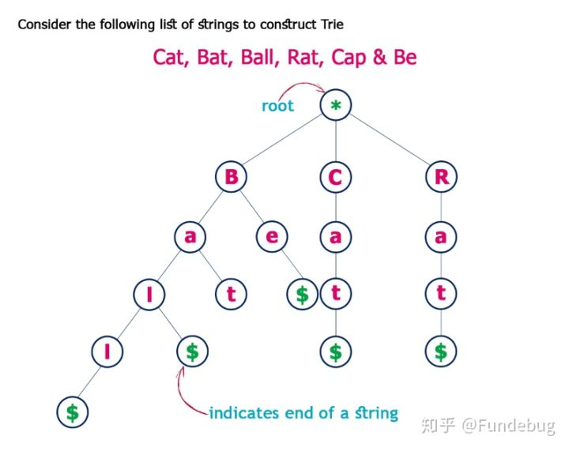
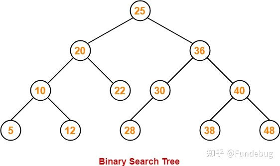
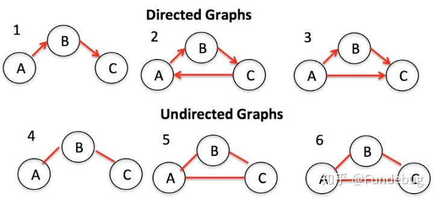
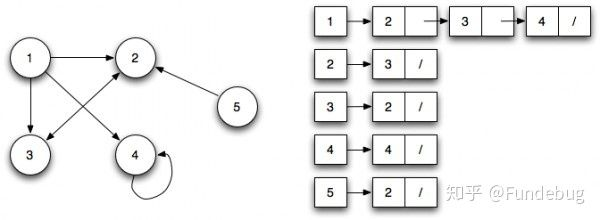
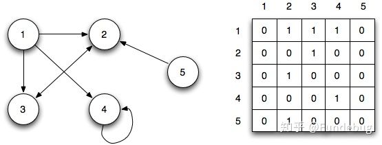

## 前言


<!--more-->

# 前端面试指南_算法

## 数据结构

### 数组

JS的Array是一个万能的数据结构，为什么这么说呢？因为首先它可以当作一个普通的数组来使用，即通过下标找到数组的元素

然后它可以当作一个栈来使用，我们知道栈的特点是先进后出，栈的基本操作是出栈和入栈

同时它还可以当作一个队列，队列的特点是先进先出，基本操作是出队和入队

甚至它还可以当作一个哈希表来使用(但是不推荐这么用)

源码里面说，JSArray有两种模式，一种是快速的，一种是慢速的，快速的用的是索引直接定位，慢速的使用用哈希查找

JSArray是继承于JSObject

#### 增 

push unshift splice

#### 删 

pop shift splice

#### 查 

arr[i] indexOf lastIndexOf includes find findIndex

```
arr.find(callback(element,index,array)[, thisArg])
find方法对数组中的每一项元素执行一次 callback 函数，直至有一个 callback 返回 true。当找到了这样一个元素后，该方法会立即返回这个元素的值，否则返回 undefined。注意 callback 函数会为数组中的每个索引调用即从 0 到 length - 1，而不仅仅是那些被赋值的索引，这意味着对于稀疏数组来说，该方法的效率要低于那些只遍历有值的索引的方法。
find方法不会改变数组。
callback函数带有3个参数：当前元素的值、当前元素的索引，以及数组本身。
findIndex() 方法，它返回数组中找到的元素的索引，而不是其值。
```

#### 改 

concat join reverse slice sort

```
arr.sort([compareFunction()])
numbers.sort((a, b) => a - b); 从小到大

sort方法用原地算法对数组的元素进行排序，并返回数组。排序算法现在是稳定的。默认排序顺序是根据字符串Unicode码点。
快速排序和优化的归并排序

快速排序主要是对哪些基本类型数据（int,short,long等）排序， 而合并排序用于对对象类型进行排序。使用不同类型的排序算法主要是由于快速排序是不稳定的，而合并排序是稳定的

归并排序相对而言比较次数比快速排序少，移动（对象引用的移动）次数比快速排序多，而对于对象来说，比较一般比移动耗时。补充一点合并排序的时间复杂度是nlogn, 快速排序的平均时间复杂度也是nlogn，但是合并排序的需要额外的n个引用的空间。

当待排序的数组中的元素个数较少时，源码中的阀值为7，采用的是插入排序。尽管插入排序的时间复杂度为0(n^2)，但是当数组元素较少时，插入排序优于快速排序，因为这时快速排序的递归操作影响性能。
```


#### 迭代器 

every somefilter reduce map forEach 

```
every() 方法测试一个数组内的所有元素是否都能通过某个指定函数的测试。它返回一个布尔值。
numbers.every((a) => a>10)

some() 方法测试是否至少有一个元素可以通过被提供的函数方法。该方法返回一个Boolean类型的值。
arr.some(callback(element[, index[, array]])[, thisArg])

filter() 方法创建一个新数组, 其包含通过所提供函数实现的测试的所有元素。
var newArray = arr.filter(callback(element[, index[, array]])[, thisArg])

reduce() 方法对数组中的每个元素执行一个由您提供的reducer函数(升序执行)，将其结果汇总为单个返回值。
arr.reduce(callback(accumulator, currentValue[, index[, array]])[, initialValue])
numbers.reduce(function(accumulator, currentValue, currentIndex, array){
  return accumulator + currentValue;
});

map() 方法创建一个新数组，其结果是该数组中的每个元素都调用一个提供的函数后返回的结果。
var new_array = arr.map(function callback(currentValue[, index[, array]]) {
 // Return element for new_array 
}[, thisArg])

forEach() 方法对数组的每个元素执行一次提供的函数。
arr.forEach(callback[, thisArg]);
```


### 链表

```
function LinkedList(){
	let Node = function(element){
		this.element = element;
		this.next = null;
	}
	
	let length = 0;
	let head = null;
	
	this.size = function(){
		return this.length
	}
	this.isEmpty = function(){
		return this.length===0
	}
	this.append = function(element){
		let node = new Node(element),current;
		if(head === null){
			head = node;
		}else{
			current = head;
			while(current.next){
				current = current.next
			}
			current.next = node;
		}
		length++;
	}
	
	this.insert = function(position,element){
    var node = new Node(element);
    var currentNode = head;
    var previousNode;
    var currentIndex = 0;

    if (position > length) {
      return false;
    }

    if (position === 0) {
      node.next = currentNode;
      head = node;
    } else {
      while (currentIndex < position) {
        currentIndex++;
        previousNode = currentNode;
        currentNode = currentNode.next;
      }
      node.next = currentNode;
      previousNode.next = node;
    }
    length++;
	}
	
	this.removeAt = function(position){
		if(position > -1 && position < length){
			let current = head,previous,index=0;
			if(position === 0){
				head = current.next;
			}else{
				while(index++<position){
					previous = current;
					current = current.next;
				}
				length--;
				return current.element;
			}
		}else{
			return null;
		}
	}

	this.indexOf = function (element) {
		var currentNode = head;
		var index = -1;
		while (currentNode) {
			index++;
			if (currentNode.element === element) {
				return index;
			}
			currentNode = currentNode.next;
		}
		return -1;
	}

	this.remove = function(element){}
	this.getHead = function(){}
	this.toString = function(){
		let current = head,string="";
		while(current){
			string+=current.element+(current.next?" ":"");
			current=current.next
		}
		return string
	}
	this.print = function(){
		return head
	}
	
}
```


### 集合

一组无序且唯一的项构成，键值相同

```
function Set(){
	let items = {}
	this.has = function(value){
		return items.hasOwnProperty(value);
	}
	this.add = function(value){
		if(!this.has(value)){
			items[value] = value;
			return true;
		}
		return false;
	}
	this.remove = function(value){
		if(this.has(value)){
			delete items[value];
			return true
		}
		return false;
	}
	this.clear=function(){
		items = {}
	}
	this.size = function(){
		return Object.keys(items).length;
	}
	this.values = function(){
		let values = [];
		for(let i = 0,keys=Object.keys(items);i<keys.length;++i){
			values.push(itmes[keys[i]]);
		}
		return values;
	}
	//并集
	this.union = function(otherSet){
		let unionSet = new Set()
		let valuse = this.values();
		for(let i = 0;i<values.length;++i){
			unionSet.add(values[i])
		}
		valuse = otherSet.values();
		for(let i = 0;i<values.length;++i){
			unionSet.add(values[i])
		}
		return unionSet;
	}
	//交集
	this.intersection = function(otherSet){
		let intersectionSet = new Set()
		let values = this.values()
		for(let i = 0;i<values.length;++i){
			if(otherSet.has(values[i])){
				intersectionSet.add(values[i])
			}
		}
		return intersectionSet
	}
	//差集
	this.difference = function(otherSet){
		let differenceSet = new Set()
		let values = this.values()
		for(let i = 0;i<values.length;++i){
			if(!otherSet.has(values[i])){
				intersectionSet.add(values[i])
			}
		}
		return differenceSet
	}
}
```

### Trie字典/映射(未完)




Trie也可以叫做Prefix Tree（前缀树），也是一种搜索树。Trie分步骤存储数据，树中的每个节点代表一个步骤，trie常用于存储单词以便快速查找，比如实现单词的自动完成功能。 Trie中的每个节点都包含一个单词的字母，跟着树的分支可以可以拼写出一个完整的单词，每个节点还包含一个布尔值表示该节点是否是单词的最后一个字母。

Trie一般有以下方法：

1. `add`：向字典树中增加一个单词
2. `isWord`：判断字典树中是否包含某个单词
3. `print`：返回字典树中的所有单词

```js
/**
 * Trie的节点
 */
function Node() {
  this.keys = new Map();
  this.end = false;
  this.setEnd = function () {
    this.end = true;
  };
  this.isEnd = function () {
    return this.end;
  }
}

function Trie() {
  this.root = new Node();

  this.add = function (input, node = this.root) {
    if (input.length === 0) {
      node.setEnd();
      return;
    } else if (!node.keys.has(input[0])) {
      node.keys.set(input[0], new Node());
      return this.add(input.substr(1), node.keys.get(input[0]));
    } else {
      return this.add(input.substr(1), node.keys.get(input[0]));
    }
  }

  this.isWord = function (word) {
    let node = this.root;
    while (word.length > 1) {
      if (!node.keys.has(word[0])) {
        return false;
      } else {
        node = node.keys.get(word[0]);
        word = word.substr(1);
      }
    }
    return (node.keys.has(word) && node.keys.get(word).isEnd()) ? true : false;
  }

  this.print = function () {
    let words = new Array();
    let search = function (node = this.root, string) {
      if (node.keys.size != 0) {
        for (let letter of node.keys.keys()) {
          search(node.keys.get(letter), string.concat(letter));
        }
        if (node.isEnd()) {
          words.push(string);
        }
      } else {
        string.length > 0 ? words.push(string) : undefined;
        return;
      }
    };
    search(this.root, new String());
    return words.length > 0 ? words : null;
  }
}
```

### 散列表MAP

通过一个特定散列函数处理值得到独一无二的键实现快速查找，但开的空间比较大

### 树

Tree的数据结构和自然界中的树极其相似，有根、树枝、叶子，如上图所示。Tree是一种多层数据结构，与Array、Stack、Queue相比是一种非线性的数据结构，在进行插入和搜索操作时很高效。在描述一个Tree时经常会用到下列概念：

1. Root（根）：代表树的根节点，根节点没有父节点
2. Parent Node（父节点）：一个节点的直接上级节点，只有一个
3. Child Node（子节点）：一个节点的直接下级节点，可能有多个
4. Siblings（兄弟节点）：具有相同父节点的节点
5. Leaf（叶节点）：没有子节点的节点
6. Edge（边）：两个节点之间的连接线
7. Path（路径）：从源节点到目标节点的连续边
8. Height of Node（节点的高度）：表示节点与叶节点之间的最长路径上边的个数
9. Height of Tree（树的高度）：即根节点的高度
10. Depth of Node（节点的深度）：表示从根节点到该节点的边的个数
11. Degree of Node（节点的度）：表示子节点的个数

我们以二叉查找树为例，展示树在Javascript中的实现。在二叉查找树中，即每个节点最多只有两个子节点，而左侧子节点小于当前节点，而右侧子节点大于当前节点，如图所示：





一个二叉查找树应该具有以下常用方法：

1. insert：向树中插入一个节点
2. `findMin`：查找树中最小的节点
3. `findMax`：查找树中最大的节点
4. `find`：查找树中的某个节点
5. `isPresent`：判断某个节点在树中是否存在
6. `remove`：移除树中的某个节点

```
function BinarySearchTree(){
	let Node = function(key){
		this.key = key;
		this.left = null;
		this.right = null;
	}
	let root = null;
	let insertNode = function(node,newNode){
		if(newNode.key < node.key){
			if(node.left === null){
				node.left = newNode
			}else{
				insertNode(node.left,newNode);
			}
		}else{
			if(node.right===null){
				node.right = newNode;
			}else{
				insertNode(node.right,newNode);
			}
		}
	}
	this.insert = function(key){
		let newNode = new Node(key);
		if(root === null){
			root = newNode;
		}else{
			insertNode(root,newNode);
		}
	}
	findMin() {
    let current = this.root;
    while (current.left !== null) {
      current = current.left;
    }
    return current.data;
  }

  findMax() {
    let current = this.root;
    while (current.right !== null) {
      current = current.right;
    }
    return current.data;
  }

  find(data) {
    let current = this.root;
    while (current.data !== data) {
      if (data < current.data) {
        current = current.left
      } else {
        current = current.right;
      }
      if (current === null) {
        return null;
      }
    }
    return current;
  }

  isPresent(data) {
    let current = this.root;
    while (current) {
      if (data === current.data) {
        return true;
      }
      if (data < current.data) {
        current = current.left;
      } else {
        current = current.right;
      }
    }
    return false;
  }

  remove(data) {
    const removeNode = function (node, data) {
      if (node == null) {
        return null;
      }
      if (data == node.data) {
        // node没有子节点
        if (node.left == null && node.right == null) {
          return null;
        }
        // node没有左侧子节点
        if (node.left == null) {
          return node.right;
        }
        // node没有右侧子节点
        if (node.right == null) {
          return node.left;
        }
        // node有两个子节点
        var tempNode = node.right;
        while (tempNode.left !== null) {
          tempNode = tempNode.left;
        }
        node.data = tempNode.data;
        node.right = removeNode(node.right, tempNode.data);
        return node;
      } else if (data < node.data) {
        node.left = removeNode(node.left, data);
        return node;
      } else {
        node.right = removeNode(node.right, data);
        return node;
      }
    }
    this.root = removeNode(this.root, data);
  }
	
	
	
	
	this.inOrderTraverse = function(callback){
		inOrderTraverseNode(root,callback);
	}
	let inOrderTraverseNode = (node,callback)=>{
		if(node!==null){
			inOrderTraverseNode(node.left,callback);
			callback(node.key)
			inOrderTraverseNode(node.right,callback);
		}
	}
	this.preOrderTraverse = function(callback){
		preOrderTraverseNode(root,callback);
	}
	let preOrderTraverseNode = (node,callback)=>{
		if(node!==null){
			callback(node.key)
			preOrderTraverseNode(node.left,callback);
			preOrderTraverseNode(node.right,callback);
		}
	}
	this.postOrderTraverse = function(callback){
		postOrderTraverseNode(root,callback);
	}
	let postOrderTraverseNode = (node,callback)=>{
		if(node!==null){
			postOrderTraverseNode(node.left,callback);
			postOrderTraverseNode(node.right,callback);
			callback(node.key)
		}
	}
	this.print = function(){
		return root;
	}
}
```

### tu



Graph是节点（或顶点）以及它们之间的连接（或边）的集合。Graph也可以称为Network（网络）。根据节点之间的连接是否有方向又可以分为Directed Graph（有向图）和Undrected Graph（无向图）。Graph在实际生活中有很多用途，比如：导航软件计算最佳路径，社交软件进行好友推荐等等。

Graph通常有两种表达方式：

**Adjaceny List（邻接列表）**：





邻接列表可以表示为左侧是节点的列表，右侧列出它所连接的所有其他节点。

和 **Adjacency Matrix（邻接矩阵）**：



邻接矩阵用矩阵来表示节点之间的连接关系，每行或者每列表示一个节点，行和列的交叉处的数字表示节点之间的关系：0表示没用连接，1表示有连接，大于1表示不同的权重。

访问Graph中的节点需要使用遍历算法，遍历算法又分为广度优先和深度优先，主要用于确定目标节点和根节点之间的距离，

在Javascript中，Graph可以用一个矩阵（二维数组）表示，广度优先搜索算法可以实现如下：

```js
function bfs(graph, root) {
  var nodesLen = {};

  for (var i = 0; i < graph.length; i++) {
    nodesLen[i] = Infinity;
  }

  nodesLen[root] = 0;

  var queue = [root];
  var current;

  while (queue.length != 0) {
    current = queue.shift();

    var curConnected = graph[current];
    var neighborIdx = [];
    var idx = curConnected.indexOf(1);
    while (idx != -1) {
      neighborIdx.push(idx);
      idx = curConnected.indexOf(1, idx + 1);
    }

    for (var j = 0; j < neighborIdx.length; j++) {
      if (nodesLen[neighborIdx[j]] == Infinity) {
        nodesLen[neighborIdx[j]] = nodesLen[current] + 1;
        queue.push(neighborIdx[j]);
      }
    }
  }

  return nodesLen;
}
```


## 算法

### 排序算法

```
//冒泡O(n^2)
bbubbleSort = (arr) =>{
	let length = arr.length;
	for(1let i = 0;i<length;++i){
		for(let j = 0;j<length-1-i;++j){
			if(arr[j]>arr[j+1]){
				let temp = arr[j];
				arr[j]=arr[j+1];
				arr[j+1]=temp;
			}
		}
	}
}
//选择O(n^2)
selectionSort = (arr)=>{
	let length = arr.length,indexMin;
	for(let i = 0;i<length-1;++i){
		indexMin = i;
		for(let j = i;j<length;++j){
			if(arr[indexMin]>arr[j]){
				indexMin = j;
			}
		}
		if(i!=indexMin){
			let temp = arr[i];
				arr[i]=arr[indexMin];
				arr[indexMin]=temp;
		}
	}
}
//插入O(n^2)，小数组比上面好
insertionSort = (arr)=>{
	let length = arr.length,j,temp;
	for(let i = 1;i<ength;++i){
		j = i;
		temp = arr[i]
		while(j>0&&arr[j-1]>temp){
			arr[j]= arr[j-1]
			j--;
		}
		arr[j]=temp
	}
}
//归并O(nlogn)分治
mergeSort = (arr) =>{
	arr = mergeSortRec(arr)
}
mergeSortRec = (arr) =>{
	let length = arr.length;
	if(length==1){
		return arr
	}
	let mid = Math.floor(length/2)
	left = arr.slice(0,mid)
	right = arr.slice(mid,length)
	return merge(mergeSortRec(left),mergeSortRec(right))
}
merge = (left,right) =>{
	let result = [],
	il = 0,
	ir = 0;
	while(il<left.length&&ir<right.length){
		if(left[il]<right[ir]){
			result.push(left[il++]);
		}else{
			result.push(right[ir++])
		}
	}
	while(il<left.length){
		result.push(left[il++]);
	}
	while(ir<right.length){
		result.push(right[ir++])
	}
	return result
}
//快排O(nlogn)
quickSort=(arr)=>{
	quick(arr,0,arr.length-1)
}
quick = (arr,left,right){
	let index 
	if(arr.length>1){
		index = partition(arr,left,right)
		if(left<index-1){
			quick(arr,left,index-1)
		}
		if(index<right){
			quick(arr,index,right)
		}
	}
}
partition=(arr,left,right)=>{
	let pivot = arr[Math.floor((right+left)/2)],
		i=left,j=right;
	while(i<=j){
		while(arr[i]<pivot){
			++i;
		}
		while(arr[j]>pivot){
			j--
		}
		if(i<=j){
			let temp = arr[j]
			arr[j]=arr[i]
			arr[i] = temp
		}
	}
	return i
}
//堆排

对一颗完全二叉树，作为数组，某节点i父节点为Math.floor((i-1)/2),子节点2i+1,2i+2
let heapSort = (arr)=>{
	let heapSize =arr.length;
	buildHeap(arr)
	while(heapSize>1){
		heapSize--;
		[arr[0],arr[heapSize]]=[arr[heapSize],arr[0]]
		heapify(arr,heapSize,0)
	}
}
let buildHeap = (arr)=>{
	heapSize = arr.length
	for(let i = Math.floor(arr.length/2);i>=0;i--){
		heapify(arr,heapSize,i)
	}
}
let heapify = (arr,heapSize,i)=>{
	let left = 2*i+1,right = i*2+2,largest = i;
	if(left<heapSize && arr[left]>arr[largest]){
		largest = left;
	}
	if(right<heapSize && arr[right]>arr[largest]){
		largest = right;
	}
	if(largest!=i){
		[arr[i],arr[largest]]=[arr[largest],arr[i]]
	}
}
```

### 搜索算法

```
//顺序

//二分
binarySearch = (arr,item)=>{
	let brr = quickSort(arr)
	let low = 0,high = brr.length -1,mid,element;
	while(low<=high){
		mid = Math.floor((low+high)/2);
		element = brr[mid]
		if(element <item){
			low = mid+1;
		}else if(element >item){
			high = mid -1;
		}else{
			return mid
		}
	}
	return -1
}
```

### 算法模式

```
//递归 ES6有尾调用优化，递归并不更慢
fibonacci = (num)=>{
	if(num ===1||num===2){
		return 1
	}
	return fibonacci(num-1)+fibonacci(num-2)
}
fib = (num)=>{
	let n1 = 1,n2=1,n=1;
	for(let i = 3;i<num;++i){
		n = n1+n2;
		n1=n2;
		n2=n;
	}
	return n
}

```

### 动态规划

#### 最少硬币

```
let minCoin = (coins) =>{
	let cache = {};
	this.makeChange = (amount)=>{
		let me = this;
		if(!amount){
			return [];
		}
		if(cache[amount]){
			return cache[amount]
		}
		let min = [],newMin,newAmount;
		for(let i = 0;i<coins.length;++i){
			let newAmount = amount -coin,coin = coins[i];
			if(newAmount >= 0){
				newMin = me.makeChange(newAmount);
			}
			if(
				newAmount>=0&&
				(newMin.length<min.length-1||!min.length)
				&&(newMin.lengthh||!newAmount)
			){
				min = [coin].concat(newMin);
				console.log(min+'for'+amount)
			}
		}
		return (cache[amount]=min)
	}
}
```


### 贪心

#### 最少硬币

```
function minChange(coins,amount){
	coins = quickSort(coins)
	let l = coins.length-1,cache = [];
	while(l>=0&&amount>=0){
		if(amount>=coins[l]){
			cache.push(coins[l])
			amount -=coins[l]
		}else{
			l--
		}
	}
	return cache
}
//问题，只在相邻级别中，前一级比后一级少一半以上才可以[1,2,5,10,20,50,100],如果是[1,3,4]这种不行
第一种从较小的硬币集合开始算，只有[1],[1,3],[1,3,4]
```


#### 数组去重


https://zhuanlan.zhihu.com/p/26388217

https://blog.fundebug.com/2019/08/12/8-common-data-structure-and-javascript-implementation/