数据库相关知识

<!--more-->

## 范式

**第一范式（1NF）：**

所谓第一范式（1NF）是指在[关系模型](https://baike.baidu.com/item/关系模型)中，对于添加的一个规范要求，所有的域都应该是原子性的，即数据库表的每一列都是不可分割的原子数据项，而不能是集合，数组，记录等非原子数据项。即实体中的某个属性有多个值时，必须拆分为不同的属性。在符合第一范式（1NF）表中的每个域值只能是实体的一个属性或一个属性的一部分。简而言之，第一范式就是无重复的域。

  **一范式就是属性不可分割。属性是什么？就是表中的字段。**
不可分割的意思就按字面理解就是最小单位，不能再分成更小单位了。
这个字段只能是一个值，不能被拆分成多个字段，否则的话，它就是可分割的，就不符合一范式。
不过能不能分割并没有绝对的答案，看需求，也就是看你的设计目标而定。
举例：
学生信息组成学生信息表，有姓名、年龄、性别、学号等信息组成。
姓名不可拆分吧？所以可以作为该表的一个字段。
但我要说这个表要在国外使用呢？人家姓和名要分开，都有特别的意义，所以姓名字段是可拆分的，分为姓字段和名字段。
简单来说，一范式是关系数据库的基础，但字段是否真的不可拆分，根据你的设计目标而定。

**第二范式（2NF）**

在1NF的基础上，非码属性必须完全依赖于候选码（在1NF基础上消除非主属性对主码的部分函数依赖）

第二范式（2NF）是在第一范式（1NF）的基础上建立起来的，即满足第二范式（2NF）必须先满足第一范式（1NF）。第二范式（2NF）要求数据库表中的每个实例或记录必须可以被唯一地区分。选取一个能区分每个实体的属性或属性组，作为实体的唯一标识。例如在员工表中的身份证号码即可实现每个一员工的区分，该身份证号码即为候选键，任何一个候选键都可以被选作主键。在找不到候选键时，可额外增加属性以实现区分，如果在员工关系中，没有对其身份证号进行存储，而姓名可能会在数据库运行的某个时间重复，无法区分出实体时，设计辟如ID等不重复的编号以实现区分，被添加的编号或ID选作主键。（该主键的添加是在ER设计时添加，不是建库时随意添加）

第二范式（2NF）要求实体的属性完全依赖于主关键字。所谓完全依赖是指不能存在仅依赖主关键字一部分的属性，如果存在，那么这个属性和主关键字的这一部分应该分离出来形成一个新的实体，新实体与原实体之间是一对多的关系。为实现区分通常需要为表加上一个列，以存储各个实例的唯一标识。简而言之，第二范式就是在第一范式的基础上属性完全依赖于主键。

**二范式就是要有主键，要求其他字段都依赖于主键。**
为什么要有主键？没有主键就没有唯一性，没有唯一性在集合中就定位不到这行记录，所以要主键。
其他字段为什么要依赖于主键？因为不依赖于主键，就找不到他们。更重要的是，其他字段组成的这行记录和主键表示的是同一个东西，而主键是唯一的，它们只需要依赖于主键，也就成了唯一的。
如果有同学不理解依赖这个词，可以勉强用“相关”这个词代替，也就是说其他字段必须和它们的主键相关。因为不相关的东西不应该放在一行记录里。
举例：
学生信息组成学生表，姓名可以做主键么？
不能！因为同名的话，就不唯一了，所以需要学号这样的唯一编码才行。
那么其他字段依赖于主键是什么意思？
就是“张三”同学的年龄和性别等字段，不能存储别人的年龄性别，必须是他自己的，因为张三的学号信息就决定了，这行记录归张三所有，不能给无关人员使用。

**第三范式（3NF）**

在2NF基础上，任何非主[属性](https://baike.baidu.com/item/属性)不依赖于其它非主属性（在2NF基础上消除传递依赖）

第三范式（3NF）是第二范式（2NF）的一个子集，即满足第三范式（3NF）必须满足第二范式（2NF）。简

[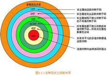](https://baike.baidu.com/pic/数据库范式/7309898/0/d009b3de9c82d15830b1f2218e0a19d8bc3e426b?fr=lemma&ct=single)数据库范式

而言之，第三范式（3NF）要求一个关系中不包含已在其它关系已包含的非主关键字信息。例如，存在一个部门信息表，其中每个部门有部门编号（dept_id）、部门名称、部门简介等信息。那么在员工信息表中列出部门编号后就不能再将部门名称、部门简介等与部门有关的信息再加入员工信息表中。如果不存在部门信息表，则根据第三范式（3NF）也应该构建它，否则就会有大量的数据冗余。简而言之，第三范式就是属性不依赖于其它非主属性，也就是在满足2NF的基础上，任何非主属性不得传递依赖于主属性。

**三范式就是要消除传递依赖，方便理解，可以看做是“消除冗余”。**
消除冗余应该比较好理解一些，就是各种信息只在一个地方存储，不出现在多张表中。
比如说大学分了很多系（中文系、英语系、计算机系……），这个系别管理表信息有以下字段组成：
系编号，系主任，系简介，系架构。
那么再回到学生信息表，张三同学的年龄、性别、学号都有了，我能不能把他的系编号，系主任、系简介也一起存着？
如果你问三范式，当然不行，因为三范式不同意。
因为系编号，系主任、系简介已经存在系别管理表中，你再存入学生信息表，就是冗余了。
三范式中说的传递依赖，就出现了。
这个时候学生信息表中，系主任信息是不是依赖于系编号了？而这个表的主键可是学号啊！
所以按照三范式，处理这个问题的时候，学生表就只能增加一个系编号字段。
这样既能根据系编号找到系别信息，又避免了冗余存储的问题。  

**4、**巴斯-科德范式（BCNF）

Boyce-Codd Normal Form（巴斯-科德范式）

在3NF基础上，任何非主属性不能对主键子集依赖（在3NF基础上消除对主码子集的依赖）

巴斯-科德范式（BCNF）是第三范式（3NF）的一个子集，即满足巴斯-科德范式（BCNF）必须满足第三范式（3NF）。通常情况下，巴斯-科德范式被认为没有新的设计规范加入，只是对第二范式与第三范式中设计规范要求更强，因而被认为是修正第三范式，也就是说，它事实上是对第三范式的修正，使数据库冗余度更小。这也是BCNF不被称为第四范式的原因。某些书上，根据范式要求的递增性将其称之为第四范式是不规范，也是更让人不容易理解的地方。而真正的第四范式，则是在设计规范中添加了对多值及依赖的要求。

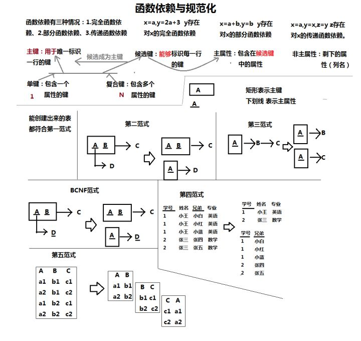

## MySQL逻辑架构

如果能在头脑中构建一幅MySQL各组件之间如何协同工作的架构图，有助于深入理解MySQL服务器。下图展示了MySQL的逻辑架构图。

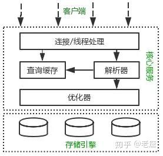


MySQL逻辑架构整体分为三层，**最上层为客户端层**，并非MySQL所独有，诸如：**连接处理、授权认证、安全**等功能均在这一层处理。
MySQL大多数核心服务均在**中间**这一层，包括查询**解析、分析、优化、缓存、内置函数**(比如：时间、数学、加密等函数)。所有的跨存储引擎的功能也在这一层实现：存储过程、触发器、视图等。
**最下层为存储引擎**，其负责MySQL中的**数据存储和提取**。和Linux下的文件系统类似，每种存储引擎都有其优势和劣势。中间的服务层通过API与存储引擎通信，这些API接口屏蔽了不同存储引擎间的差异。
MySQL查询过程
我们总是希望MySQL能够获得更高的查询性能，最好的办法是弄清楚MySQL是如何优化和执行查询的。一旦理解了这一点，就会发现：**很多的查询优化工作实际上就是遵循一些原则让MySQL的优化器能够按照预想的合理方式运行而已。**
当向MySQL发送一个请求的时候，MySQL到底做了些什么呢？

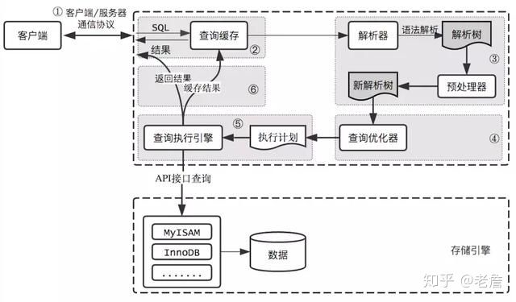

## MySQL查询过程

**客户端/服务端通信协议**
**MySQL客户端/服务端通信协议是“半双工”的**：在任一时刻，要么是服务器向客户端发送数据，要么是客户端向服务器发送数据，这**两个动作不能同时发生**。一旦一端开始发送消息，另一端要接收完整个消息才能响应它，所以我们无法也无须将一个消息切成小块独立发送，也没有办法进行流量控制。

客户端用一个单独的数据包将查询请求发送给服务器，所以当查询语句很长的时候，需要设置max_allowed_packet参数。但是需要注意的是，如果查询实在是太大，服务端会拒绝接收更多数据并抛出异常。

与之相反的是，**服务器响应给用户的数据**通常会很多，由**多个数据包组成**。但是当服务器响应客户端请求时，客户端必须完整的接收整个返回结果，而不能简单的只取前面几条结果，然后让服务器停止发送。因而在实际开发中，尽量保持查询简单且只返回必需的数据，减小通信间数据包的大小和数量是一个非常好的习惯，这也是查询中尽量避免使用SELECT *以及加上LIMIT限制的原因之一。

## 查询缓存

在解析一个查询语句前，如果查询缓存是打开的，那么MySQL会检查这个查询语句是否命中查询缓存中的数据。如果当前查询恰好命中查询缓存，在检查一次用户权限后直接返回缓存中的结果。这种情况下，查询不会被解析，也不会生成执行计划，更不会执行。

**MySQL将缓存存放在一个引用表**（不要理解成table，可以认为是类似于HashMap的数据结构），通过一个哈希值索引，这个哈希值通过查询本身、当前要查询的数据库、客户端协议版本号等一些可能影响结果的信息计算得来。所以两个查询在任何字符上的不同（例如：空格、注释），都会导致缓存不会命中。

如果查询中包含任何用户**自定义函数、存储函数、用户变量、临时表、mysql库中的系统表**，其查询结果都不会被缓存。比如函数NOW()或者CURRENT_DATE()会因为不同的查询时间，返回不同的查询结果，再比如包含CURRENT_USER或者CONNECION_ID()的查询语句会因为不同的用户而返回不同的结果，将这样的查询结果缓存起来没有任何的意义。

既然是**缓存**，就会失效，那查询缓存何时失效呢？MySQL的查询缓存系统会跟踪查询中涉及的每个表，如果这些表（数据或结构）发生变化，那么和这张表相关的所有缓存数据都将失效。正因为如此，在任何的写操作时，MySQL必须将对应表的所有缓存都设置为失效。**如果查询缓存非常大或者碎片很多，这个操作就可能带来很大的系统消耗**，甚至导致系统僵死一会儿。而且查询缓存对系统的额外消耗也不仅仅在写操作，读操作也不例外：

1. **任何的查询语句在开始之前都必须经过检查，即使这条SQL语句永远不会命中缓存**
2. **如果查询结果可以被缓存，那么执行完成后，会将结果存入缓存，也会带来额外的系统消耗**

基于此，我们要知道并不是什么情况下查询缓存都会提高系统性能，缓存和失效都会带来额外消耗，只有当缓存带来的资源节约大于其本身消耗的资源时，才会给系统带来性能提升。但要如何评估打开缓存是否能够带来性能提升是一件非常困难的事情，也不在本文讨论的范畴内。如果系统确实存在一些性能问题，可以尝试打开查询缓存，并在数据库设计上做一些优化，比如：

1. **用多个小表代替一个大表，注意不要过度设计**
2. **批量插入代替循环单条插入**
3. **合理控制缓存空间大小，一般来说其大小设置为几十兆比较合适**
4. **可以通过SQL_CACHE和SQL_NO_CACHE来控制某个查询语句是否需要进行缓存**

最后的忠告是不要轻易打开查询缓存，特别是写密集型应用。如果你实在是忍不住，可以将query_cache_type设置为DEMAND，这时只有加入SQL_CACHE的查询才会走缓存，其他查询则不会，这样可以非常自由地控制哪些查询需要被缓存。

当然查询缓存系统本身是非常复杂的，这里讨论的也只是很小的一部分，其他更深入的话题，比如：缓存是如何使用内存的？如何控制内存的碎片化？事务对查询缓存有何影响等等，读者可以自行阅读相关资料，这里权当抛砖引玉吧。

**因为文章篇幅过长，希望您能读到最后，对你一定是有帮助的，文末有彩蛋哦，分享大量mysql面试资料以及各个专项面试资料给大家！**

## 语法解析和预处理

MySQL通过关键字将SQL语句进行解析，并生成一颗对应的解析树。这个过程解析器主要通过语法规则来验证和解析。比如SQL中是否使用了错误的关键字或者关键字的顺序是否正确等等。预处理则会根据MySQL规则进一步检查解析树是否合法。比如检查要查询的数据表和数据列是否存在等等。

## 查询优化

经过前面的步骤生成的语法树被认为是合法的了，并且由优化器将其转化成查询计划。多数情况下，一条查询可以有很多种执行方式，最后都返回相应的结果。优化器的作用就是找到这其中最好的执行计划。

```text
mysql> select * from t_message limit 10;
...省略结果集
mysql> show status like 'last_query_cost';
+-----------------+-------------+
| Variable_name | Value |
+-----------------+-------------+
| Last_query_cost | 6391.799000 |
+-----------------+-------------+
```

示例中的结果表示优化器认为大概需要做6391个数据页的随机查找才能完成上面的查询。这个结果是根据一些列的统计信息计算得来的，这些统计信息包括：每张表或者索引的页面个数、索引的基数、索引和数据行的长度、索引的分布情况等等。

有非常多的原因会导致MySQL选择错误的执行计划，比如统计信息不准确、不会考虑不受其控制的操作成本（用户自定义函数、存储过程）、MySQL认为的最优跟我们想的不一样（我们希望执行时间尽可能短，但MySQL值选择它认为成本小的，但成本小并不意味着执行时间短）等等。

**MySQL的查询优化器是一个非常复杂的部件，它使用了非常多的优化策略来生成一个最优的执行计划：**

- 重新定义表的关联顺序（多张表关联查询时，并不一定按照SQL中指定的顺序进行，但有一些技巧可以指定关联顺序）
- 优化MIN()和MAX()函数（找某列的最小值，如果该列有索引，只需要查找B+Tree索引最左端，反之则可以找到最大值，具体原理见下文）
- 提前终止查询（比如：使用Limit时，查找到满足数量的结果集后会立即终止查询）
- 优化排序（在老版本MySQL会使用两次传输排序，即先读取行指针和需要排序的字段在内存中对其排序，然后再根据排序结果去读取数据行，而新版本采用的是单次传输排序，也就是一次读取所有的数据行，然后根据给定的列排序。对于I/O密集型应用，效率会高很多）

随着MySQL的不断发展，优化器使用的优化策略也在不断的进化，这里仅仅介绍几个非常常用且容易理解的优化策略，其他的优化策略，大家自行查阅吧。

## 查询执行引擎

在完成解析和优化阶段以后，MySQL会生成对应的执行计划，查询执行引擎根据执行计划给出的指令逐步执行得出结果。整个执行过程的大部分操作均是通过调用存储引擎实现的接口来完成，这些接口被称为handler API。查询过程中的每一张表由一个handler实例表示。实际上，MySQL在查询优化阶段就为每一张表创建了一个handler实例，优化器可以根据这些实例的接口来获取表的相关信息，包括表的所有列名、索引统计信息等。存储引擎接口提供了非常丰富的功能，但其底层仅有几十个接口，这些接口像搭积木一样完成了一次查询的大部分操作。

## 返回结果给客户端

查询执行的最后一个阶段就是将结果返回给客户端。即使查询不到数据，MySQL仍然会返回这个查询的相关信息，比如该查询影响到的行数以及执行时间等等。


如果查询缓存被打开且这个查询可以被缓存，MySQL也会将结果存放到缓存中。

**结果集返回客户端是一个增量且逐步返回的过程**。有可能MySQL在生成第一条结果时，就开始向客户端逐步返回结果集了。这样服务端就无须存储太多结果而消耗过多内存，也可以让客户端第一时间获得返回结果。需要注意的是，结果集中的每一行都会以一个满足①中所描述的通信协议的数据包发送，再通过TCP协议进行传输，在传输过程中，可能对MySQL的数据包进行缓存然后批量发送。

**回头总结一下MySQL整个查询执行过程，总的来说分为6个步骤**：

1. 客户端向MySQL服务器发送一条查询请求
2. 服务器首先检查查询缓存，如果命中缓存，则立刻返回存储在缓存中的结果。否则进入下一阶段
3. 服务器进行SQL解析、预处理、再由优化器生成对应的执行计划
4. MySQL根据执行计划，调用存储引擎的API来执行查询
5. 将结果返回给客户端，同时缓存查询结果

性能优化建议
看了这么多，你可能会期待给出一些优化手段，是的，下面会从3个不同方面给出一些优化建议。但请等等，还有一句忠告要先送给你：**不要听信你看到的关于优化的“绝对真理”，包括本文所讨论的内容，而应该是在实际的业务场景下通过测试来验证你关于执行计划以及响应时间的假设**。

## Scheme设计与数据类型优化

选择数据类型只要遵循**小而简单**的原则就好，越小的数据类型通常会更快，占用更少的磁盘、内存，处理时需要的CPU周期也更少。越简单的数据类型在计算时需要更少的CPU周期，比如，整型就比字符操作代价低，因而会使用整型来存储ip地址，使用DATETIME来存储时间，而不是使用字符串。

**这里总结几个可能容易理解错误的技巧：**

1. 通常来说把可为NULL的列改为NOT NULL不会对性能提升有多少帮助，只是如果计划在列上创建索引，就应该将该列设置为NOT NULL。
2. 对整数类型指定宽度，比如INT(11)，没有任何卵用。INT使用32位（4个字节）存储空间，那么它的表示范围已经确定，所以INT(1)和INT(20)对于存储和计算是相同的。
3. UNSIGNED表示不允许负值，大致可以使正数的上限提高一倍。比如TINYINT存储范围是-128 ~ 127，而UNSIGNED TINYINT存储的范围却是0 - 255。
4. 通常来讲，没有太大的必要使用DECIMAL数据类型。即使是在需要存储财务数据时，仍然可以使用BIGINT。比如需要精确到万分之一，那么可以将数据乘以一百万然后使用BIGINT存储。这样可以避免浮点数计算不准确和DECIMAL精确计算代价高的问题。
5. TIMESTAMP使用4个字节存储空间，DATETIME使用8个字节存储空间。因而，TIMESTAMP只能表示1970 - 2038年，比DATETIME表示的范围小得多，而且TIMESTAMP的值因时区不同而不同。
6. 大多数情况下没有使用枚举类型的必要，其中一个缺点是枚举的字符串列表是固定的，添加和删除字符串（枚举选项）必须使用ALTER TABLE（如果只只是在列表末尾追加元素，不需要重建表）。
7. schema的列不要太多。原因是存储引擎的API工作时需要在服务器层和存储引擎层之间通过行缓冲格式拷贝数据，然后在服务器层将缓冲内容解码成各个列，这个转换过程的代价是非常高的。如果列太多而实际使用的列又很少的话，有可能会导致CPU占用过高。
8. 大表ALTER TABLE非常耗时，MySQL执行大部分修改表结果操作的方法是用新的结构创建一个张空表，从旧表中查出所有的数据插入新表，然后再删除旧表。尤其当内存不足而表又很大，而且还有很大索引的情况下，耗时更久。当然有一些奇技淫巧可以解决这个问题，有兴趣可自行查阅。

## 创建高性能索引

索引是提高MySQL查询性能的一个重要途径，但过多的索引可能会导致过高的磁盘使用率以及过高的内存占用，从而影响应用程序的整体性能。应当尽量避免事后才想起添加索引，因为事后可能需要监控大量的SQL才能定位到问题所在，而且添加索引的时间肯定是远大于初始添加索引所需要的时间，可见索引的添加也是非常有技术含量的。

接下来将向你展示一系列创建高性能索引的策略，以及每条策略其背后的工作原理。但在此之前，先了解与索引相关的一些算法和数据结构，将有助于更好的理解后文的内容。

## 索引相关的数据结构和算法

通常我们所说的索引是指B-Tree索引，它是目前关系型数据库中查找数据最为常用和有效的索引，大多数存储引擎都支持这种索引。使用B-Tree这个术语，是因为MySQL在CREATE TABLE或其它语句中使用了这个关键字，但实际上不同的存储引擎可能使用不同的数据结构，比如InnoDB就是使用的B+Tree。

B+Tree中的B是指balance，意为平衡。需要注意的是，B+树索引并不能找到一个给定键值的具体行，它找到的只是被查找数据行所在的页，接着数据库会把页读入到内存，再在内存中进行查找，最后得到要查找的数据。

在介绍B+Tree前，先了解一下二叉查找树，它是一种经典的数据结构，其左子树的值总是小于根的值，右子树的值总是大于根的值，如下图①。如果要在这课树中查找值为5的记录，其大致流程：先找到根，其值为6，大于5，所以查找左子树，找到3，而5大于3，接着找3的右子树，总共找了3次。同样的方法，如果查找值为8的记录，也需要查找3次。所以二叉查找树的平均查找次数为(3 + 3 + 3 + 2 + 2 + 1) / 6 = 2.3次，而顺序查找的话，查找值为2的记录，仅需要1次，但查找值为8的记录则需要6次，所以顺序查找的平均查找次数为：(1 + 2 + 3 + 4 + 5 + 6) / 6 = 3.3次，因此大多数情况下二叉查找树的平均查找速度比顺序查找要快。

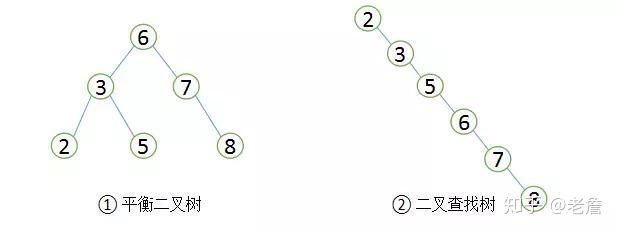

##  二叉查找树和平衡二叉树

由于二叉查找树可以任意构造，同样的值，可以构造出如图②的二叉查找树，显然这棵二叉树的查询效率和顺序查找差不多。若想二叉查找数的查询性能最高，需要这棵二叉查找树是平衡的，也即平衡二叉树（AVL树）。

平衡二叉树首先需要符合二叉查找树的定义，其次必须满足任何节点的两个子树的高度差不能大于1。显然图②不满足平衡二叉树的定义，而图①是一课平衡二叉树。平衡二叉树的查找性能是比较高的（性能最好的是最优二叉树），查询性能越好，维护的成本就越大。比如图①的平衡二叉树，当用户需要插入一个新的值9的节点时，就需要做出如下变动。

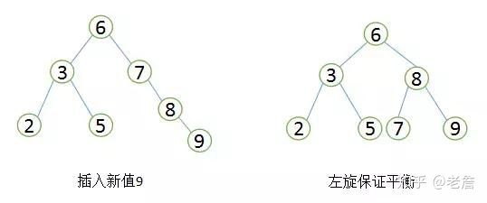

##  平衡二叉树旋转

通过一次左旋操作就将插入后的树重新变为平衡二叉树是最简单的情况了，实际应用场景中可能需要旋转多次。至此我们可以考虑一个问题，平衡二叉树的查找效率还不错，实现也非常简单，相应的维护成本还能接受，为什么MySQL索引不直接使用平衡二叉树？

随着数据库中数据的增加，索引本身大小随之增加，不可能全部存储在内存中，因此索引往往以索引文件的形式存储的磁盘上。这样的话，索引查找过程中就要产生磁盘I/O消耗，相对于内存存取，I/O存取的消耗要高几个数量级。可以想象一下一棵几百万节点的二叉树的深度是多少？如果将这么大深度的一颗二叉树放磁盘上，每读取一个节点，需要一次磁盘的I/O读取，整个查找的耗时显然是不能够接受的。那么如何减少查找过程中的I/O存取次数？

一种行之有效的解决方法是减少树的深度，将二叉树变为m叉树（多路搜索树），而B+Tree就是一种多路搜索树。理解B+Tree时，只需要理解其最重要的两个特征即可：第一，所有的关键字（可以理解为数据）都存储在叶子节点（Leaf Page），非叶子节点（Index Page）并不存储真正的数据，所有记录节点都是按键值大小顺序存放在同一层叶子节点上。其次，所有的叶子节点由指针连接。如下图为高度为2的简化了的B+Tree。

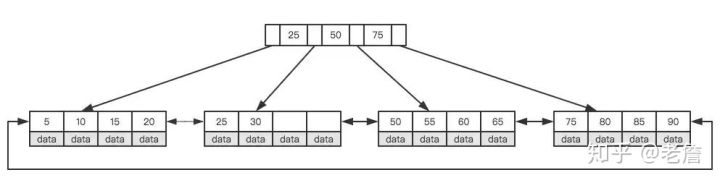

##  简化B+Tree

怎么理解这两个特征？MySQL将每个节点的大小设置为一个页的整数倍（原因下文会介绍），也就是在节点空间大小一定的情况下，每个节点可以存储更多的内结点，这样每个结点能索引的范围更大更精确。所有的叶子节点使用指针链接的好处是可以进行区间访问，比如上图中，如果查找大于20而小于30的记录，只需要找到节点20，就可以遍历指针依次找到25、30。如果没有链接指针的话，就无法进行区间查找。这也是MySQL使用B+Tree作为索引存储结构的重要原因。

MySQL为何将节点大小设置为页的整数倍，这就需要理解磁盘的存储原理。磁盘本身存取就比主存慢很多，在加上机械运动损耗（特别是普通的机械硬盘），磁盘的存取速度往往是主存的几百万分之一，为了尽量减少磁盘I/O，磁盘往往不是严格按需读取，而是每次都会预读，即使只需要一个字节，磁盘也会从这个位置开始，顺序向后读取一定长度的数据放入内存，预读的长度一般为页的整数倍。

页是计算机管理存储器的逻辑块，硬件及OS往往将主存和磁盘存储区分割为连续的大小相等的块，每个存储块称为一页（许多OS中，页的大小通常为4K）。主存和磁盘以页为单位交换数据。当程序要读取的数据不在主存中时，会触发一个缺页异常，此时系统会向磁盘发出读盘信号，磁盘会找到数据的起始位置并向后连续读取一页或几页载入内存中，然后一起返回，程序继续运行。

MySQL巧妙利用了磁盘预读原理，将一个节点的大小设为等于一个页，这样每个节点只需要一次I/O就可以完全载入。为了达到这个目的，每次新建节点时，直接申请一个页的空间，这样就保证一个节点物理上也存储在一个页里，加之计算机存储分配都是按页对齐的，就实现了读取一个节点只需一次I/O。假设B+Tree的高度为h，一次检索最多需要h-1次I/O（根节点常驻内存），复杂度O(h) = O(logmN)。实际应用场景中，M通常较大，常常超过100，因此树的高度一般都比较小，通常不超过3。

最后简单了解下B+Tree节点的操作，在整体上对索引的维护有一个大概的了解，虽然索引可以大大提高查询效率，但维护索引仍要花费很大的代价，因此合理的创建索引也就尤为重要。
仍以上面的树为例，我们假设每个节点只能存储4个内节点。首先要插入第一个节点28，如下图所示。

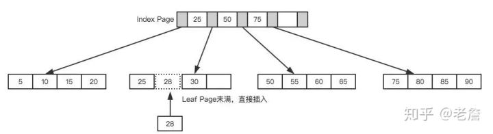

##  leaf page和index page都没有满

接着插入下一个节点70，在Index Page中查询后得知应该插入到50 - 70之间的叶子节点，但叶子节点已满，这时候就需要进行也分裂的操作，当前的叶子节点起点为50，所以根据中间值来拆分叶子节点，如下图所示。

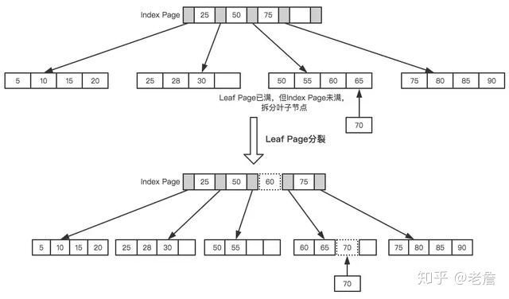

## Leaf Page拆分

最后插入一个节点95，这时候Index Page和Leaf Page都满了，就需要做两次拆分，如下图所示。

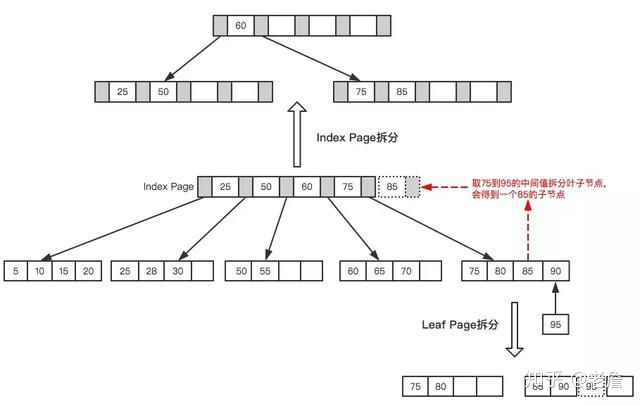

## Leaf Page与Index Page拆分

拆分后最终形成了这样一颗树。

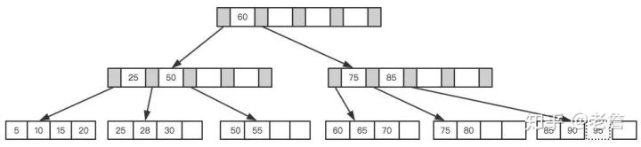

## 最终树

B+Tree为了保持平衡，对于新插入的值需要做大量的拆分页操作，而页的拆分需要I/O操作，为了尽可能的减少页的拆分操作，B+Tree也提供了类似于平衡二叉树的旋转功能。当Leaf Page已满但其左右兄弟节点没有满的情况下，B+Tree并不急于去做拆分操作，而是将记录移到当前所在页的兄弟节点上。通常情况下，左兄弟会被先检查用来做旋转操作。就比如上面第二个示例，当插入70的时候，并不会去做页拆分，而是左旋操作。

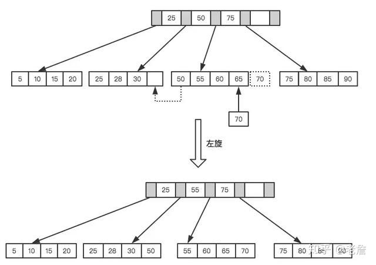

## 左旋操作

通过旋转操作可以最大限度的减少页分裂，从而减少索引维护过程中的磁盘的I/O操作，也提高索引维护效率。需要注意的是，删除节点跟插入节点类似，仍然需要旋转和拆分操作，这里就不再说明。

## 高性能策略

通过上文，相信你对B+Tree的数据结构已经有了大致的了解，但MySQL中索引是如何组织数据的存储呢？以一个简单的示例来说明，假如有如下数据表：

```text
CREATE TABLE People(
 last_name varchar(50) not null,
 first_name varchar(50) not null,
 dob date not null,
 gender enum(`m`,`f`) not null,
 key(last_name,first_name,dob)
);
```

对于表中每一行数据，索引中包含了last_name、first_name、dob列的值，下图展示了索引是如何组织数据存储的。

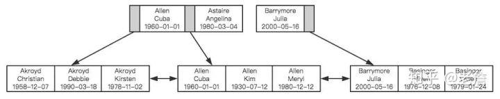


可以看到，索引首先根据第一个字段来排列顺序，当名字相同时，则根据第三个字段，即出生日期来排序，正是因为这个原因，才有了索引的“最左原则”。

**1、MySQL不会使用索引的情况：非独立的列**
“独立的列”是指索引列不能是表达式的一部分，也不能是函数的参数。比如：

```text
select * from where id + 1 = 5
```

我们很容易看出其等价于 id = 4，但是MySQL无法自动解析这个表达式，使用函数是同样的道理。

**2、前缀索引**

如果列很长，通常可以索引开始的部分字符，这样可以有效节约索引空间，从而提高索引效率。

**3、多列索引和索引顺序**

在多数情况下，在多个列上建立独立的索引并不能提高查询性能。理由非常简单，MySQL不知道选择哪个索引的查询效率更好，所以在老版本，比如MySQL5.0之前就会随便选择一个列的索引，而新的版本会采用合并索引的策略。举个简单的例子，在一张电影演员表中，在actor_id和film_id两个列上都建立了独立的索引，然后有如下查询：

```text
select film_id,actor_id from film_actor where actor_id = 1 or film_id = 1
```

老版本的MySQL会随机选择一个索引，但新版本做如下的优化：

```text
select film_id,actor_id from film_actor where actor_id = 1 
union all 
select film_id,actor_id from film_actor where film_id = 1 and actor_id <> 1
```

- 当出现多个索引做相交操作时（多个AND条件），通常来说一个包含所有相关列的索引要优于多个独立索引。
- 当出现多个索引做联合操作时（多个OR条件），对结果集的合并、排序等操作需要耗费大量的CPU和内存资源，特别是当其中的某些索引的选择性不高，需要返回合并大量数据时，查询成本更高。所以这种情况下还不如走全表扫描。

因此**explain时如果发现有索引合并（Extra字段出现Using union），应该好好检查一下查询和表结构是不是已经是最优的**，如果查询和表都没有问题，那只能说明索引建的非常糟糕，应当慎重考虑索引是否合适，有可能一个包含所有相关列的多列索引更适合。

前面我们提到过索引如何组织数据存储的，从图中可以看到多列索引时，索引的顺序对于查询是至关重要的，很明显应该把选择性更高的字段放到索引的前面，这样通过第一个字段就可以过滤掉大多数不符合条件的数据。

**索引选择性**是指不重复的索引值和数据表的总记录数的比值，选择性越高查询效率越高，因为选择性越高的索引可以让MySQL在查询时过滤掉更多的行。唯一索引的选择性是1，这是最好的索引选择性，性能也是最好的。
理解索引选择性的概念后，就不难确定哪个字段的选择性较高了，查一下就知道了，比如：

```text
SELECT * FROM payment where staff_id = 2 and customer_id = 584
```

是应该创建(staff_id,customer_id)的索引还是应该颠倒一下顺序？执行下面的查询，哪个字段的选择性更接近1就把哪个字段索引前面就好。

```text
select count(distinct staff_id)/count(*) as staff_id_selectivity,
 count(distinct customer_id)/count(*) as customer_id_selectivity,
 count(*) from payment
```

多数情况下使用这个原则没有任何问题，但仍然注意你的数据中是否存在一些特殊情况。举个简单的例子，比如要查询某个用户组下有过交易的用户信息：

```text
select user_id from trade where user_group_id = 1 and trade_amount > 0
```

MySQL为这个查询选择了索引(user_group_id,trade_amount)，如果不考虑特殊情况，这看起来没有任何问题，但实际情况是这张表的大多数数据都是从老系统中迁移过来的，由于新老系统的数据不兼容，所以就给老系统迁移过来的数据赋予了一个默认的用户组。这种情况下，通过索引扫描的行数跟全表扫描基本没什么区别，索引也就起不到任何作用。

推广开来说，经验法则和推论在多数情况下是有用的，可以指导我们开发和设计，但实际情况往往会更复杂，实际业务场景下的某些特殊情况可能会摧毁你的整个设计。

**4、避免多个范围条件**

实际开发中，我们会经常使用多个范围条件，比如想查询某个时间段内登录过的用户：

```text
select user.* from user where login_time > '2017-04-01' and age between 18 and 30;
```

这个查询有一个问题：它有两个范围条件，login_time列和age列，MySQL可以使用login_time列的索引或者age列的索引，但无法同时使用它们。

**5、覆盖索引**

**如果一个索引包含或者说覆盖所有需要查询的字段的值，那么就没有必要再回表查询**，这就称为**覆盖索引**。覆盖索引是非常有用的工具，可以极大的提高性能，因为查询只需要扫描索引会带来许多好处：

- 索引条目远小于数据行大小，如果只读取索引，极大减少数据访问量
- 索引是有按照列值顺序存储的，对于I/O密集型的范围查询要比随机从磁盘读取每一行数据的IO要少的多

**6、使用索引扫描来排序**

**MySQL有两种方式**可以**生产有序的结果集**，其一是**对结果集进行排序的操作**，其二是**按照索引顺序扫描得出的结果自然是有序的**。如果explain的结果中type列的值为index表示使用了索引扫描来做排序。

扫描索引本身很快，因为只需要从一条索引记录移动到相邻的下一条记录。但**如果索引本身不能覆盖所有需要查询的列**，那么就**不得不每扫描一条索引记录就回表查询一次对应的行**。这个读取操作基本上是随机I/O，因此按照索引顺序读取数据的速度通常要比顺序地全表扫描要慢。

在设计索引时，如果一个索引既能够满足排序，又满足查询，是最好的。

只有当索引的列顺序和ORDER BY子句的顺序完全一致，并且所有列的排序方向也一样时，才能够使用索引来对结果做排序。如果查询需要关联多张表，则只有ORDER BY子句引用的字段全部为第一张表时，才能使用索引做排序。ORDER BY子句和查询的限制是一样的，都要满足最左前缀的要求（有一种情况例外，就是最左的列被指定为常数，下面是一个简单的示例），其他情况下都需要执行排序操作，而无法利用索引排序。

```text
// 最左列为常数，索引：(date,staff_id,customer_id)
select staff_id,customer_id from demo where date = '2015-06-01' order by staff_id,customer_id
```

**7、冗余和重复索引**

冗余索引是指在相同的列上按照相同的顺序创建的相同类型的索引，应当尽量避免这种索引，发现后立即删除。比如有一个索引(A,B)，再创建索引(A)就是冗余索引。冗余索引经常发生在为表添加新索引时，比如有人新建了索引(A,B)，但这个索引不是扩展已有的索引(A)。

大多数情况下都应该尽量扩展已有的索引而不是创建新索引。但有极少情况下出现性能方面的考虑需要冗余索引，比如扩展已有索引而导致其变得过大，从而影响到其他使用该索引的查询。

**8、删除长期未使用的索引**
定期删除一些长时间未使用过的索引是一个非常好的习惯。
关于索引这个话题打算就此打住，最后要说一句，索引并不总是最好的工具，只有当索引帮助提高查询速度带来的好处大于其带来的额外工作时，索引才是有效的。对于非常小的表，简单的全表扫描更高效。对于中到大型的表，索引就非常有效。对于超大型的表，建立和维护索引的代价随之增长，这时候其他技术也许更有效，比如分区表。最后的最后，**explain后再提测是一种美德**。

**特定类型查询优化**

**优化COUNT()查询**
**COUNT()**可能是被大家误解最多的函数了，它有**两种不同的作用**，其一是**统计某个列值的数量**，其二是**统计行数**。统计列值时，要求列值是非空的，它不会统计NULL。如果确认括号中的表达式不可能为空时，实际上就是在统计行数。最简单的就是当使用COUNT(*)时，并不是我们所想象的那样扩展成所有的列，实际上，它会忽略所有的列而直接统计行数。

我们最常见的误解也就在这儿，在括号内指定了一列却希望统计结果是行数，而且还常常误以为前者的性能会更好。但实际并非这样，如果要统计行数，直接使用COUNT(*)，意义清晰，且性能更好。

有时候**某些业务场景并不需要完全精确的COUNT值，可以用近似值来代替**，**EXPLAIN**出来的行数就是一个**不错的近似值**，而且执行EXPLAIN并不需要真正地去执行查询，所以成本非常低。通常来说，执行COUNT()都需要扫描大量的行才能获取到精确的数据，因此很难优化，MySQL层面还能做得也就只有覆盖索引了。如果不还能解决问题，只有从架构层面解决了，比如添加汇总表，或者使用redis这样的外部缓存系统。

**优化关联查询**

在大数据场景下，表与表之间通过一个冗余字段来关联，要比直接使用JOIN有更好的性能。如果确实需要使用关联查询的情况下，需要特别注意的是：

- 确保ON和USING字句中的列上有索引。在创建索引的时候就要考虑到关联的顺序。当表A和表B用列c关联的时候，如果优化器关联的顺序是A、B，那么就不需要在A表的对应列上创建索引。没有用到的索引会带来额外的负担，一般来说，除非有其他理由，只需要在关联顺序中的第二张表的相应列上创建索引（具体原因下文分析）。
- 确保任何的GROUP BY和ORDER BY中的表达式只涉及到一个表中的列，这样MySQL才有可能使用索引来优化。

要理解优化关联查询的第一个技巧，就需要理解MySQL是如何执行关联查询的。当前MySQL关联执行的策略非常简单，它对任何的关联都执行**嵌套循环关联**操作，即先在一个表中循环取出单条数据，然后在嵌套循环到下一个表中寻找匹配的行，依次下去，直到找到所有表中匹配的行为为止。然后根据各个表匹配的行，返回查询中需要的各个列。

太抽象了？以上面的示例来说明，比如有这样的一个查询：

```text
SELECT A.xx,B.yy 
FROM A INNER JOIN B USING(c)
WHERE A.xx IN (5,6)
```

假设MySQL按照查询中的关联顺序A、B来进行关联操作，那么可以用下面的伪代码表示MySQL如何完成这个查询：

```text
outer_iterator = SELECT A.xx,A.c FROM A WHERE A.xx IN (5,6);
outer_row = outer_iterator.next;
while(outer_row) {
 inner_iterator = SELECT B.yy FROM B WHERE B.c = outer_row.c;
 inner_row = inner_iterator.next;
 while(inner_row) {
 output[inner_row.yy,outer_row.xx];
 inner_row = inner_iterator.next;
 }
 outer_row = outer_iterator.next;
}
```

可以看到，最外层的查询是根据A.xx列来查询的，A.c上如果有索引的话，整个关联查询也不会使用。再看内层的查询，很明显B.c上如果有索引的话，能够加速查询，因此只需要在关联顺序中的第二张表的相应列上创建索引即可。

**优化LIMIT分页**

当需要分页操作时，通常会使用LIMIT加上偏移量的办法实现，同时加上合适的ORDER BY字句。如果有对应的索引，通常效率会不错，否则，MySQL需要做大量的文件排序操作。

一个常见的问题是当偏移量非常大的时候，比如：LIMIT 10000 20这样的查询，MySQL需要查询10020条记录然后只返回20条记录，前面的10000条都将被抛弃，这样的代价非常高。

优化这种查询一个最简单的办法就是尽可能的使用覆盖索引扫描，而不是查询所有的列。然后根据需要做一次关联查询再返回所有的列。对于偏移量很大时，这样做的效率会提升非常大。考虑下面的查询：

```text
SELECT film_id,description FROM film ORDER BY title LIMIT 50,5;
```

如果这张表非常大，那么这个查询最好改成下面的样子：

```text
SELECT film.film_id,film.description
FROM film INNER JOIN (
 SELECT film_id FROM film ORDER BY title LIMIT 50,5
) AS tmp USING(film_id);
```

这里的延迟关联将大大提升查询效率，让MySQL扫描尽可能少的页面，获取需要访问的记录后在根据关联列回原表查询所需要的列。

有时候如果可以使用书签记录上次取数据的位置，那么下次就可以直接从该书签记录的位置开始扫描，这样就可以避免使用OFFSET，比如下面的查询：

```text
SELECT id FROM t LIMIT 10000, 10;
```

改为：

```text
SELECT id FROM t WHERE id > 10000 LIMIT 10;
```

其他优化的办法还包括使用预先计算的汇总表，或者关联到一个冗余表，冗余表中只包含主键列和需要做排序的列。

## 优化UNION

MySQL处理UNION的策略是先创建临时表，然后再把各个查询结果插入到临时表中，最后再来做查询。因此很多优化策略在UNION查询中都没有办法很好的时候。经常需要手动将WHERE、LIMIT、ORDER BY等字句“下推”到各个子查询中，以便优化器可以充分利用这些条件先优化。

除非确实需要服务器去重，否则就一定要使用UNION ALL，如果没有ALL关键字，MySQL会给临时表加上DISTINCT选项，这会导致整个临时表的数据做唯一性检查，这样做的代价非常高。当然即使使用ALL关键字，MySQL总是将结果放入临时表，然后再读出，再返回给客户端。虽然很多时候没有这个必要，比如有时候可以直接把每个子查询的结果返回给客户端。

## 索引

 B+ Tree 就是针对这个对 B tree 做了优化。如下图所示：

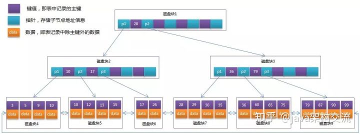

我们看到，B+ Tree 将所有的 data 数据都保存到了叶子节点中，非也子节点只保存索引和指针。

我们假设一个非页子节点是 16kb，每个索引，即主键是 bigint，即 8b，指针为 8b。那么每页能存储大约 1000 个索引（16kb/ 8b + 8b）.

而一颗 3 层的 B+树能够存储多少索引呢？如下图：

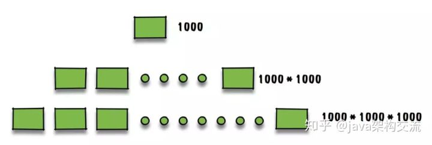

大约能够存储 10 亿个索引。通常 B+ 树的高度在 2-4 层，由于 MySql 在运行时，根节点是常驻内存的，因此每次查找只需要大约 2 -3 次 IO。可以说，B+ 树的设计，就是根据机械磁盘的特性来进行设计的。

知道了索引的设计，我们能够知道另外一些信息：

1. MySql 的主键不能太大，如果使用 UUID 这种，将会浪费 B+ 树的非叶子节点。
2. MySql 的主键最好是自增的，如果使用 UUID 这种，每次插入都会调整 B+树，从而导致页分裂，严重影响性能。

那么，如果项目中使用了分库分表，我们通常都会需要一个主键进行 sharding，那怎么办呢？在实现上，我们可以保留自增主键，而逻辑主键用来作为唯一索引即可。

**磁盘IO与预读**

考虑到磁盘IO是非常高昂的操作，访问磁盘的成本大概是访问内存的十万倍左右，计算机操作系统做了一些优化，**当一次IO时，不光把当前磁盘地址的数据，而是把相邻的数据也都读取到内存缓冲区内**，因为局部预读性原理告诉我们，当计算机访问一个地址的数据的时候，与其相邻的数据也会很快被访问到。每一次IO读取的数据我们称之为一页(page)。具体一页有多大数据跟操作系统有关，一般为4k或8k，也就是我们读取一页内的数据时候，实际上才发生了一次IO，这个理论对于索引的数据结构设计非常有帮助。

b+树性质
1**.索引字段要尽量的小**：通过上面的分析，我们知道IO次数取决于b+数的高度h，假设当前数据表的数据为N，每个磁盘块的数据项的数量是m，则有h=㏒(m+1)N，当数据量N一定的情况下，m越大，h越小；而m = 磁盘块的大小 / 数据项的大小，磁盘块的大小也就是一个数据页的大小，是固定的，如果数据项占的空间越小，数据项的数量越多，树的高度越低。这就是为什么每个数据项，即索引字段要尽量的小，比如int占4字节，要比bigint8字节少一半。这也是为什么b+树要求把真实的数据放到叶子节点而不是内层节点，一旦放到内层节点，磁盘块的数据项会大幅度下降，导致树增高。当数据项等于1时将会退化成线性表。
2.**索引的最左匹配特性（即从左往右匹配）**：当b+树的数据项是复合的数据结构，比如(name,age,sex)的时候，b+数是按照从左到右的顺序来建立搜索树的，比如当(张三,20,F)这样的数据来检索的时候，b+树会优先比较name来确定下一步的所搜方向，如果name相同再依次比较age和sex，最后得到检索的数据；但当(20,F)这样的没有name的数据来的时候，b+树就不知道下一步该查哪个节点，因为建立搜索树的时候name就是第一个比较因子，必须要先根据name来搜索才能知道下一步去哪里查询。比如当(张三,F)这样的数据来检索时，b+树可以用name来指定搜索方向，但下一个字段age的缺失，所以只能把名字等于张三的数据都找到，然后再匹配性别是F的数据了， 这个是非常重要的性质，即索引的最左匹配特性。

**Mysql索引管理**

一、功能

```
#1. 索引的功能就是加速查找
#2. mysql中的primary key，unique，联合唯一也都是索引，这些索引除了加速查找以外，还有约束的功能
```

二、MySQL的索引分类

```
索引分类
1.普通索引index :加速查找
2.唯一索引
    主键索引：primary key ：加速查找+约束（不为空且唯一）
    唯一索引：unique：加速查找+约束 （唯一）
3.联合索引
    -primary key(id,name):联合主键索引
    -unique(id,name):联合唯一索引
    -index(id,name):联合普通索引
4.全文索引fulltext :用于搜索很长一篇文章的时候，效果最好。
5.空间索引spatial :了解就好，几乎不用

这个系统有一个会员表
 4 有下列字段：
 5 会员编号 INT
 6 会员姓名 VARCHAR(10)
 7 会员身份证号码 VARCHAR(18)
 8 会员电话 VARCHAR(10)
 9 会员住址 VARCHAR(50)
10 会员备注信息 TEXT
11 
12 那么这个 会员编号，作为主键，使用 PRIMARY
13 会员姓名 如果要建索引的话，那么就是普通的 INDEX
14 会员身份证号码 如果要建索引的话，那么可以选择 UNIQUE （唯一的，不允许重复）
15 
16 #除此之外还有全文索引，即FULLTEXT
17 会员备注信息 ， 如果需要建索引的话，可以选择全文搜索。
18 用于搜索很长一篇文章的时候，效果最好。
19 用在比较短的文本，如果就一两行字的，普通的 INDEX 也可以。
20 但其实对于全文搜索，我们并不会使用MySQL自带的该索引，而是会选择第三方软件如Sphinx，专门来做全文搜索。
```


 索引的两大类型hash与btree


```
#我们可以在创建上述索引的时候，为其指定索引类型，分两类
hash类型的索引：查询单条快，范围查询慢
btree类型的索引：b+树，层数越多，数据量指数级增长（我们就用它，因为innodb默认支持它）

#不同的存储引擎支持的索引类型也不一样
InnoDB 支持事务，支持行级别锁定，支持 B-tree、Full-text 等索引，不支持 Hash 索引；
MyISAM 不支持事务，支持表级别锁定，支持 B-tree、Full-text 等索引，不支持 Hash 索引；
Memory 不支持事务，支持表级别锁定，支持 B-tree、Hash 等索引，不支持 Full-text 索引；
NDB 支持事务，支持行级别锁定，支持 Hash 索引，不支持 B-tree、Full-text 等索引；
Archive 不支持事务，支持表级别锁定，不支持 B-tree、Hash、Full-text 等索引；
```


创建/删除索引的语法

```
1 #方法一：创建表时
 2     　　CREATE TABLE 表名 (
 3                 字段名1  数据类型 [完整性约束条件…],
 4                 字段名2  数据类型 [完整性约束条件…],
 5                 [UNIQUE | FULLTEXT | SPATIAL ]   INDEX | KEY
 6                 [索引名]  (字段名[(长度)]  [ASC |DESC]) 
 7                 );
 8 
 9 
10 #方法二：CREATE在已存在的表上创建索引
11         CREATE  [UNIQUE | FULLTEXT | SPATIAL ]  INDEX  索引名 
12                      ON 表名 (字段名[(长度)]  [ASC |DESC]) ;
13 
14 
15 #方法三：ALTER TABLE在已存在的表上创建索引
16         ALTER TABLE 表名 ADD  [UNIQUE | FULLTEXT | SPATIAL ] INDEX
17                              索引名 (字段名[(长度)]  [ASC |DESC]) ;
18                              
19 #删除索引：DROP INDEX 索引名 ON 表名字;


1.创建索引
    -在创建表时就创建（需要注意的几点）
    create table s1(
    id int ,#可以在这加primary key
    #id int index #不可以这样加索引，因为index只是索引，没有约束一说，
    #不能像主键，还有唯一约束一样，在定义字段的时候加索引
    name char(20),
    age int,
    email varchar(30)
    #primary key(id) #也可以在这加
    index(id) #可以这样加
    );
    -在创建表后在创建
    create index name on s1(name); #添加普通索引
    create unique age on s1(age);添加唯一索引
    alter table s1 add primary key(id); #添加住建索引，也就是给id字段增加一个主键约束
    create index name on s1(id,name); #添加普通联合索引
2.删除索引
    drop index id on s1;
    drop index name on s1; #删除普通索引
    drop index age on s1; #删除唯一索引，就和普通索引一样，不用在index前加unique来删，直接就可以删了
    alter table s1 drop primary key; #删除主键(因为它添加的时候是按照alter来增加的，那么我们也用alter来删)
```

## 事务

**什么是事务**

**事务就是一组原子性的sql,要么MySQL引擎会全部执行这一组sql语句，要么全部不行（不允许任何一条失败）。**失败的语句将导致事务的整个回滚。事务系统通常满足四个特性，分别为原子性（要么全部执行、要么全部回滚）、一致性（数据必须从一个一致性状态转换为另一种一致性状态）、隔离性（事务未执行成功，其他人无法看到结果）、持久性（事务在commit之后，数据不会丢失）。

由上述概念可知，事务是用来保障数据的一致性以及完整性的。也是MySQL中用来平衡效率与安全之间的一种手段，所以，InnoDB引擎下的事务通常提供了四种事务的隔离级别，方便用户自己在效率和安全之间做出权衡。

## **事务的 ACID**

事务具有四个特征：原子性（ Atomicity ）、一致性（ Consistency ）、隔离性（ Isolation ）和持续性（ Durability ）。这四个特性简称为 ACID 特性。

- 原子性。事务是数据库的逻辑工作单位，事务中包含的各操作要么都做，要么都不做
- 一致性。事 务执行的结果必须是使数据库从一个一致性状态变到另一个一致性状态。因此当数据库只包含成功事务提交的结果时，就说数据库处于一致性状态。如果数据库系统 运行中发生故障，有些事务尚未完成就被迫中断，这些未完成事务对数据库所做的修改有一部分已写入物理数据库，这时数据库就处于一种不正确的状态，或者说是 不一致的状态。
- 隔离性。一个事务的执行不能其它事务干扰。即一个事务内部的操作及使用的数据对其它并发事务是隔离的，并发执行的各个事务之间不能互相干扰。
- 持续性。也称永久性，指一个事务一旦提交，它对数据库中的数据的改变就应该是永久性的。接下来的其它操作或故障不应该对其执行结果有任何影响。

## **Mysql的四种隔离级别**

SQL标准定义了4类隔离级别，包括了一些具体规则，用来限定事务内外的哪些改变是可见的，哪些是不可见的。低级别的隔离级一般支持更高的并发处理，并拥有更低的系统开销。

## **Read Uncommitted（读取未提交内容）**

在该隔离级别，所有事务都可以看到其他未提交事务的执行结果。本隔离级别很少用于实际应用，因为它的性能也不比其他级别好多少。读取未提交的数据，也被称之为脏读（Dirty Read）。

事务中的修改，即使该事务未提交，对其他的事务也是可见的。可以读取到其他事务中的数据，又称为脏读，在实际数据库事务中，脏读会破坏数据的一致性，对业务产生极大影响，所以一般不推荐采用READ UNCOMMITED作为数据库事务的隔离级别。

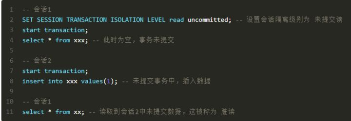

## **Read Committed（读取提交内容）**

这是大多数数据库系统的默认隔离级别（但不是MySQL默认的）。它满足了隔离的简单定义：一个事务只能看见已经提交事务所做的改变。这种隔离级别 也支持所谓的不可重复读（Nonrepeatable Read），因为同一事务的其他实例在该实例处理其间可能会有新的commit，所以同一select可能返回不同结果。


在提交读级别中，数据库将保证如果一个事务没有完全执行成功（commit完成），事务中的操作对其他的事务是不可见的。在该隔离级别下，虽然杜绝了脏读的发生，但是还是存在着不可重复读以及幻读的问题。不可重复读发生在事务T1读取了一行数据，事务T2接着修改或者删除了该行数据（已提交），当T1事务再次读取同一行数据的时候，发现数据已经被修改或者被删除。示例如下图：

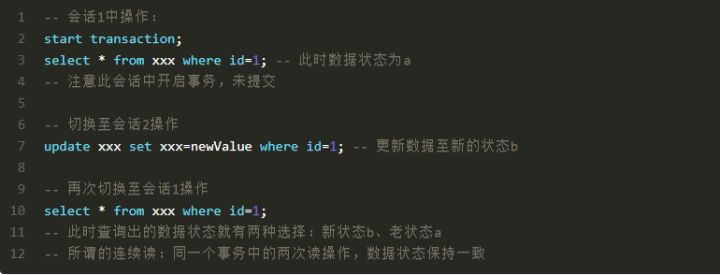

幻读则发生在事务T1读取了满足某条件的一个数据集，事务T2此时插入了一行或者多行满足T1查询条件的的数据并提交，当T1再次采用相同的条件进行读取时，得到了与第一次不同的结果集。示例如下：

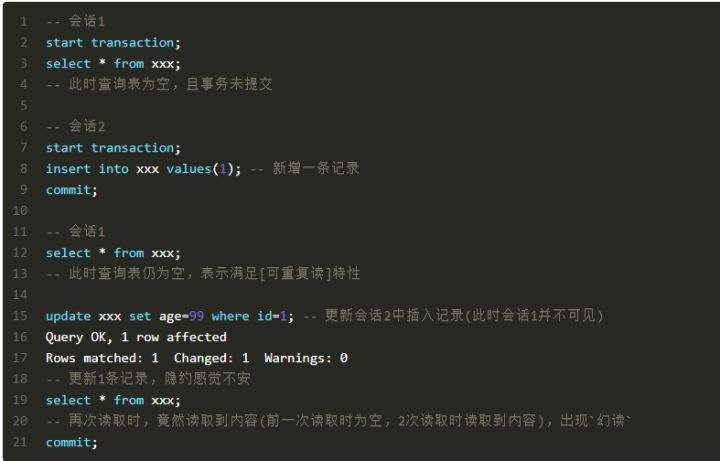

## **Repeatable Read（可重读）**

这是MySQL的默认事务隔离级别，它确保同一事务的多个实例在并发读取数据时，会看到同样的数据行。不过理论上，这会导致另一个棘手的问题：幻读 （Phantom Read）。简单的说，幻读指当用户读取某一范围的数据行时，另一个事务又在该范围内插入了新行，当用户再读取该范围的数据行时，会发现有新的“幻影” 行。InnoDB和Falcon存储引擎通过多版本并发控制（MVCC，Multiversion Concurrency Control）机制解决了该问题。

## **Serializable（可串行化）**

这是最高的隔离级别，它通过强制事务排序，使之不可能相互冲突，从而解决幻读问题。简言之，它是在每个读的数据行上加上共享锁。在这个级别，可能导致大量的超时现象和锁竞争。

这四种隔离级别采取不同的锁类型来实现，若读取的是同一个数据的话，就容易发生问题。例如：

- 脏读(Drity Read)：某个事务已更新一份数据，另一个事务在此时读取了同一份数据，由于某些原因，前一个RollBack了操作，则后一个事务所读取的数据就会是不正确的。
- 不可重复读(Non-repeatable read):在一个事务的两次查询之中数据不一致，这可能是两次查询过程中间插入了一个事务更新的原有的数据。
- 幻读(Phantom Read):在一个事务的两次查询中数据笔数不一致，例如有一个事务查询了几列(Row)数据，而另一个事务却在此时插入了新的几列数据，先前的事务在接下来的查询中，就有几列数据是未查询出来的，如果此时插入和另外一个事务插入的数据，就会报错。

在MySQL中，实现了这四种隔离级别，分别有可能产生问题如下所示：


## **测试Mysql的隔离级别**

下面，将利用MySQL的客户端程序，我们分别来测试一下这几种隔离级别。

测试数据库为demo，表为test；表结构：

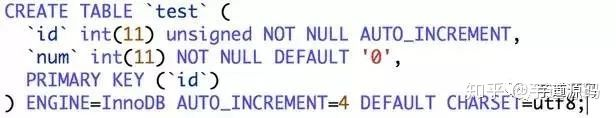

两个命令行客户端分别为A，B；不断改变A的隔离级别，在B端修改数据。

## **将A的隔离级别设置为read uncommitted(未提交读)**


A：启动事务，此时数据为初始状态


B：启动事务，更新数据，但不提交


A：再次读取数据，发现数据已经被修改了，这就是所谓的“脏读”


B：回滚事务


A：再次读数据，发现数据变回初始状态


经过上面的实验可以得出结论，事务B更新了一条记录，但是没有提交，此时事务A可以查询出未提交记录。造成脏读现象。未提交读是最低的隔离级别。

## **将客户端A的事务隔离级别设置为read committed(已提交读)**


A：启动事务，此时数据为初始状态

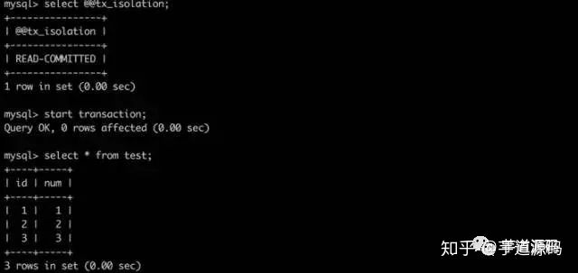

B：启动事务，更新数据，但不提交


A：再次读数据，发现数据未被修改


B：提交事务


A：再次读取数据，发现数据已发生变化，说明B提交的修改被事务中的A读到了，这就是所谓的“不可重复读”


经过上面的实验可以得出结论，已提交读隔离级别解决了脏读的问题，但是出现了不可重复读的问题，即事务A在两次查询的数据不一致，因为在两次查询之间事务B更新了一条数据。已提交读只允许读取已提交的记录，但不要求可重复读。

## **将A的隔离级别设置为repeatable read(可重复读)**


A：启动事务，此时数据为初始状态


B：启动事务，更新数据，但不提交


A：再次读取数据，发现数据未被修改


B：提交事务


A：再次读取数据，发现数据依然未发生变化，这说明这次可以重复读了


B：插入一条新的数据，并提交

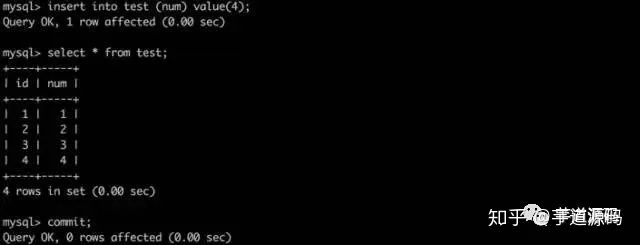

A：再次读取数据，发现数据依然未发生变化，虽然可以重复读了，但是却发现读的不是最新数据，这就是所谓的“幻读”


A：提交本次事务，再次读取数据，发现读取正常了


由以上的实验可以得出结论，可重复读隔离级别只允许读取已提交记录，而且在一个事务两次读取一个记录期间，其他事务部的更新该记录。但该事务不要求与其他事务可串行化。例如，当一个事务可以找到由一个已提交事务更新的记录，但是可能产生幻读问题(注意是可能，因为数据库对隔离级别的实现有所差别)。像以上的实验，就没有出现数据幻读的问题。

## **将A的隔离级别设置为可串行化(Serializable)**


A：启动事务，此时数据为初始状态

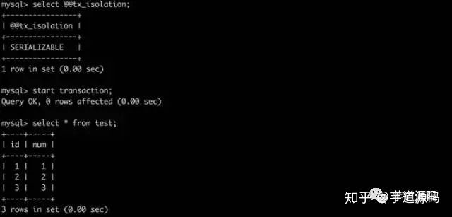

B：发现B此时进入了等待状态，原因是因为A的事务尚未提交，只能等待（此时，B可能会发生等待超时）


A：提交事务


B：发现插入成功


serializable完全锁定字段，若一个事务来查询同一份数据就必须等待，直到前一个事务完成并解除锁定为止。是完整的隔离级别，会锁定对应的数据表格，因而会有效率的问题。

## **锁与锁策略**

在MySQL中，为了应对并发场景下的读写，锁通常分为两类：共享锁以及排他锁。其中，共享锁允许多个连接在同一时间并发的读取相同的资源，彼此之间互不影响,所以又称为读锁。排他锁则会阻塞其他尝试获取共享锁或者排他锁的操作，确保同一时间只有一个连接可以写入数据，并禁止其他用户的读写，又称写锁。

在实际使用下，加锁往往意味着高昂的开销，MySQL为了平衡锁的开销以及并发的线程之间的安全，采用了两种不同的锁策略：

- **table lock(表锁)**

表锁会锁定整张表，如果当前有用户正在执行写操作并且获取了写锁，这可能导致整张表被锁定，阻塞其他用户的读写操作。如果用户执行的是读操作，则会获取读锁，此时其他用户的并发读操作将被接受，写操作会被阻塞。

举个例子，执行语句:


如果b字段不存在索引，那么会锁住所有的记录，即锁上了表锁。

- **row lock(行锁)**

行锁的粒度是在每一条行数据，这意味行锁可以尽可能的支持并发处理，相应的行锁开销也会比较大。并且，**在InnoDB中的行锁是针对索引加的锁，不是针对记录加的锁，并且该索引不能失效，否则行锁将会自动升级为表锁**。

相比较而言，表锁的优势在于开销小，加锁快，无死锁，劣势是锁的粒度大，发生锁冲突的概率较高，并发能力较弱。而行锁则相反。实际使用中，两者都会由MySQL自动加锁。行锁冲突可以通过执行 show status like 'innodb_row_lock%'语句进行分析，表锁冲突则可通过执行show status like 'table_locks%' 进行查看。

## **三、MySQL中的MVCC**

MVCC(multiple-version-concurrency-control）是个行级锁的变种，它在普通读情况下避免了加锁操作，因此开销更低。其原理具体为，在InnoDB存储引擎中，每行数据会加入一些隐藏字段DATA_TRX_ID，DATA_ROLL_PTR，DB_ROW_ID，DELETE_BIT。DATA_TRX_ID 字段记录了数据的创建和删除时间，这个时间指的是对数据进行操作的事务的id，DATA_ROLL_PTR 指向当前数据的undo log记录，回滚数据就是通过这个指针，DELETE BIT位用于标识该记录是否被删除，这里的不是真正的删除数据，而是标志出来的删除。真正意义的删除是在mysql进行数据的GC，清理历史版本数据的时候。

相应的，其DML的处理方式也发生了变化：

SELECT语句**先查找DATA_TRX_ID早于当前事务ID的数据行**。这样就保证了读取的数据要么是在这个事务开始之前就已经commit了的（早于当前事务ID），要么是在这个事务中自身创建的数据（等于当前事务ID）。查找行的DELETE_BIT为1时，查找删除事务ID对应的事务，确定此条记录在当前事务开始之前，行没有被删除。

INSERT语句会在新插入行数据之后，保存当前事务ID作为行的DATA_TRX_ID。

DELETE语句为每一条删除的记录保存当前的事务ID作为行的删除标记。

UPDATE语句将复制变更的记录，并把新记录的DATA_TRX_ID置为当前事务ID，同时更新老记录中的DB_ROLL_PT指向了上一个版本。

所以在并发读的时候，不需要等到访问行上的锁释放，只需要读取一个行的快照即可。既然是多版本的读取，就肯定读取不到其他事务中的新插入的数据了，也就避免了上述场景中提到的幻读。

## **四、幻读**

从上述信息我们已经知道，在REPEATABLE READ级别下，InnoDB采取多版本策略成功

避免了部分幻读现象，但是实际使用中，还是会有幻读产生，先看场景：

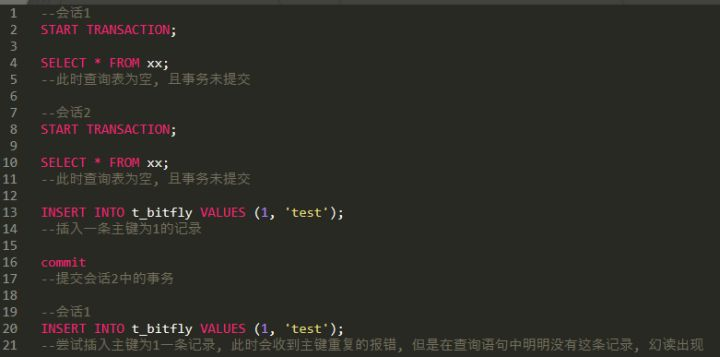

通过MVCC，在事务中的多次读取不会出现幻读，但是此时的插入操作依旧会发生主键重复的错误，并且因为MVCC机制，在上图中的会话1无论读取多少次都不会读到导致冲突产生的数据，确实就如“幻影”一般诡异。

为了解决上述场景中的幻读，需要简单提一下InnoDB的行锁机制，在InnoDB引擎下存在三种行锁，分别为：

- - Record Lock：在单行记录上的锁
  - Gap Lock：间隙锁，锁定一个范围，但不包括记录本身，。GAP锁的目的，是为了防止同一事务的两次读出现幻读的情况
  - Next-Key Lock: 前两个锁的共同使用，即锁定了记录本身，也锁定了一定的范围。

通常情况下，INSERT/UPDATE/DELETE默认会在操作的记录上加上Next-Key Lock，而

普通的SELECT因为MVCC的关系反而只需要读取快照即可，**所以如果业务需要再REPEATABLE READ场景下保证绝对不产生幻读，需要手动给SELECT加锁，在类似SELECT…WHERE加入FOR UPDATE（排它锁）或者LOCK IN SHARE MODE（共享锁）**

### 锁是什么

- 在计算机科学中，锁是在执行多线程时用于强行限制资源访问的同步机制，即用于在并发控制中保证对互斥要求的满足。
- 加锁是实现数据库并发控制的一个非常重要的技术。当事务在对某个数据对象进行操作前，先向系统发出请求，对其加锁。加锁后事务就对该数据对象有了一定的控制，在该事务释放锁之前，其他的事务不能对此数据对象进行更新操作。

## 锁的分类

### 行

- 行级锁
- 行级锁是Mysql中锁定粒度最细的一种锁，表示只针对当前操作的行进行加锁。行级锁能大大减少数据库操作的冲突。其加锁粒度最小，但加锁的开销也最大。行级锁分为共享锁 和 排他锁。
- 特点
- 开销大，加锁慢；会出现死锁；锁定粒度最小，发生锁冲突的概率最低，并发度也最高。

### 表

- 表级锁是MySQL中锁定粒度最大的一种锁，表示对当前操作的整张表加锁，它实现简单，资源消耗较少，被大部分MySQL引擎支持。最常使用的MYISAM与INNODB都支持表级锁定。表级锁定分为表共享读锁（共享锁）与表独占写锁（排他锁）。
- 特点
- 开销小，加锁快；不会出现死锁；锁定粒度大，发出锁冲突的概率最高，并发度最低。

### 页

- 页级锁是MySQL中锁定粒度介于行级锁和表级锁中间的一种锁。表级锁速度快，但冲突多，行级冲突少，但速度慢。所以取了折衷的页级，一次锁定相邻的一组记录。BDB支持页级锁
- 特点
- 开销和加锁时间界于表锁和行锁之间；会出现死锁；锁定粒度界于表锁和行锁之间，并发度一般


锁有好几种维度，我们来解释一下。

## 1. 类型维度

- 共享锁（读锁 / S 锁）

- 排它锁（写锁 / X 锁）
  类型细分：

- - 意向共享锁
  - 意向排他（互斥）锁

- 悲观锁（使用锁，即 for update）

- 乐观锁（使用版本号字段，类似 CAS 机制，即用户自己控制。缺点：并发很高的时候，多了很多无用的重试）

## 2. 锁的粒度（粒度维度）

- 表锁
- 页锁（Mysql BerkeleyDB 引擎）
- 行锁（InnoDB）

## 3. 锁的算法（算法维度）

- Record Lock（单行记录）
- Gap Lock（间隙锁，锁定一个范围，但不包含锁定记录）
- Next-Key Lock（Record Lock + Gap Lock，锁定一个范围，并且锁定记录本身， MySql 防止幻读，就是使用此锁实现）

## 4. 默认的读操作，上锁吗？

- 默认是 MVCC 机制（“一致性非锁定读”）保证 RR 级别的隔离正确性，是不上锁的。

可以选择手动上锁：select xxxx for update (排他锁); select xxxx lock in share mode(共享锁)，称之为“一致性锁定读”。

使用锁之后，就能在 RR 级别下，避免幻读。当然，默认的 MVCC 读，也能避免幻读。

既然 RR 能够防止幻读，那么，SERIALIZABLE 有啥用呢？

防止丢失更新。例如下图：

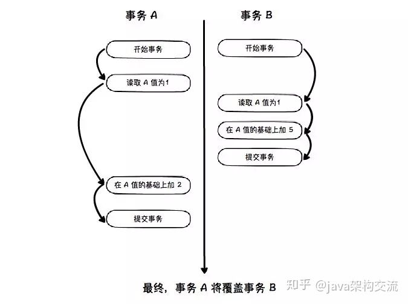


这个时候，我们必须使用 SERIALIZABLE 级别进行串行读取。

最后，行锁的实现原理就是锁住聚集索引，如果你查询的时候，没有正确地击中索引，MySql 优化器将会抛弃行锁，使用表锁。


## MySQL常用存储引擎的锁机制

### MyISAM和MEMORY采用表级锁(table-level locking)

### BDB采用页面锁(page-level locking)或表级锁，默认为页面锁

### InnoDB支持行级锁(row-level locking)和表级锁,默认为行级锁

- InnoDB行锁是通过给索引上的索引项加锁来实现的，InnoDB这种行锁实现特点意味着：只有通过索引条件检索数据，InnoDB才使用行级锁，否则，InnoDB将使用表锁！

在实际应用中，要特别注意InnoDB行锁的这一特性，不然的话，可能导致大量的锁冲突，从而影响并发性能。

行级锁都是基于索引的，如果一条SQL语句用不到索引是不会使用行级锁的，会使用表级锁。行级锁的缺点是：由于需要请求大量的锁资源，所以速度慢，内存消耗大。

### 实例说明

- MySQL InnoDB引擎默认的修改数据语句：update,delete,insert都会自动给涉及到的数据加上排他锁。

select语句默认不会加任何锁类型，如果加排他锁可以使用select …for update语句，加共享锁可以使用select … lock in share mode语句。

所以加过排他锁的数据行在其他事务种是不能修改数据的，也不能通过for update和lock in share mode锁的方式查询数据，但可以直接通过select …from…查询数据，因为普通查询没有任何锁机制。

## 行级锁与死锁

MyISAM中是不会产生死锁的，因为MyISAM总是一次性获得所需的全部锁，要么全部满足，要么全部等待。而在InnoDB中，锁是逐步获得的，就造成了死锁的可能。

在MySQL中，行级锁并不是直接锁记录，而是锁索引。索引分为主键索引和非主键索引两种，如果一条sql语句操作了主键索引，MySQL就会锁定这条主键索引；如果一条语句操作了非主键索引，MySQL会先锁定该非主键索引，再锁定相关的主键索引。在UPDATE、DELETE操作时，MySQL不仅锁定WHERE条件扫描过的所有索引记录，而且会锁定相邻的键值，即所谓的next-key locking。

当两个事务同时执行，一个锁住了主键索引，在等待其他相关索引。另一个锁定了非主键索引，在等待主键索引。这样就会发生死锁。

发生死锁后，InnoDB一般都可以检测到，并使一个事务释放锁回退，另一个获取锁完成事务。

## 共享锁与排它锁

### 共享锁（Share Lock）

- 共享锁又称读锁，是读取操作创建的锁。其他用户可以并发读取数据，但任何事务都不能对数据进行修改（获取数据上的排他锁），直到已释放所有共享锁。

如果事务T对数据A加上共享锁后，则其他事务只能对A再加共享锁，不能加排他锁。获准共享锁的事务只能读数据，不能修改数据。

用法 SELECT ... LOCK IN SHARE MODE;

在查询语句后面增加LOCK IN SHARE MODE，Mysql会对查询结果中的每行都加共享锁，当没有其他线程对查询结果集中的任何一行使用排他锁时，可以成功申请共享锁，否则会被阻塞。其他线程也可以读取使用了共享锁的表，而且这些线程读取的是同一个版本的数据。

### 排它锁（eXclusive Lock）

- 排他锁又称写锁，如果事务T对数据A加上排他锁后，则其他事务不能再对A加任任何类型的封锁。获准排他锁的事务既能读数据，又能修改数据。

用法 SELECT ... FOR UPDATE;

在查询语句后面增加FOR UPDATE，Mysql会对查询结果中的每行都加排他锁，当没有其他线程对查询结果集中的任何一行使用排他锁时，可以成功申请排他锁，否则会被阻塞。

## 乐观锁（Optimistic Lock）

### 是什么

- 假设认为数据一般情况下不会造成冲突，所以在数据进行提交更新的时候，才会正式对数据的冲突与否进行检测，如果发现冲突了，则让返回用户错误的信息，让用户决定如何去做。

相对于悲观锁，在对数据库进行处理的时候，乐观锁并不会使用数据库提供的锁机制。一般的实现乐观锁的方式就是记录数据版本。

数据版本,为数据增加的一个版本标识。当读取数据时，将版本标识的值一同读出，数据每更新一次，同时对版本标识进行更新。当我们提交更新的时候，判断数据库表对应记录的当前版本信息与第一次取出来的版本标识进行比对，如果数据库表当前版本号与第一次取出来的版本标识值相等，则予以更新，否则认为是过期数据。

实现数据版本有两种方式，第一种是使用版本号，第二种是使用时间戳。

### 使用版本号实现乐观锁

- 使用版本号时，可以在数据初始化时指定一个版本号，每次对数据的更新操作都对版本号执行+1操作。并判断当前版本号是不是该数据的最新的版本号。

```text
1.查询出商品信息
select (status,status,version) from t_goods where id=#{id}
2.根据商品信息生成订单
3.修改商品status为2
update t_goods
set status=2,version=version+1
where id=#{id} and version=#{version};
```

### 优点与不足

- 乐观并发控制相信事务之间的数据竞争(data race)的概率是比较小的，因此尽可能做下去，直到提交的时候才去锁定，所以不会产生任何锁和死锁。但如果直接简单这么做，还是有可能会遇到不可预期的结果，例如两个事务都读取了数据库的某一行，经过修改以后写回数据库，这时就遇到了问题

## 悲观锁（Pessimistic Lock）

### 是什么

- 在整个数据处理过程中，将数据处于锁定状态。悲观锁的实现，往往依靠数据库提供的锁机制 （也只有数据库层提供的锁机制才能真正保证数据访问的排他性，否则，即使在本系统中实现了加锁机制，也无法保证外部系统不会修改数据）

### 悲观锁的流程

- 在对任意记录进行修改前，先尝试为该记录加上排他锁（exclusive locking）。
- 如果加锁失败，说明该记录正在被修改，那么当前查询可能要等待或者抛出异常。具体响应方式由开发者根据实际需要决定。
- 如果成功加锁，那么就可以对记录做修改，事务完成后就会解锁了。
- 其间如果有其他对该记录做修改或加排他锁的操作，都会等待我们解锁或直接抛出异常。

### MySQL InnoDB中使用悲观锁

- 要使用悲观锁，我们必须关闭mysql数据库的自动提交属性，因为MySQL默认使用autocommit模式，也就是说，当你执行一个更新操作后，MySQL会立刻将结果进行提交。set autocommit=0;

```text
//0.开始事务
begin;
//1.查询出商品信息
select status from t_goods where id=1 for update;
//2.根据商品信息生成订单
insert into t_orders (id,goods_id) values (null,1);
//3.修改商品status为2
update t_goods set status=2;
//4.提交事务
commit;
```

上面的查询语句中，我们使用了select…for update的方式，这样就通过开启排他锁的方式实现了悲观锁。此时在t_goods表中，id为1的 那条数据就被我们锁定了，其它的事务必须等本次事务提交之后才能执行。这样我们可以保证当前的数据不会被其它事务修改。


# Effective way to compare/merge large tables

```mysql
  merge into TARGET_TABLE w
  using ( select
             PK_COL
            ,COL2
            ,COL3
            ,...
          from SOURCE_TABLE ) p
   on (  p.PK_COL = w.PK_COL
  )
  when matched then
  update set
    w.COL2           = p.COL2
  , w.COL3           = p.COL3
  , ...
  where   decode(w.COL2,p.COL2,1,0)=0
     or   decode(w.COL2,p.COL2,1,0)=0
     or   ...
  when not matched then
  insert
    ( w.PK_COL
    , w.COL2
    , w.COL3
    , ...
  )
  values (p.PK_COL
         ,p.COL2
         ,p.COL3
         ,...
  );

```

https://www.cnblogs.com/doudouxiaoye/p/5831449.html

https://www.cnblogs.com/bypp/p/7755307.html

https://zhuanlan.zhihu.com/p/59697340

## https://zhuanlan.zhihu.com/p/59061106

https://zhuanlan.zhihu.com/p/85889976

https://zhuanlan.zhihu.com/p/85990712

https://zhuanlan.zhihu.com/p/84939754

https://zhuanlan.zhihu.com/p/72855648

https://zhuanlan.zhihu.com/p/59764376

https://asktom.oracle.com/pls/asktom/f?p=100:11:0::::P11_QUESTION_ID:9534169900346876704

https://www.zhihu.com/question/24696366/answer/29049568