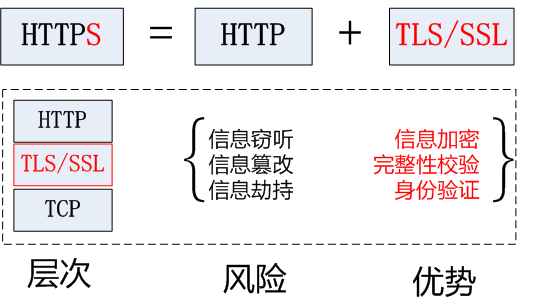
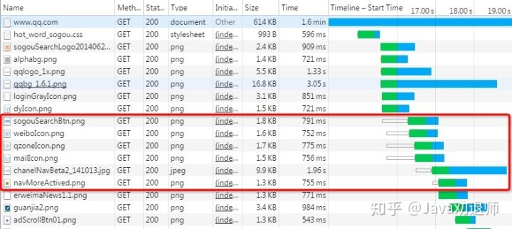
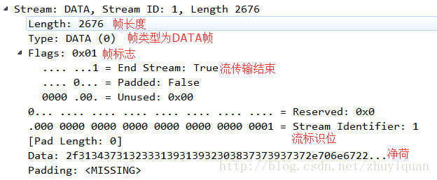
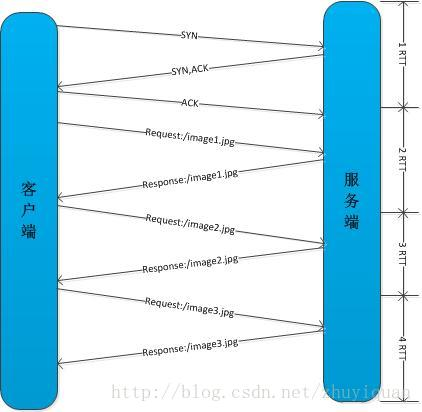
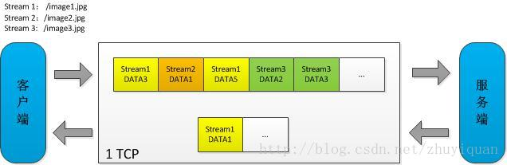
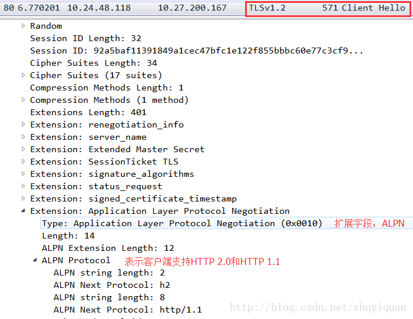
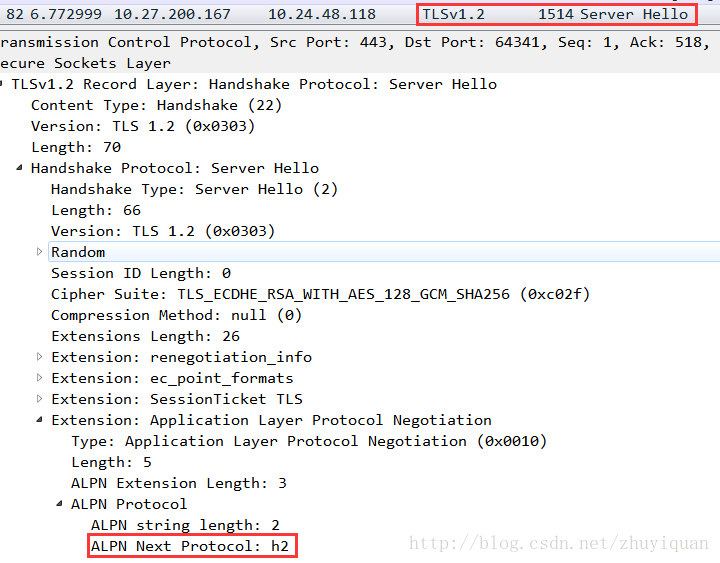
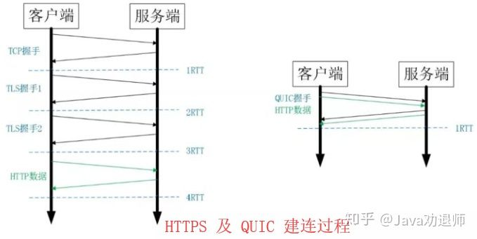
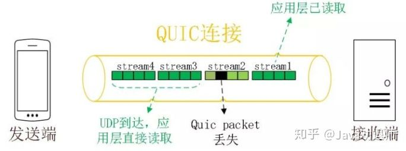
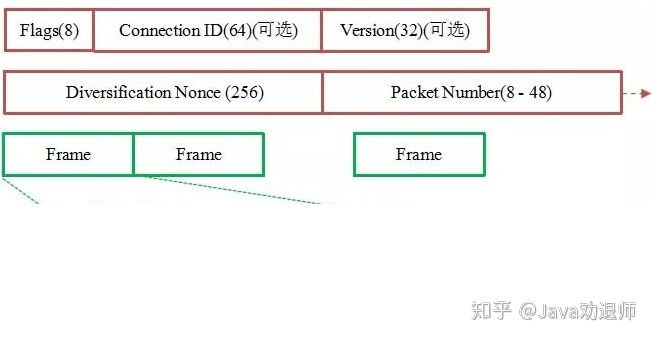

梳理计算机网络的知识

<!--more-->

## 计算机网络


**大白话，就是**URI是抽象的定义，不管用什么方法表示，只要能定位一个资源，就叫URI，本来设想的的使用两种方法定位：1，URL，用地址定位；2，URN 用名称定位。

通过URL找到资源是对网络位置进行标识，如：
通过URI找到资源是通过对名称进行标识，这个名称在某命名空间中，并不代表网络地址，如：**urn:issn:1535-3613**

**URI 是统一资源标识符，而 URL 是统一资源定位符。**因此，笼统地说，每个 URL 都是 URI，但不一定每个 URI 都是 URL。这是因为 URI 还包括一个子类，即统一资源名称 (URN)，它命名资源但不指定如何定位资源。上面的 mailto、news 和 isbn URI 都是 URN 的示例。

URI 和 URL 概念上的不同反映在此类和 URL 类的不同中。


此类的实例代表由 RFC 2396 定义的语法意义上的一个 URI 引用。URI 可以是绝对的，也可以是相对的。对 URI 字符串按照一般语法进行解析，不考虑它所指定的方案（如果有）不对主机（如果有）执行查找，也不构造依赖于方案的流处理程序。相等性、哈希计算以及比较都严格地根据实例的字符内容进行定义。**换句话说，一个 URI 实例和一个支持语法意义上的、依赖于方案的比较、规范化、解析和相对化计算的结构化字符串差不多。**


**作为对照，URL 类的实例代表了 URL 的语法组成部分以及访问它描述的资源所需的信息。URL 必须是绝对的，即它必须始终指定一个方案。**URL 字符串按照其方案进行解析。通常会为 URL 建立一个流处理程序，实际上无法为未提供处理程序的方案创建一个 URL 实例。相等性和哈希计算依赖于方案和主机的 Internet 地址（如果有）；没有定义比较。**换句话说，URL 是一个结构化字符串，它支持解析的语法运算以及查找主机和打开到指定资源的连接之类的网络 I/O 操作。**


**URI类不包含任何访问资源的方法，它唯一的作用就是解析。**

**相反的是，URL类可以打开一个到达资源的流。**

**URI—Uniform Resource Identifier通用资源标志符**Web上可用的每种资源如HTML文档、图像、视频片段、程序等都是一个来URI来定位的
URI一般由三部组成
①访问资源的命名机制
②存放资源的主机名
③资源自身的名称，由路径表示，着重强调于资源。


**URL—Uniform Resource Location统一资源定位符**URL是Internet上用来描述信息资源的字符串，主要用在各种WWW客户程序和服务器程序上，特别是著名的Mosaic。
采用URL可以用一种统一的格式来描述各种信息资源，包括文件、服务器的地址和目录等。
URL一般由三部组成
①协议(或称为服务方式)
②存有该资源的主机IP地址(有时也包括端口号)
③主机资源的具体地址。如目录和文件名等


### 五层协议

- **应用层** ：为特定应用程序提供数据传输服务，例如 HTTP、DNS 等协议。数据单位为报文。
- **传输层** ：为进程提供通用数据传输服务。由于应用层协议很多，定义通用的传输层协议就可以支持不断增多的应用层协议。运输层包括两种协议：传输控制协议 TCP，提供面向连接、可靠的数据传输服务，数据单位为报文段；用户数据报协议 UDP，提供无连接、尽最大努力的数据传输服务，数据单位为用户数据报。TCP 主要提供完整性服务，UDP 主要提供及时性服务。
- **网络层** ：为主机提供数据传输服务。而传输层协议是为主机中的进程提供数据传输服务。网络层把传输层传递下来的报文段或者用户数据报封装成分组。
- **数据链路层** ：网络层针对的还是主机之间的数据传输服务，而主机之间可以有很多链路，链路层协议就是为同一链路的主机提供数据传输服务。数据链路层把网络层传下来的分组封装成帧。
- **物理层** ：考虑的是怎样在传输媒体上传输数据比特流，而不是指具体的传输媒体。物理层的作用是尽可能屏蔽传输媒体和通信手段的差异，使数据链路层感觉不到这些差异。

#### OSI

其中表示层和会话层用途如下：

- **表示层** ：数据压缩、加密以及数据描述，这使得应用程序不必关心在各台主机中数据内部格式不同的问题。
- **会话层** ：建立及管理会话。

五层协议没有表示层和会话层，而是将这些功能留给应用程序开发者处理。

#### TCP/IP

它只有四层，相当于五层协议中数据链路层和物理层合并为网络接口层。

TCP/IP 体系结构不严格遵循 OSI 分层概念，应用层可能会直接使用 IP 层或者网络接口层。

基于TCP的应用层协议有：SMTP、TELNET、HTTP、FTP

基于UDP的应用层协议：DNS、TFTP（简单文件传输协议）、RIP（路由选择协议）、DHCP、BOOTP（是DHCP的前身）、IGMP（Internet组管理协议）

DNS占用53号端口，同时使用TCP和UDP协议。
**DNS区域传输的时候使用TCP协议**
**域名解析时使用UDP协议**

[](https://github.com/CyC2018/CS-Notes/blob/master/notes/pics/48d79be8-085b-4862-8a9d-18402eb93b31.png)


**各个协议的作用和关系**
以太网(Ethernet)协议:解决局域网内点对点通信
IP协议: 解决多个局域网之间的通信
TCP协议: TCP 是以太网协议和IP协议的上层协议，也是应用层协议的下层协议
TCP 协议: 保证数据通信的完整性和可靠性，防止丢包。IP协议只是一个地址协议,并不保证数据包的完整。如果路由器丢包(比如缓存满了,新进来的数据包就会丢失),就需要发现丢了哪一个包,以及如何重新发送这个包.这就要依靠TCP协议。

### 传输层

#### UDP 和 TCP 的特点

- 用户数据报协议 UDP（User Datagram Protocol）是无连接的，尽最大可能交付，没有拥塞控制，面向报文（对于应用程序传下来的报文不合并也不拆分，只是添加 UDP 首部），支持一对一、一对多、多对一和多对多的交互通信。
- 传输控制协议 TCP（Transmission Control Protocol）是面向连接的，提供可靠交付，有流量控制，拥塞控制，提供全双工通信，面向字节流（把应用层传下来的报文看成字节流，把字节流组织成大小不等的数据块），每一条 TCP 连接只能是点对点的（一对一）。

#### UDP 首部格式

首部字段只有 8 个字节，包括源端口、目的端口、长度、检验和。12 字节的伪首部是为了计算检验和临时添加的。


#### TCP 首部格式


- **序号** ：用于对字节流进行编号，例如序号为 301，表示第一个字节的编号为 301，如果携带的数据长度为 100 字节，那么下一个报文段的序号应为 401。
- **确认号** ：期望收到的下一个报文段的序号。例如 B 正确收到 A 发送来的一个报文段，序号为 501，携带的数据长度为 200 字节，因此 B 期望下一个报文段的序号为 701，B 发送给 A 的确认报文段中确认号就为 701。
- **数据偏移** ：指的是数据部分距离报文段起始处的偏移量，实际上指的是首部的长度。
- **确认 ACK** ：当 ACK=1 时确认号字段有效，否则无效。TCP 规定，在连接建立后所有传送的报文段都必须把 ACK 置 1。
- **同步 SYN** ：在连接建立时用来同步序号。当 SYN=1，ACK=0 时表示这是一个连接请求报文段。若对方同意建立连接，则响应报文中 SYN=1，ACK=1。
- **终止 FIN** ：用来释放一个连接，当 FIN=1 时，表示此报文段的发送方的数据已发送完毕，并要求释放连接。
- **窗口** ：窗口值作为接收方让发送方设置其发送窗口的依据。之所以要有这个限制，是因为接收方的数据缓存空间是有限的。

#### TCP 的三次握手


假设 A 为客户端，B 为服务器端。

- 首先 B 处于 LISTEN（监听）状态，等待客户的连接请求。
- A 向 B 发送连接请求报文，SYN=1，ACK=0，选择一个初始的序号 x。
- B 收到连接请求报文，如果同意建立连接，则向 A 发送连接确认报文，SYN=1，ACK=1，确认号为 x+1，同时也选择一个初始的序号 y。
- A 收到 B 的连接确认报文后，还要向 B 发出确认，确认号为 y+1，序号为 x+1。
- B 收到 A 的确认后，连接建立。

**三次握手的原因**

第三次握手是为了防止失效的连接请求到达服务器，让服务器错误打开连接。

客户端发送的连接请求如果在网络中滞留，那么就会隔很长一段时间才能收到服务器端发回的连接确认。客户端等待一个超时重传时间之后，就会重新请求连接。但是这个滞留的连接请求最后还是会到达服务器，如果不进行三次握手，那么服务器就会打开两个连接。如果有第三次握手，客户端会忽略服务器之后发送的对滞留连接请求的连接确认，不进行第三次握手，因此就不会再次打开连接。

#### TCP 的四次挥手

[](https://github.com/CyC2018/CS-Notes/blob/master/notes/pics/f87afe72-c2df-4c12-ac03-9b8d581a8af8.jpg)


以下描述不讨论序号和确认号，因为序号和确认号的规则比较简单。并且不讨论 ACK，因为 ACK 在连接建立之后都为 1。

- A 发送连接释放报文，FIN=1。
- B 收到之后发出确认，此时 TCP 属于半关闭状态，B 能向 A 发送数据但是 A 不能向 B 发送数据。
- 当 B 不再需要连接时，发送连接释放报文，FIN=1。
- A 收到后发出确认，进入 TIME-WAIT 状态，等待 2 MSL（最大报文存活时间）后释放连接。
- B 收到 A 的确认后释放连接。

**四次挥手的原因**

客户端发送了 FIN 连接释放报文之后，服务器收到了这个报文，就进入了 CLOSE-WAIT 状态。这个状态是为了让服务器端发送还未传送完毕的数据，传送完毕之后，服务器会发送 FIN 连接释放报文。

**TIME_WAIT**

客户端接收到服务器端的 FIN 报文后进入此状态，此时并不是直接进入 CLOSED 状态，还需要等待一个时间计时器设置的时间 2MSL。这么做有两个理由：

- 确保最后一个确认报文能够到达。如果 B 没收到 A 发送来的确认报文，那么就会重新发送连接释放请求报文，A 等待一段时间就是为了处理这种情况的发生。
- 等待一段时间是为了让本连接持续时间内所产生的所有报文都从网络中消失，使得下一个新的连接不会出现旧的连接请求报文。

#### TCP 可靠传输

TCP 使用超时重传来实现可靠传输：如果一个已经发送的报文段在超时时间内没有收到确认，那么就重传这个报文段。

一个报文段从发送再到接收到确认所经过的时间称为往返时间 RTT，加权平均往返时间 RTTs 计算如下：

[](https://camo.githubusercontent.com/02e9a4a23b05bcf814d9e5d0c1b79a6bb5ae2aee/68747470733a2f2f6c617465782e636f6465636f67732e636f6d2f6769662e6c617465783f525454733d28312d61292a2852545473292b612a525454)


其中，0 ≤ a ＜ 1，RTTs 随着 a 的增加更容易受到 RTT 的影响。

超时时间 RTO 应该略大于 RTTs，TCP 使用的超时时间计算如下：

[](https://camo.githubusercontent.com/da3da0a6cad7ef2af7d7adcd2940277780c35325/68747470733a2f2f6c617465782e636f6465636f67732e636f6d2f6769662e6c617465783f52544f3d525454732b342a5254545f64)


其中 RTTd 为偏差的加权平均值。

#### TCP 滑动窗口

窗口是缓存的一部分，用来暂时存放字节流。发送方和接收方各有一个窗口，接收方通过 TCP 报文段中的窗口字段告诉发送方自己的窗口大小，发送方根据这个值和其它信息设置自己的窗口大小。

发送窗口内的字节都允许被发送，接收窗口内的字节都允许被接收。如果发送窗口左部的字节已经发送并且收到了确认，那么就将发送窗口向右滑动一定距离，直到左部第一个字节不是已发送并且已确认的状态；接收窗口的滑动类似，接收窗口左部字节已经发送确认并交付主机，就向右滑动接收窗口。

接收窗口只会对窗口内最后一个按序到达的字节进行确认，例如接收窗口已经收到的字节为 {31, 34, 35}，其中 {31} 按序到达，而 {34, 35} 就不是，因此只对字节 31 进行确认。发送方得到一个字节的确认之后，就知道这个字节之前的所有字节都已经被接收。

[](https://github.com/CyC2018/CS-Notes/blob/master/notes/pics/a3253deb-8d21-40a1-aae4-7d178e4aa319.jpg)

#### TCP 流量控制

流量控制是为了控制发送方发送速率，保证接收方来得及接收。

接收方发送的确认报文中的窗口字段可以用来控制发送方窗口大小，从而影响发送方的发送速率。将窗口字段设置为 0，则发送方不能发送数据。

#### TCP 拥塞控制

如果网络出现拥塞，分组将会丢失，此时发送方会继续重传，从而导致网络拥塞程度更高。因此当出现拥塞时，应当控制发送方的速率。这一点和流量控制很像，但是出发点不同。流量控制是为了让接收方能来得及接收，而拥塞控制是为了降低整个网络的拥塞程度。

[](https://github.com/CyC2018/CS-Notes/blob/master/notes/pics/51e2ed95-65b8-4ae9-8af3-65602d452a25.jpg)


TCP 主要通过四个算法来进行拥塞控制：慢开始、拥塞避免、快重传、快恢复。

发送方需要维护一个叫做拥塞窗口（cwnd）的状态变量，注意拥塞窗口与发送方窗口的区别：拥塞窗口只是一个状态变量，实际决定发送方能发送多少数据的是发送方窗口。

为了便于讨论，做如下假设：

- 接收方有足够大的接收缓存，因此不会发生流量控制；
- 虽然 TCP 的窗口基于字节，但是这里设窗口的大小单位为报文段。

[](https://github.com/CyC2018/CS-Notes/blob/master/notes/pics/910f613f-514f-4534-87dd-9b4699d59d31.png)

##### 慢启动与拥塞避免

发送的最初执行慢开始，令 cwnd = 1，发送方只能发送 1 个报文段；当收到确认后，将 cwnd 加倍，因此之后发送方能够发送的报文段数量为：2、4、8 ...

注意到慢开始每个轮次都将 cwnd 加倍，这样会让 cwnd 增长速度非常快，从而使得发送方发送的速度增长速度过快，网络拥塞的可能性也就更高。设置一个慢开始门限 ssthresh，当 cwnd >= ssthresh 时，进入拥塞避免，每个轮次只将 cwnd 加 1。

如果出现了超时，则令 ssthresh = cwnd / 2，然后重新执行慢开始。

##### 快重传与快恢复

在接收方，要求每次接收到报文段都应该对最后一个已收到的有序报文段进行确认。例如已经接收到 M1 和 M2，此时收到 M4，应当发送对 M2 的确认。

在发送方，如果收到三个重复确认，那么可以知道下一个报文段丢失，此时执行快重传，立即重传下一个报文段。例如收到三个 M2，则 M3 丢失，立即重传 M3。

在这种情况下，只是丢失个别报文段，而不是网络拥塞。因此执行快恢复，令 ssthresh = cwnd / 2 ，cwnd = ssthresh，注意到此时直接进入拥塞避免。

慢开始和快恢复的快慢指的是 cwnd 的设定值，而不是 cwnd 的增长速率。慢开始 cwnd 设定为 1，而快恢复 cwnd 设定为 ssthresh。

[](https://github.com/CyC2018/CS-Notes/blob/master/notes/pics/f61b5419-c94a-4df1-8d4d-aed9ae8cc6d5.png)

### 应用层—HTTP

#### 一 、基础概念

#### 请求和响应报文

1. 请求报文

[](https://github.com/CyC2018/CS-Notes/blob/master/notes/pics/HTTP_RequestMessageExample.png)


Http请求报文由三部分组成：请求行，请求头，请求体

请求行：请求方法、请求地址、协议名称和版本号
请求头：Referer、User-Agent、Accept、Cookie、Cache-Control、Content-Length等属性。Content-Length可用于服务端判断消息接受完的条件
请求体：GET请求与POST请求传递方式不同(Message Body)


Accept：浏览器可接受的MIME类型。
Accept-Charset：浏览器可接受的[字符集](https://baike.baidu.com/item/字符集)。
Accept-Encoding：浏览器能够进行解码的数据编码方式，比如gzip。Servlet能够向支持gzip的浏览器返回经gzip编码的HTML页面。许多情形下这可以减少5到10倍的下载时间。
Accept-Language：浏览器所希望的语言种类，当服务器能够提供一种以上的语言版本时要用到。

Authorization：授权信息，通常出现在对服务器发送的WWW-Authenticate头的应答中。

Connection：表示是否需要[持久连接](https://baike.baidu.com/item/持久连接)。

Content-Length：表示请求消息正文的长度。

**Cookie：这是最重要的请求头信息之一**

From：请求发送者的email地址，由一些特殊的Web客户程序使用，浏览器不会用到它。

Host：初始URL中的[主机](https://baike.baidu.com/item/主机)和端口。

If-Modified-Since：只有当所请求的内容在指定的日期之后又经过修改才返回它，否则返回304“Not Modified”应答。

Pragma：指定“no-cache”值表示服务器必须返回一个刷新后的文档，即使它是[代理服务器](https://baike.baidu.com/item/代理服务器)而且已经有了页面的本地拷贝。

**Referer：包含一个URL，用户从该URL代表的页面出发访问当前请求的页面。**

User-Agent：浏览器类型，如果Servlet返回的内容与浏览器类型有关则该值非常有用。


POST 请求体类型分类
**form-data**：就是http请求中的multipart/form-data,它会将表单的数据处理为一条消息，以标签为单元，用分隔符分开。既可以上传键值对，也可以上传文件。当上传的字段是文件时，会有Content-Type来表名文件类型；content-disposition，用来说明字段的一些信息；由于有boundary隔离，所以multipart/form-data既可以上传文件，也可以上传键值对，它采用了键值对的方式，所以可以上传多个文件。可以模拟填写表单，并且提交表单。可以选择文件类型，但不能保存历史记录
**x-www-form-urlencoded**：就是application/x-www-from-urlencoded,会将表单内的数据转换为键值对
**raw**：原生任意格式的文本，text、json、xml、html
**binary**：相当于Content-Type:application/octet-stream,从字面意思得知，只可以上传二进制数据，通常用来上传文件，由于没有键值，所以，一次只能上传一个文件。image, audio or video files.text files，也不能保存历史记录，每次选择文件，提交


2. 响应报文

[](https://github.com/CyC2018/CS-Notes/blob/master/notes/pics/HTTP_ResponseMessageExample.png)

响应行：报文协议及版本，状态码及状态描述
响应头：Referer、User-Agent、Accept、Cookie、Cache-Control等属性
响应体：服务器返回的数据


Allow 服务器支持哪些请求方法（如GET、POST等）。

Content-Encoding 文档的编码（Encode）方法。只有在解码之后才可以得到Content-Type头指定的内容类型。利用gzip压缩文档能够显著地减少HTML文档的下载时间。

Content-Length 表示内容长度。只有当浏览器使用持久HTTP连接时才需要这个数据。如果你想要利用[持久连接](https://baike.baidu.com/item/持久连接)的优势，可以把输出文档写入ByteArrayOutputStram，完成后查看其大小，然后把该值放入Content-Length头，最后通过byteArrayStream.writeTo(response.getOutputStream()发送内容。

Content-Type 表示后面的文档属于什么MIME类型。Servlet默认为text/plain，但通常需要显式地指定为text/html。由于经常要设置Content-Type，因此HttpServletResponse提供了一个专用的方法setContentType。

Date 当前的GMT时间。你可以用setDateHeader来设置这个头以避免转换时间格式的麻烦。

Expires 应该在什么时候认为文档已经过期，从而不再缓存它？

Last-Modified 文档的最后改动时间。客户可以通过If-Modified-Since请求头提供一个日期，该请求将被视为一个条件GET，只有改动时间迟于指定时间的文档才会返回，否则返回一个304（Not Modified）状态。Last-Modified也可用setDateHeader方法来设置。

Location 表示客户应当到哪里去提取文档。

Refresh 表示浏览器应该在多少时间之后刷新文档，以秒计。除了刷新当前文档之外，你还可以通过setHeader("Refresh", "5; URL=http://host/path")让浏览器读取指定的页面。注意这种功能通常是通过设置HTML页面HEAD区的<META HTTP-EQUIV="Refresh" CONTENT="5;URL=http://host/path">实现，这是因为，自动刷新或重定向对于那些不能使用CGI或Servlet的HTML编写者十分重要。但是，对于Servlet来说，直接设置Refresh头更加方便。注意Refresh的意义是“N秒之后刷新本页面或访问指定页面”，而不是“每隔N秒刷新本页面或访问指定页面”。因此，连续刷新要求每次都发送一个Refresh头，而发送204[状态代码](https://baike.baidu.com/item/状态代码)则可以阻止浏览器继续刷新，不管是使用Refresh头还是<META HTTP-EQUIV="Refresh" ...>。注意Refresh头不属于HTTP 1.1正式规范的一部分，而是一个扩展，但Netscape和IE都支持它。

Server 服务器名字。Servlet一般不设置这个值，而是由Web服务器自己设置。

**Set-Cookie 设置和页面关联的Cookie。**

WWW-Authenticate 客户应该在Authorization头中提供什么类型的授权信息？在包含401（Unauthorized）状态行的应答中这个头是必需的。例如，response.setHeader("WWW-Authenticate", "BASIC realm=\"executives\"")。注意Servlet一般不进行这方面的处理，而是让Web服务器的专门机制来控制受密码保护页面的访问（例如.htaccess）。

#### 二、HTTP 方法

客户端发送的 **请求报文** 第一行为请求行，包含了方法字段。

##### GET

> 获取资源

当前网络请求中，绝大部分使用的是 GET 方法。

##### HEAD

> 获取报文首部

和 GET 方法类似，但是不返回报文实体主体部分。

主要用于确认 URL 的有效性以及资源更新的日期时间等。

##### POST

> 传输实体主体

POST 主要用来传输数据，而 GET 主要用来获取资源。

更多 POST 与 GET 的比较请见第九章。


GET产生一个TCP数据包；POST产生两个TCP数据包。

 

长的说：

对于GET方式的请求，浏览器会把http header和data一并发送出去，服务器响应200（返回数据）；

而对于POST，浏览器先发送header，服务器响应100 continue，浏览器再发送data，服务器响应200 ok（返回数据）。

- GET在浏览器回退时是无害的，而POST会再次提交请求。

   

- GET产生的URL地址可以被Bookmark，而POST不可以。

   

- GET请求会被浏览器主动cache，而POST不会，除非手动设置。

   

- GET请求只能进行url编码，而POST支持多种编码方式。

   

- GET请求参数会被完整保留在浏览器历史记录里，而POST中的参数不会被保留。

   

- GET请求在URL中传送的参数是有长度限制的，而POST么有。

   

- 对参数的数据类型，GET只接受ASCII字符，而POST没有限制。

   

- GET比POST更不安全，因为参数直接暴露在URL上，所以不能用来传递敏感信息。

   

- GET参数通过URL传递，POST放在Request body中。


##### PUT

> 上传文件

由于自身不带验证机制，任何人都可以上传文件，因此存在安全性问题，一般不使用该方法。

```
PUT /new.html HTTP/1.1
Host: example.com
Content-type: text/html
Content-length: 16

<p>New File</p>
```

##### PATCH

> 对资源进行部分修改

PUT 也可以用于修改资源，但是只能完全替代原始资源，PATCH 允许部分修改。

```
PATCH /file.txt HTTP/1.1
Host: www.example.com
Content-Type: application/example
If-Match: "e0023aa4e"
Content-Length: 100

[description of changes]
```

##### DELETE

> 删除文件

与 PUT 功能相反，并且同样不带验证机制。

```
DELETE /file.html HTTP/1.1
```

##### OPTIONS

> 查询支持的方法

查询指定的 URL 能够支持的方法。

会返回 `Allow: GET, POST, HEAD, OPTIONS` 这样的内容。

##### CONNECT

> 要求在与代理服务器通信时建立隧道

使用 SSL（Secure Sockets Layer，安全套接层）和 TLS（Transport Layer Security，传输层安全）协议把通信内容加密后经网络隧道传输。

```
CONNECT www.example.com:443 HTTP/1.1
```

[](https://github.com/CyC2018/CS-Notes/blob/master/notes/pics/dc00f70e-c5c8-4d20-baf1-2d70014a97e3.jpg)

##### TRACE

> 追踪路径

服务器会将通信路径返回给客户端。

发送请求时，在 Max-Forwards 首部字段中填入数值，每经过一个服务器就会减 1，当数值为 0 时就停止传输。

通常不会使用 TRACE，并且它容易受到 XST 攻击（Cross-Site Tracing，跨站追踪）。

##### **GET 和 POST 比较**

**作用**

GET 用于获取资源，而 POST 用于传输实体主体。

**参数**

GET 和 POST 的请求都能使用额外的参数，但是 GET 的参数是以查询字符串出现在 URL 中，而 POST 的参数存储在实体主体中。不能因为 POST 参数存储在实体主体中就认为它的安全性更高，因为照样可以通过一些抓包工具（Fiddler）查看。

因为 URL 只支持 ASCII 码，因此 GET 的参数中如果存在中文等字符就需要先进行编码。例如 `中文` 会转换为 `%E4%B8%AD%E6%96%87`，而空格会转换为 `%20`。POST 参数支持标准字符集。

```
GET /test/demo_form.asp?name1=value1&name2=value2 HTTP/1.1
POST /test/demo_form.asp HTTP/1.1
Host: w3schools.com
name1=value1&name2=value2
```

**安全**

安全的 HTTP 方法不会改变服务器状态，也就是说它只是可读的。

GET 方法是安全的，而 POST 却不是，因为 POST 的目的是传送实体主体内容，这个内容可能是用户上传的表单数据，上传成功之后，服务器可能把这个数据存储到数据库中，因此状态也就发生了改变。

安全的方法除了 GET 之外还有：HEAD、OPTIONS。

不安全的方法除了 POST 之外还有 PUT、DELETE。

**幂等性**

幂等的 HTTP 方法，同样的请求被执行一次与连续执行多次的效果是一样的，服务器的状态也是一样的。换句话说就是，幂等方法不应该具有副作用（统计用途除外）。

所有的安全方法也都是幂等的。

在正确实现的条件下，GET，HEAD，PUT 和 DELETE 等方法都是幂等的，而 POST 方法不是。

GET /pageX HTTP/1.1 是幂等的，连续调用多次，客户端接收到的结果都是一样的：

```
GET /pageX HTTP/1.1
GET /pageX HTTP/1.1
GET /pageX HTTP/1.1
GET /pageX HTTP/1.1
```

POST /add_row HTTP/1.1 不是幂等的，如果调用多次，就会增加多行记录：

```
POST /add_row HTTP/1.1   -> Adds a 1nd row
POST /add_row HTTP/1.1   -> Adds a 2nd row
POST /add_row HTTP/1.1   -> Adds a 3rd row
```

DELETE /idX/delete HTTP/1.1 是幂等的，即使不同的请求接收到的状态码不一样：

```
DELETE /idX/delete HTTP/1.1   -> Returns 200 if idX exists
DELETE /idX/delete HTTP/1.1   -> Returns 404 as it just got deleted
DELETE /idX/delete HTTP/1.1   -> Returns 404
```

**可缓存**

如果要对响应进行缓存，需要满足以下条件：

- 请求报文的 HTTP 方法本身是可缓存的，包括 GET 和 HEAD，但是 PUT 和 DELETE 不可缓存，POST 在多数情况下不可缓存的。
- 响应报文的状态码是可缓存的，包括：200, 203, 204, 206, 300, 301, 404, 405, 410, 414, and 501。
- 响应报文的 Cache-Control 首部字段没有指定不进行缓存。

**XMLHttpRequest**

- 在使用 XMLHttpRequest 的 POST 方法时，浏览器会先发送 Header 再发送 Data。但并不是所有浏览器会这么做，例如火狐就不会。
- 而 GET 方法 Header 和 Data 会一起发送。

#### 三、HTTP 状态码

服务器返回的 **响应报文** 中第一行为状态行，包含了状态码以及原因短语，用来告知客户端请求的结果。

| 状态码 | 类别                             | 含义                       |
| ------ | -------------------------------- | -------------------------- |
| 1XX    | Informational（信息性状态码）    | 接收的请求正在处理         |
| 2XX    | Success（成功状态码）            | 请求正常处理完毕           |
| 3XX    | Redirection（重定向状态码）      | 需要进行附加操作以完成请求 |
| 4XX    | Client Error（客户端错误状态码） | 服务器无法处理请求         |
| 5XX    | Server Error（服务器错误状态码） | 服务器处理请求出错         |

1XX 信息

- **100 Continue** ：表明到目前为止都很正常，客户端可以继续发送请求或者忽略这个响应。

2XX 成功

- **200 OK**
- **204 No Content** ：请求已经成功处理，但是返回的响应报文不包含实体的主体部分。一般在只需要从客户端往服务器发送信息，而不需要返回数据时使用。
- **206 Partial Content** ：表示客户端进行了范围请求，响应报文包含由 Content-Range 指定范围的实体内容。

3XX 重定向

- **301 Moved Permanently** ：永久性重定向
- **302 Found** ：临时性重定向
- **303 See Other** ：和 302 有着相同的功能，但是 303 明确要求客户端应该采用 GET 方法获取资源。
- 注：虽然 HTTP 协议规定 301、302 状态下重定向时不允许把 POST 方法改成 GET 方法，但是大多数浏览器都会在 301、302 和 303 状态下的重定向把 POST 方法改成 GET 方法。
- **304 Not Modified** ：如果请求报文首部包含一些条件，例如：If-Match，If-Modified-Since，If-None-Match，If-Range，If-Unmodified-Since，如果不满足条件，则服务器会返回 304 状态码。
- **307 Temporary Redirect** ：临时重定向，与 302 的含义类似，但是 307 要求浏览器不会把重定向请求的 POST 方法改成 GET 方法。

4XX 客户端错误

- **400 Bad Request** ：请求报文中存在语法错误。
- **401 Unauthorized** ：该状态码表示发送的请求需要有认证信息（BASIC 认证、DIGEST 认证）。如果之前已进行过一次请求，则表示用户认证失败。
- **403 Forbidden** ：请求被拒绝。
- **404 Not Found**

5XX 服务器错误

- **500 Internal Server Error** ：服务器正在执行请求时发生错误。
- **503 Service Unavailable** ：服务器暂时处于超负载或正在进行停机维护，现在无法处理请求。

#### 四、具体应用

**连接管理**

1. 短连接与长连接

当浏览器访问一个包含多张图片的 HTML 页面时，除了请求访问的 HTML 页面资源，还会请求图片资源。如果每进行一次 HTTP 通信就要新建一个 TCP 连接，那么开销会很大。

长连接只需要建立一次 TCP 连接就能进行多次 HTTP 通信。

- 从 HTTP/1.1 开始默认是长连接的，如果要断开连接，需要由客户端或者服务器端提出断开，使用 `Connection : close`；
- 在 HTTP/1.1 之前默认是短连接的，如果需要使用长连接，则使用 `Connection : Keep-Alive`。

2. 流水线

默认情况下，HTTP 请求是按顺序发出的，下一个请求只有在当前请求收到响应之后才会被发出。由于受到网络延迟和带宽的限制，在下一个请求被发送到服务器之前，可能需要等待很长时间。

流水线是在同一条长连接上连续发出请求，而不用等待响应返回，这样可以减少延迟。

#### 五、HTTPS

HTTP 有以下安全性问题：

- 使用明文进行通信，内容可能会被窃听；
- 不验证通信方的身份，通信方的身份有可能遭遇伪装；
- 无法证明报文的完整性，报文有可能遭篡改。

HTTPS 并不是新协议，而是让 HTTP 先和 SSL（Secure Sockets Layer）通信，再由 SSL 和 TCP 通信，也就是说 HTTPS 使用了隧道进行通信。

通过使用 SSL，HTTPS 具有了加密（防窃听）、认证（防伪装）和完整性保护（防篡改）。

[](https://github.com/CyC2018/CS-Notes/blob/master/notes/pics/ssl-offloading.jpg)

**非对称密钥加密**

非对称密钥加密，又称公开密钥加密（Public-Key Encryption），加密和解密使用不同的密钥。

公开密钥所有人都可以获得，通信发送方获得接收方的公开密钥之后，就可以使用公开密钥进行加密，接收方收到通信内容后使用私有密钥解密。

非对称密钥除了用来加密，还可以用来进行签名。因为私有密钥无法被其他人获取，因此通信发送方使用其私有密钥进行签名，通信接收方使用发送方的公开密钥对签名进行解密，就能判断这个签名是否正确。

- 优点：可以更安全地将公开密钥传输给通信发送方；
- 缺点：运算速度慢。

[](https://github.com/CyC2018/CS-Notes/blob/master/notes/pics/39ccb299-ee99-4dd1-b8b4-2f9ec9495cb4.png)

**HTTPS 采用的加密方式**

HTTPS 采用混合的加密机制，使用非对称密钥加密用于传输对称密钥来保证传输过程的安全性，之后使用对称密钥加密进行通信来保证通信过程的效率。（下图中的 Session Key 就是对称密钥），而服务器公钥只用于加密”**Session Key **“本身，这样就减少了加密运算的消耗时间。

[](https://github.com/CyC2018/CS-Notes/blob/master/notes/pics/How-HTTPS-Works.png)

如上图所示，整个SSL/TLS握手阶段一共有4次通信：

1.客户端发出请求（ClientHello）：随机数1，支持的协议，支持的加密方法

首先，客户端先向服务器发出加密通信的请求，并向服务器提供以下信息：

- 支持的协议版本，如TLS 1.0
- 一个客户端生成的随机数，稍后用于生成对话密钥
- 支持的加密方法，如RSA公钥加密
- 支持的压缩方法

2.服务器回应（ServerHello）：随机数2，确认协议和加密方法，证书

- 确认加密通信协议版本。如果浏览器与服务器支持的版本不一致，则服务器关闭加密通信
- 一个服务器生成的随机数，稍后用于生成对话密钥
- 确认加密方法
- 服务器证书

此处，如果服务器需要确认客户端的身份，如金融机构需要客户提供USB密钥（U盾），就会向客户端请求证书。

3.客户端回应：随机数3（加密 session key，根据前面随机数生成，证书中公钥加密），编码通知

- 一个随机数，稍后用于生成对话密钥，并且只用服务器的公钥加密，防止被窃听
- 编码改变通知，表示随后的信息都将用双方商定的加密方法和密钥发送
- 客户端握手结束通知，表示客户端的握手阶段已经结束。这一项同时也是前面发送的所有内容的hash值，用来供服务器校验

如果前一步要求了客户端证书，则会发送证书及相关信息。

4.服务器回应：编码通知

- 编码改变通知，表示随后的信息都将用双方商定的加密方法和密钥发送
- 服务器握手结束通知，表示服务器的握手阶段已经结束。这一项同时也是前面发送的所有内容的hash值，用来供客户端校验

至此，整个握手阶段全部结束。接下来，客户端与服务器进入HTTPS加密通信，就完全是使用[普通的HTTP协议](https://www.flyzy2005.cn/tech/net/tcp-connecting-process/)，只不过用”**会话密钥**“加密内容。

**认证**

通过使用 **证书** 来对通信方进行认证。

数字证书认证机构（CA，Certificate Authority）是客户端与服务器双方都可信赖的第三方机构。

服务器的运营人员向 CA 提出公开密钥的申请，CA 在判明提出申请者的身份之后，会对已申请的公开密钥做数字签名，然后分配这个已签名的公开密钥，并将该公开密钥放入公开密钥证书后绑定在一起。




##### SSL

起初是因为HTTP在传输数据时使用的是明文（虽然说POST提交的数据时放在报体里看不到的，但是还是可以通过抓包工具窃取到）是不安全的，为了解决这一隐患**网景公司**（Netscape）推出了SSL安全套接字协议层(Secure Socket Layer 安全套接层)，SSL是基于HTTP之下TCP之上的一个协议层，是基于HTTP标准并对TCP传输数据时进行加密，所以HPPTS是HTTP+SSL/TCP的简称。

由于HTTPS的推出受到了很多人的欢迎，在SSL更新到3.0时，IETF对SSL3.0进行了标准化，并添加了少数机制(但是几乎和SSL3.0无差异)，标准化后的IETF更名为TLS1.0(Transport Layer Security 安全传输层协议)，可以说TLS就是SSL的新版本3.1

SSL协议位于TCP/IP协议与各种应用层协议之间，为数据通讯提供安全支持。SSL协议可分为两层： 

- SSL记录协议（SSL Record Protocol）：它建立在可靠的传输协议（如TCP）之上，为高层协议提供数据封装、压缩、加密等基本功能的支持。

- SSL握手协议（SSL Handshake Protocol）：它建立在SSL记录协议之上，用于在实际的数据传输开始前，通讯双方进行身份认证、协商加密算法、交换加密密钥等。

它利用对称加密、公私钥不对称加密及其密钥交换算法，CA系统进行加密且可信任的信息传输

在HTTP SSL中常用的对称加密算法有RC4,AES,3DES,Camellia等

SSL由从前的网景公司开发
有1,2,3三个版本，但现在只使用版本3

**SSL协议提供的服务主要有：**

　　1）认证用户和服务器，确保数据发送到正确的客户机和服务器；

　　2）加密数据以防止数据中途被窃取；

　　3）维护数据的完整性，确保数据在传输过程中不被改变。

**SSL协议的工作流程：**

　　**服务器认证阶段：**

　　1）客户端向服务器发送一个开始信息“Hello”以便开始一个新的会话连接；

　　2）服务器根据客户的信息确定是否需要生成新的主密钥，如需要则服务器在响应客户的“Hello”信息时将包含生成主密钥所需的信息；

　　3）客服根据收到的服务器响应信息，产生一个主密钥，并用服务器的公开密钥加密后传给服务器；

　　4）服务器恢复该主密钥，并返回给客户一个用主密钥认证的信息，以此让客户认证服务器。

　　用户认证阶段：在此之前，服务器已经通过了客户认证，这一阶段主要完成对客户的认证。经认证的服务器发送一个提问给客户，客户则返回（数字）签名后的提问和其公开密钥，从而向服务器提供认证。

##### TLS

传输层安全（Transport Layer Security，TLS）是更为安全的升级版 SSL。由于 SSL 这一术语更为常用，因此我们仍然将我们的安全证书称作 SSL。

该协议由两层组成： TLS 记录协议（TLS Record）和 TLS 握手协议（TLS Handshake）。

TLS 的最大优势就在于：TLS 是独立于应用协议。高层协议可以透明地分布在 TLS 协议上面。然而，TLS 标准并没有规定应用程序如何在 TLS 上增加安全性；它把如何启动 TLS 握手协议以及如何解释交换的认证证书的决定权留给协议的设计者和实施者来判断。

TLS/SSL是一种加密通道的规范

TLS是SSL的标准化后的产物
有1.0 1.1 1.2三个版本
默认使用1.0

TLS1.0和SSL3.0几乎没有区别

安全传输层协议（TLS）用于在两个通信应用程序之间提供保密性和数据完整性。

**TLS握手过程**

建立TCP连接后，开始建立TLS连接。下面抓包分析TLS握手过程，握手实际上是一种协商的过程，对协议所必需的一些参数进行协商。抓包图片来源于[传输层安全协议抓包分析之SSL/TLS](http://www.freebuf.com/articles/network/116497.html)


###### Client Hello

客户端告知服务端，自己**支持哪些加密算法**，所以客户端需要将本地支持的加密套件(Cipher Suite)的列表传送给服务端。除此之外，客户端还要产生一个**随机数**，这个随机数一方面需要在客户端保存，另一方面需要传送给服务端，客户端的随机数需 要跟服务端产生的随机数结合起来产生后面要讲到的Master Secret。

###### Server Hello

服务端在接收到客户端的Client Hello之后，服务端将自己的**证书**发送给客户端。这个证书是对于服务端的一种认证。证书是需要申请，并由专门的数字证书认证机构(CA)通过非常严格的审核之后颁发的电子证书。颁发证书的同时会产生一个私钥和公钥。私钥由服务端 自己保存，不可泄漏。公钥则是附带在证书的信息中，可以公开的。证书本身也附带一个证书电子签名，这个签名用来验证证书的完整性和真实性，可以防止证书被串改。另外，证书还有个有效期。

在服务端向客户端发送的证书中没有提供足够的信息的时候，还可以向客户端发送一个**Server Key Exchange**。

此外，对于非常重要的保密数据，服务端还需要对客户端进行验证，以保证数据传送给了安全的合法的客户端。服务端可以向客户端发出Cerficate Request消息，要求客户端发送证书对客户端的合法性进行验证。

跟客户端一样，服务端也需要产生一个**随机数**发送给客户端。客户端和服务端都需要使用这两个随机数来产生Master Secret。

最后服务端会发送一个Server Hello Done消息给客户端，表示Server Hello消息结束了。

###### Client Key Exchange

如果服务端需要对客户端进行验证，在客户端收到服务端的Server Hello消息之后，首先需要向服务端发送客户端的证书，让服务端来验证客户端的合法性。

**在此之前的所有TLS握手信息都是明文传送的。**在收到服务端的证书等信息之后，客户端会使用一些加密算法(例如：RSA, Diffie-Hellman)产生一个48个字节的Key，这个Key叫**PreMaster Secret**，很多材料上也被称作PreMaster Key, 最终通过Master secret生成session secret， session secret就是用来对应用数据进行加解密的。PreMaster secret属于一个保密的Key，只要截获PreMaster secret，就可以通过之前明文传送的随机数，最终计算出session
secret，所以PreMaster secret使用RSA非对称加密的方式，**使用服务端传过来的公钥进行加密**，然后传给服务端。

接着，客户端需要对服务端的证书进行检查，检查证书的完整性以及证书跟服务端域名是否吻合。

ChangeCipherSpec是一个独立的协议，体现在数据包中就是一个字节的数据，用于告知服务端，客户端已经切换到之前协商好的加密套件的状态，准备使用之前协商好的加密套件加密数据并传输了。

在ChangecipherSpec传输完毕之后，客户端会使用之前协商好的加密套件和session secret加密一段Finish的数据传送给服务端，此数据是为了在正式传输应用数据之前对刚刚握手建立起来的加解密通道进行验证。

###### Server Finish

服务端在接收到客户端传过来的**PreMaster加密数据之后，使用私钥对这段加密数据进行解密**，并对数据进行验证，也会使用跟客户端同样的方式**生 成session secret**，一切准备好之后，会给客户端发送一个ChangeCipherSpec，告知客户端已经切换到协商过的加密套件状态，准备使用加密套件和 session secret加密数据了。之后，服务端也会使用session secret加密后一段Finish消息发送给客户端，以验证之前通过握手建立起来的加解密通道是否成功。

根据之前的握手信息，如果客户端和服务端都能对Finish信息进行正常加解密且消息正确的被验证，则说明握手通道已经建立成功，接下来，双方可以使用上面产生的session secret对数据进行加密传输了。

###### 应用数据传输

在所有的握手阶段都完成之后，就可以开始传送应用数据了。应用数据在传输之前，首先要附加上MAC secret，然后再对这个数据包使用write encryption key进行加密。在服务端收到密文之后，使用Client write encryption key进行解密，客户端收到服务端的数据之后使用Server write encryption key进行解密，然后使用各自的write MAC key对数据的完整性包括是否被串改进行验证。

先非对称加密，获得一个session secret后用此进行对称加密

#### 六、HTTP/1.1新特性

- 默认是长连接
- 支持流水线
- 支持同时打开多个 TCP 连接
- 支持虚拟主机
- 新增状态码 100
- 支持分块传输编码
- 新增缓存处理指令 max-age Entity tag，If-Unmodified-Since, If-Match, If-None-Match
- **缓存处理**，在HTTP1.0中主要使用header里的If-Modified-Since,Expires来做为缓存判断的标准，HTTP1.1则引入了更多的缓存控制策略例如Entity tag，If-Unmodified-Since, If-Match, If-None-Match等更多可供选择的缓存头来控制缓存策略。
- **带宽优化及网络连接的使用**，HTTP1.0中，存在一些浪费带宽的现象，例如客户端只是需要某个对象的一部分，而服务器却将整个对象送过来了，并且不支持断点续传功能，HTTP1.1则在请求头引入了range头域，它允许只请求资源的某个部分，即返回码是206（Partial Content），这样就方便了开发者自由的选择以便于充分利用带宽和连接。
- **错误通知的管理**，在HTTP1.1中新增了24个错误状态响应码，如409（Conflict）表示请求的资源与资源的当前状态发生冲突；410（Gone）表示服务器上的某个资源被永久性的删除。
- **Host头处理**，在HTTP1.0中认为每台服务器都绑定一个唯一的IP地址，因此，请求消息中的URL并没有传递主机名（hostname）。但随着虚拟主机技术的发展，在一台物理服务器上可以存在多个虚拟主机（Multi-homed Web Servers），并且它们共享一个IP地址。HTTP1.1的请求消息和响应消息都应支持Host头域，且请求消息中如果没有Host头域会报告一个错误（400 Bad Request）。
- **长连接**，HTTP 1.1支持长连接（PersistentConnection）和请求的流水线（Pipelining）处理，在一个TCP连接上可以传送多个HTTP请求和响应，减少了建立和关闭连接的消耗和延迟，在HTTP1.1中默认开启Connection： keep-alive，一定程度上弥补了HTTP1.0每次请求都要创建连接的缺点。

#### 七、HTTP/2.0

**HTTP/1.x 缺陷**

HTTP/1.x 实现简单是以牺牲性能为代价的：

- 不支持有效的资源优先级，致使底层 TCP 连接的利用率低下。

- **连接无法复用**：连接无法复用会导致客户端需要使用多个连接才能实现并发和缩短延迟，每次请求都经历三次握手和慢启动。三次握手在高延迟的场景下影响较明显，慢启动则对大量小文件请求影响较大（没有达到最大窗口请求就被终止）。

- - HTTP/1.0 传输数据时，每次都需要重新建立连接，增加延迟。
  - HTTP/1.1 虽然加入 keep-alive 可以复用一部分连接，但域名分片等情况下仍然需要建立多个 connection，耗费资源，给服务器带来性能压力。

- **Head-Of-Line Blocking（HOLB，队头阻塞）**：这会导致带宽无法被充分利用，以及后续健康请求被阻塞。HOLB 是指一系列包（package）因为第一个包被阻塞；当页面中需要请求很多资源的时候，HOLB 会导致在达到最大请求数量时，剩余的资源需要等待其它资源请求完成后才能发起请求。

- - HTTP 1.0：下个请求必须在前一个请求返回后才能发出，`request-response`对按序发生。显然，如果某个请求长时间没有返回，那么接下来的请求就全部阻塞了。
  - HTTP 1.1：尝试使用 pipeling 来解决，即浏览器可以一次性发出多个请求（同个域名、同一条 TCP 链接）。但 pipeling 要求返回是按序的，那么前一个请求如果很耗时（比如处理大图片），那么后面的请求即使服务器已经处理完，仍会等待前面的请求处理完才开始按序返回。所以，pipeling 只部分解决了 HOLB。





如上图所示，红色圈出来的请求就因域名链接数已超过限制，而被挂起等待了一段时间。

- **协议开销大**： HTTP/1 在使用时，header 里携带的内容过大，在一定程度上增加了传输的成本，并且每次请求 header 基本不怎么变化，尤其在移动端增加用户流量。
- **安全因素**：HTTP/1 在传输数据时，所有传输的内容都是明文，客户端和服务器端都无法验证对方的身份，这在一定程度上无法保证数据的安全性。

谷歌公开了自行研发的 SPDY 协议，它主要解决 HTTP/1.1 效率不高的问题。SPDY 协议在 Chrome 浏览器上证明可行以后，就被当作 HTTP/2 的基础，主要特性都在 HTTP/2 之中得到继承。

**二进制分帧层**

HTTP/2.0 将报文分成 HEADERS 帧和 DATA 帧，它们都是二进制格式的。

[](https://github.com/CyC2018/CS-Notes/blob/master/notes/pics/86e6a91d-a285-447a-9345-c5484b8d0c47.png)


在通信过程中，只会有一个 TCP 连接存在，它承载了任意数量的双向数据流（Stream）。

- 一个数据流（Stream）都有一个唯一标识符和可选的优先级信息，用于承载双向信息。每个流有唯一整数标识符。为了防止两端流ID冲突，客户端发起的流具有奇数ID，服务器端发起的流具有偶数ID。**连接**可以承载任意数量的双向数据**流**Stream。 相应地， 每个数据流以 **消息**的形式发送， 而消息由一 或多个**帧**组成， **这些帧可以乱序发送， 然后根据每个帧首部的流标识符重新组装。**

- 消息（Message）是与逻辑请求或响应对应的完整的一系列帧。一系列数据帧组成了一个完整的消息。比如一系列DATA帧和一个HEADERS帧组成了请求消息。

- 帧（Frame）是最小的通信单位，来自不同数据流的帧可以交错发送，然后再根据每个帧头的数据流标识符重新组装。帧类型又可以分为：

  DATA：用于传输HTTP消息体；
  HEADERS：用于传输首部字段；
  SETTINGS：用于约定客户端和服务端的配置数据。比如设置初识的双向流量控制窗口大小；
  WINDOW_UPDATE：用于调整个别流或个别连接的流量
  PRIORITY： 用于指定或重新指定引用资源的优先级。
  RST_STREAM： 用于通知流的非正常终止。
  PUSH_ PROMISE： 服务端推送许可。
  PING： 用于计算往返时间，执行“ 活性” 检活。
  GOAWAY： 用于通知对端停止在当前连接中创建流。
  标志位用于不同的帧类型定义特定的消息标志。比如DATA帧就可以使用End Stream: true表示该条消息通信完毕。流标识位表示帧所属的流ID。优先值用于HEADERS帧，表示请求优先级。R表示保留位。
  下面是Wireshark抓包的一个DATA帧：

  

[](https://github.com/CyC2018/CS-Notes/blob/master/notes/pics/af198da1-2480-4043-b07f-a3b91a88b815.png)


在二进制分帧层上，HTTP 2.0 会将所有传输的信息分割为更小的消息和帧,并对它们采用二进制格式的编码 ，其中HTTP1.x的首部信息会被封装到Headers帧，而我们的request body则封装到Data帧里面。

然后，HTTP 2.0 通信都在一个连接上完成，这个连接可以承载任意数量的双向数据流。相应地，每个数据流以消息的形式发送，而消息由一或多个帧组成，这些帧可以乱序发送，然后再根据每个帧首部的流标识符重新组装。

HTTP 2.0 的二进制分帧机制解决了HTTP1.x中存在的**队首阻塞**问题，也消除了并行处理和发送请求及响应时对多个连接的依赖。

有了新的分帧机制后，HTTP 2.0不再依赖多个TCP连接去实现多流并行了。每个数据流都拆分成很多帧,而这些帧可以交错，还可以分别优先级。HTTP2.0连接都是持久化的，而且客户端与服务器之间也只需要一个连接即可。

大多数HTTP 连接的时间都很短，而且是突发性的，但TCP 只在长时间连接传输大块数据时效率才最高。HTTP 2.0 通过让所有数据流共用同一个连接，可以更有效地使用TCP 连接

**http1.0的队首阻塞**

对于同一个tcp连接，所有的http1.0请求放入队列中，只有前一个请求的响应收到了，然后才能发送下一个请求。

可见，http1.0的队首组塞发生在**客户端**。

**http1.1的队首阻塞**

对于同一个tcp连接，http1.1允许一次发送多个http1.1请求，也就是说，不必等前一个响应收到，就可以发送下一个请求，这样就解决了http1.0的客户端的队首阻塞。但是，http1.1规定，服务器端的响应的发送要根据请求被接收的顺序排队，也就是说，**先接收到的请求的响应也要先发送**。这样造成的问题是，如果最先收到的请求的处理时间长的话，响应生成也慢，就会阻塞已经生成了的响应的发送。也会造成队首阻塞。

可见，http1.1的队首阻塞发生在**服务器端**。

HTTP 1.x发起请求是串行的，image1返回后才能再发起image2，image2返回后才能再发起image3。



HTTP 2.0建立一条TCP连接后，并行传输着3个数据流，客户端向服务端乱序发送stream1~3的一系列的DATA帧，与此同时，服务端已经在返回stream 1的DATA帧



性能对比，高下立见。HTTP 2.0成功解决了HTTP 1.x的队首阻塞问题（TCP层的阻塞仍无法解决），同时，也不需要通过pipeline机制多


**服务端推送**

HTTP/2.0 在客户端请求一个资源时，会把相关的资源一起发送给客户端，客户端就不需要再次发起请求了。例如客户端请求 page.html 页面，服务端就把 script.js 和 style.css 等与之相关的资源一起发给客户端。

[](https://github.com/CyC2018/CS-Notes/blob/master/notes/pics/e3f1657c-80fc-4dfa-9643-bf51abd201c6.png)

PUSH_PROMISE帧是服务端向客户端有意推送资源的信号。

如果客户端不需要服务端Push，可在SETTINGS帧中设定服务端流的值为0，禁用此功能
**PUSH_PROMISE帧中只包含预推送资源的首部**。如果客户端对PUSH_PROMISE帧没有意见，服务端在PUSH_PROMISE帧后发送响应的DATA帧开始推送资源。如果客户端已经缓存该资源，不需要再推送，可以选择拒绝PUSH_PROMISE帧。
PUSH_PROMISE必须遵循请求-响应原则，只能借着对请求的响应推送资源。

**首部压缩**

HTTP/1.1 的首部带有大量信息，而且每次都要重复发送。

HTTP/2.0 要求客户端和服务器同时维护和更新一个包含之前见过的首部字段表，从而避免了重复传输。

不仅如此，HTTP/2.0 也使用 Huffman 编码对首部字段进行压缩。压缩算法使用HPACK。可让报头更紧凑，更快速传输，有利于移动网络环境。

[](

##### **基于HTTP的协商过程**

**ALPN协议**

支持HTTP 2.0的浏览器可以在TLS会话层自发完成和服务端的协议协商以确定是否使用HTTP 2.0通信。其原理是TLS 1.2中引入了扩展字段，以允许协议的扩展，其中ALPN协议（Application Layer Protocol Negotiation, 应用层协议协商, 前身是NPN）用于客户端和服务端的协议协商过程。
服务端使用ALPN，监听443端口默认提高HTTP 1.1，并允许协商其他协议，比如SPDY和HTTP 2.0。
比如，客户端在TLS握手Client Hello阶段表明自身支持HTTP 2.0



服务端收到后，响应Server Hello，表示自己也支持HTTP 2.0。双方开始HTTP 2.0通信。


**HTTP Upgrade机制**

HTTP Upgrade机制（OkHttp, nghttp2等组件均可实现，也可以自己编码完成）通过协调确定适当的协议：

```
HTTP Upgrade request
GET / HTTP/1.1
host: nghttp2.org
connection: Upgrade, HTTP2-Settings
upgrade: h2c        /*发起带有HTTP2.0 Upgrade头部的请求*/       
http2-settings: AAMAAABkAAQAAP__   /*客户端SETTINGS净荷*/
user-agent: nghttp2/1.9.0-DEV

HTTP Upgrade response    
HTTP/1.1 101 Switching Protocols   /*服务端同意升级到HTTP 2.0*/
Connection: Upgrade
Upgrade: h2c

HTTP Upgrade success               /*协商完成*/

```

#### **HTTP/3**

虽然 HTTP/2 解决了很多之前旧版本的问题，但是它还是存在一个巨大的问题，主要是底层支撑的 TCP 协议造成的。

上文提到 HTTP/2 使用了多路复用，一般来说同一域名下只需要使用一个 TCP 连接。但当这个连接中出现了丢包的情况，那就会导致 HTTP/2 的表现情况反倒不如 HTTP/1 了。

因为在出现丢包的情况下，整个 TCP 都要开始等待重传，也就导致了后面的所有数据都被阻塞了。但是**对于 HTTP/1.1 来说，可以开启多个 TCP 连接，出现这种情况反到只会影响其中一个连接，剩余的 TCP 连接还可以正常传输数据**。

那么可能就会有人考虑到去修改 TCP 协议，其实这已经是一件**不可能完成的任务**了，因为 TCP 存在的时间实在太长，已经充斥在各种设备中，并且这个协议是由操作系统实现的，更新起来不大现实。

基于这个原因，**Google 就自己架起炉灶搞了一个基于 UDP 协议的 QUIC 协议，并且使用在了 HTTP/3 上**，HTTP/3 之前名为 HTTP-over-QUIC，从这个名字中我们也可以发现，HTTP/3 最大的改造就是使用了 QUIC。

QUIC 虽然基于 UDP，但是在原本的基础上新增了很多功能，接下来我们重点介绍几个 QUIC 功能。

##### **QUIC 功能**

- **0RTT**

通过使用类似 TCP 快速打开的技术，缓存当前会话的上下文，在下次恢复会话的时候，只需要将之前的缓存传递给服务端验证通过就可以进行传输了。**0RTT 建连可以说是 QUIC 相比 HTTP/2 最大的性能优势**。那什么是 0RTT 建连呢？

这里面有两层含义:

1、传输层 0RTT 就能建立连接。

2、加密层 0RTT 就能建立加密连接。





因为这里考虑到安全性，我们就拿加了 TLS 的“安全的 HTTP 协议”HTTPS 来对比。上图左边是 HTTPS 的一次完全握手的建连过程，需要 3 个 RTT，就算是会话复用也需要至少 2 个 RTT。

而 QUIC 呢？由于建立在 UDP 的基础上，同时又实现了 0RTT 的安全握手，所以在大部分情况下，只需要 0 个 RTT 就能实现数据发送，在实现前向加密的基础上，并且 0RTT 的成功率相比 TLS 的会话记录单要高很多。

- **多路复用**

QUIC 原生实现了多路复用功能，并且传输的单个数据流可以保证有序交付且不会影响其它数据流，这样的技术就解决了前边提到的 TCP 多路复用存在的问题。

同 HTTP/2 一样，同一个 QUIC 连接上可以创建多个 stream 来发送多个 HTTP 请求，但是，QUIC 是基于 UDP 的，因为一个连接上的多个 stream 之间没有依赖，所以不存在 HTTP/2 中的问题。比如下图中 stream2 丢了一个 UDP 包，不会影响后面跟着 Stream3 和 Stream4，不存在 TCP 队头阻塞。虽然 stream2 的那个包需要重新传，但是 stream3、stream4 的包无需等待就可以发给用户。





另外 QUIC 在移动端的表现也会比 TCP 好。因为 TCP 是基于 IP 和端口去识别连接的，这种方式在多变的移动端网络环境下是很脆弱的。而 QUIC 是通过 ID 的方式去识别一个连接，不管你网络环境如何变化，只要 ID 不变，就能迅速重连上。

- **加密认证的报文**

TCP 协议头部没有经过任何加密和认证，所以在传输过程中很容易被中间网络设备篡改、注入和窃听，比如修改序列号与滑动窗口。这些行为有可能是出于性能优化，也有可能是主动攻击。

相比之下，QUIC 的 packet 可以说是武装到了牙齿。除了个别报文比如 PUBLIC_RESET 和 CHLO，所有报文头部都是经过认证的，报文 Body 都是经过加密的。

这样只要是针对 QUIC 报文进行了任何修改，接收端都能够及时发现，有效地降低了安全风险。




如上图所示，红色部分是 Stream Frame 的报文头部，有认证；绿色部分是报文内容，全部经过加密。

- **前向纠错机制**

QUIC 协议有一个非常独特的特性，称为前向纠错（Forward Error Correction，FEC），每个数据包除了它本身的内容之外，还包括了部分其它数据包的数据，因此少量的丢包可以通过其它包的冗余数据直接组装而无需重传。

前向纠错牺牲了每个数据包可以发送数据的上限，但是减少了因为丢包导致的数据重传次数。这会取得更好的效果，因为数据重传将会消耗更多的时间，包括确认数据包丢失、请求重传与等待新数据包等步骤。

假如说这次我要发送三个包，那么协议会算出这三个包的异或值并单独发出一个校验包，也就是总共发出了四个包，当出现其中的非校验包丢包的情况时，可以通过另外三个包计算出丢失的数据包的内容。**当然这种技术只能使用在丢失一个包的情况下，如果出现丢失多个包就不能使用纠错机制了，只能使用重传的方式了**。


https://www.xuebuyuan.com/3267330.html

https://blog.csdn.net/zhuyiquan/article/details/69257126

https://zhuanlan.zhihu.com/p/68012355?utm_source=qq&utm_medium=social&utm_oi=549346247203553280