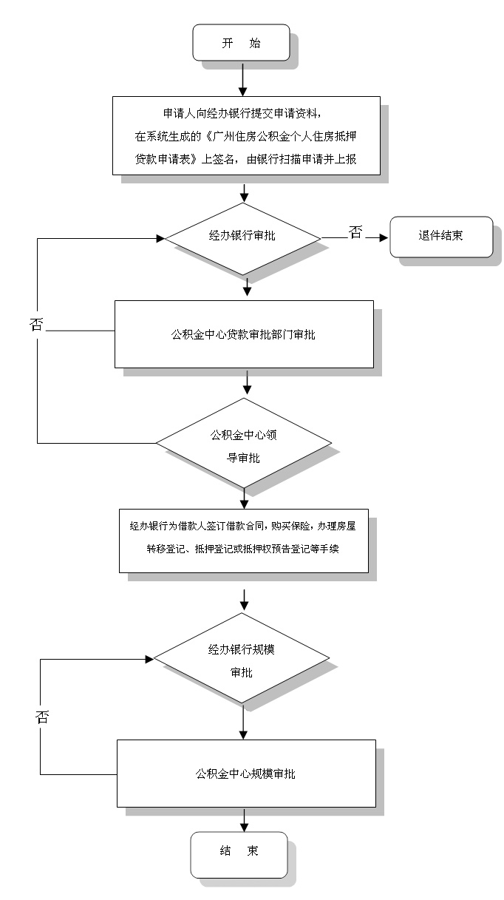

## 法律法规

### [《中华人民共和国宪法》](http://www.npc.gov.cn/npc/xinwen/2018-03/22/content_2052489.htm)

#### 第二章第四十三条：

> 中华人民共和国劳动者有休息的权利。
> 国家发展劳动者休息和休养的设施，规定职工的工作时间和休假制度。

### [《中华人民共和国劳动法》](http://www.rl.gov.cn/rsj/Web/_F0_0_04T80O2F3F3T5R2DG2LPNQS0DJ.htm)

#### 第一章第三条：

> 劳动者享有平等就业和选择职业的权利、**取得劳动报酬的权利**、**休息休假的权利**、获得劳动安全卫生保护的权利、接受职业技能培训的权利、享受社会保险和福利的权利、提请劳动争议处理的权利以及法律规定的其他劳动权利。

#### 第四章第三十六条：

> 国家实行劳动者每日工作时间不超过八小时、平均每周工作时间不超过四十四小时的工时制度。

#### 第四章第三十九条：

> 企业因生产特点不能实行本法第三十六条、第三十八条规定的，经劳动行政部门批准，可以实行其他工作和休息办法。

#### 第四章第四十一条：

> 用人单位由于生产经营需要，经与工会和劳动者协商后可以延长工作时间，一般每日不得超过一小时；因特殊原因需要延长工作时间的，在保障劳动者身体健康的条件下延长工作时间每日不得超过三小时，但是每月不得超过三十六小时。

#### 第四章第四十三条：

> 用人单位不得违反本法规定延长劳动者的工作时间。

#### 第四章第四十四条：

> 有下列情形之一的，用人单位应当按照下列标准支付高于劳动者正常工作时间工资的工资报酬：
> （一）安排劳动者延长工作时间的，支付不低于工资的百分之一百五十的工资报酬；
> （二）休息日安排劳动者工作又不能安排补休的，支付不低于工资的百分之二百的工资报酬；
> （三）法定休假日安排劳动者工作的，支付不低于工资的百分之三百的工资报酬。

#### 第十二章第九十条：

> 用人单位违反本法规定，延长劳动者工作时间的，由劳动行政部门给予警告，责令改正，并可以处以罚款。

#### 第十二章第九十一条：

> 用人单位有下列侵害劳动者合法权益情形之一的，由劳动行政部门责令支付劳动者的工资报酬、经济补偿，并可以责令支付赔偿金：
> ……
> （二）拒不支付劳动者延长工作时间工资报酬的；
> ……

### [《中华人民共和国劳动合同法》](http://www.npc.gov.cn/wxzl/gongbao/2013-04/15/content_1811058.htm)

#### 第三章第三十一条：

> 用人单位应当严格执行劳动定额标准，不得强迫或者变相强迫劳动者加班。用人单位安排加班的，应当按照国家有关规定向劳动者支付加班费。

#### 第五章第六十二条：

> 用工单位应当履行下列义务：
> ……
> （三）支付加班费、绩效奖金，提供与工作岗位相关的福利待遇；
> ……

#### 第七章第八十五条：

> 用人单位有下列情形之一的，由劳动行政部门责令限期支付劳动报酬、加班费或者经济补偿；劳动报酬低于当地最低工资标准的，应当支付其差额部分；逾期不支付的，责令用人单位按应付金额百分之五十以上百分之一百以下的标准向劳动者加付赔偿金：
> （一）未按照劳动合同的约定或者国家规定及时足额支付劳动者劳动报酬的；
> （二）低于当地最低工资标准支付劳动者工资的；
> （三）安排加班不支付加班费的；
> ……

### [《国务院关于职工工作时间的规定》](http://www.mohrss.gov.cn/SYrlzyhshbzb/zcfg/flfg/xzfg/201604/t20160412_237909.html)

#### 第三条：

> 职工每日工作8小时、每周工作40小时。

#### 第六条：

> 任何单位和个人不得擅自延长职工工作时间。因特殊情况和紧急任务确需

## 福利制度

### 五险一金

五险一金是指用人单位给予劳动者的几种保障性待遇的合称，包括养老保险、医疗保险、失业保险、工伤保险和生育保险，及住房公积金。 其中养老保险、医疗保险和失业保险，这三种险是由企业和个人共同缴纳的保费，工伤保险和生育保险完全是由企业承担的，五险统称**社会保险**，社保。个人不需要缴纳。这里要注意的是“五险”是法定的，而“一金”不是法定的。 

#### 2019-2020年广州五险一金缴纳比例

养老保险：公司缴14%，个人缴8%；

医疗保险：公司缴5.5%，个人缴2% ，还有12.45元/月的大病保险 ；

失业保险：公司浮动费率第一档为0.48%，第二档为0.64%，第三档为0.8%，个人缴费比例为0.2%；

工伤保险：单位0.2%、0.4%、0.7%、0.9%、1.1%、1.2%、1.3%、1.4%，个人不缴；

生育保险：公司缴0.85%，个人不缴；

住房公积金：用人单位缴费比例为5-12%、职工个人缴费比例为5-12%。

#### 2019-2020年广州五险一金缴纳基数

养老保险：上限19014元; 下限3803元

医疗保险：上限27960元; 下限5592元

工伤保险：工伤保险(按行业分为八档费率)

失业保险：上限27960元; 下限2100元

生育保险：上限27960元; 下限5592元

备注：工伤保险

一、根据行业调整为八个档次(0.2%、0.4%、0.7%、0.9%、1.1%、1.2%、1.3%、1.4%)。

二、用人单位属于一类行业的，其费率分为三个档次，即在行业基准费率的基础上，可向上浮动至120%、150%，不实施费率下浮;用人单位属于二类至八类行业的，其费率分为五个档次，即在行业基准费率的基础上，可分别向上浮动至120%、150%或向下浮动至80%、50%。

三、在我市现行工伤保险八类行业基准费率和浮动费率政策的基础上，参加我市工伤保险的所有用人单位现行工伤保险缴费费率阶段性下调比例从30%统一调整至50%，执行期限为2019年5月1日至2021年4月30日。

四、全省房屋建筑和市政基础设施工程建设项目工伤保险缴费比例，从2019年7月1日起统一调整为工程含税合同总造价的0.8‰。

### 社会保险

#### 养老保险

**劳动者具备什么条件才能办理退休手续并按月领取养老金?**

劳动者同时具备以下条件，可以办理退休：

（1）达到国家法定的退休年龄，即男职工60岁；从事管理和科研工作的女干部55岁，女职工50岁。

（2）缴费年限（含视同缴费年限）满15年及其以上。

凡符合上述条件的人员，经所在地社会保险经办机构审核，劳动保障行政部门批准办理退休手续，按月领取养老金。

**退休后，可以领取多少养老金？**

每月到手的养老金=月基础养老金+月个人账户养老金

（1）月基础养老金=（全省上年度所有职工的月平均工资+本人指数化月平均缴费工资）÷2×缴费年限×1%

（2）个人账户养老金=个人账户的余额÷计发月数（50岁为195、55岁为170、60岁为139）

 **“断保”对职工有什么影响?**

以前参加了养老保险的职工，因为劳动关系变更等原因，停止继续缴纳养老保险费，这种现象叫做中断保险关系，也叫做断保。断保对职工的影响，一是因为缴费年限和缴费额的减少而降低退休待遇，有的缴费年限不满15年的，将丧失按月领取养老金的资格。二是影响再就业，如果养老保险关系不及时接转，那么新的就业单位将不能及时为你续缴养老保险费，则损害了自己的社会保险权益。

**办理续保手续需要哪些证件?**

（1）基本养老保险手册；

（2）个人账户对帐单（对帐单上需加盖社保机构的“养老保险关系转移章”）；

（3）本人身份证件；

（4）解除或终止劳动关系证明；

（5）失业人员的需携带失业保险手册或有关证明。

**失业人员在领取失业金期间可以缴费吗?**

政策规定，失业人员在领取失业金期间可以不缴纳基本养老保险费，也不计作缴费年限。领取失业保险金的期限最长为两年，在这两年时间里，有条件的也可以自愿缴费，连续计算缴费年限。

**劳动者流动到外省市就业后，已缴的养老保险费怎么处理?**

劳动者变更劳动关系的，养老保险关系随同转移。如果劳动者跨省市、或者在企业与机关事业单位之间（即所谓的跨统筹区域）流动的，不仅养老保险关系随同转移，而且同时把个人账户金额一起转移到新就业所在地的社会保险经办机构，继续缴费，之前与之后的缴费年限累积计算。所以说“不论职工哪里干，保险关系连续算”。

#### [医疗保险](http://gz.bendibao.com/life/yibaobs/)

**单位和职工缴纳医疗保险费后，怎样建立个人账户和统筹基金？**

个人缴纳的医疗保险费，全部记入个人账户。单位缴纳的医疗保险费，拿出其中的一部分按职工不同年龄段分别划入个人账户，其余部分作为医疗保险统筹基金。个人账户的资金由三部分组成：一是职工本人缴纳的部分；二是单位缴费中划入的部分，45周岁以下的（含45周岁）从单位缴费中按本人工资额1%划入，45周岁以上的按1.5%划入，退休人员按养老金的4.2%划入。

**个人账户和统筹基金支付医疗费的范围是如何划分的？**

个人账户用于支付门诊医疗费和按规定由个人负担的其他医疗费。个人账户不足时，职工个人用现金支付。个人账户为职工个人所有，可以结转使用和继承，相当于在银行的存款，但不得提取现金，不得透支或挪作他用。基本医疗保险统筹基金用于支付住院医疗费和指定病种门诊医疗费的补助。

**统筹基金支付住院医疗费的具体比例和标准是多少？**

起付标准（门槛）以上，最高支付限额以下的住院医疗费用，按照分档计算累加负担的办法，由统筹基金和职工个人按以下比例分别负担：

| 起付线(以当地收费标准为最终价格) | 一级医院200元 | 二级医院300元 | 三级医院400元 |      |      |      |
| -------------------------------- | ------------- | ------------- | ------------- | ---- | ---- | ---- |
| 统筹金支付比例                   | 在职          | 退休          | 在职          | 退休 | 在职 | 退休 |
| 5000元以下                       | 87            | 92            | 83            | 88   | 80   | 85   |
| 5001-15000元                     | 90            | 95            | 87            | 92   | 85   | 90   |
| 15000元以上                      | 90            | 95            | 90            | 95   | 90   | 95   |
| 大额                             | 90            | 90            | 90            | 90   | 90   | 90   |

**急诊发生的医疗费如何结算？**

因公出差、探亲等发生急诊住院时，患者须在入院后5日内携带医疗证、《急诊证明》、单位证明、身份证复印件到医疗保险处进行急诊登记（可由家人代办）。出院后持有效医疗费用单据、住院（或门诊）病历复印件、医疗费用清单、处方（化价）、检查单到医疗保险处审核。符合支付范围的费用首先自付5%后，再按规定比例予以报销。急诊观察时间不能超过3天，急诊观察期间的医疗费，按住院医疗费计算。

**哪些病种属于特殊疾病？**

（1）恶性肿瘤患者的放、化疗；（2）尿毒症患者的透析治疗；（3）器官移植患者的抗排异治疗；（4）I、Ⅱ型糖尿病（并感染或有心、脑、肾、眼并发症之一者）；（5）高血压病Ⅲ期；（6）冠心病；（7）脑出血、脑梗塞恢复期；（8）肺心病（出现右心衰竭者）；（9）支气管哮喘；（10）类风湿性关节炎（活动期）；（11）慢性肝炎（ALT高于正常值2倍以上）；（12）再生障碍性贫血；（13）系统性红斑狼疮；（14）银屑病；（15）永久性甲状腺功能减退；（16）风湿性心脏病；（17）结核病；（18）各类精神病；（19）前列腺增生；（20）重症肌无力；（21）帕金森综合症；（22）消化性溃疡；（23）甲状腺功能亢进；（24）股骨头坏死；（25）颈、腰椎病；（26）周围血管疾病（包括血管闭塞性脉管炎和下肢静脉曲张）。

对规定的26种特殊疾病实行分类管理。为了减轻部分医疗费用较高的参保病人个人负担，将恶性肿瘤放化疗、尿毒症患者的透析治疗和器官移植患者的抗排异治疗列为甲类管理病种，其他23种为乙类管理病种。

**如何办理特殊疾病申请？**

参保人员申报特殊疾病门诊治疗，必须符合特殊疾病目录规定的病种。一人患两种或两种以上特殊疾病的，可以同时提出申报。甲类病种随时鉴定，乙类病种每月25号以后集中办理。

鉴定资料：近期一寸免冠照片2张、《医疗证》、二级以上医院住院病历复印件、检查单、病理单等。

方法：首先在定点医院中，任意选择一所医院作为自己的门诊治疗定点医院，一年内不得变更。持上述资料到本人选定的门诊特殊疾病定点医院填写《门诊特殊疾病鉴定审批表》并鉴定，鉴定合格者到医疗保险处办理《特殊疾病医疗证》。异地安置的特殊疾病患者的有关申报材料也可由所在单位统一上报。（具体请以当地规定为准。）

**特殊疾病门诊医疗费报销的比例是多少？**

特殊疾病门诊治疗发生的医疗费，一年内，起付标准为500元，超出500元以上的部分，甲类管理的病种门诊医疗费报销85%；乙类管理的病种门诊医疗费报销75%。从统筹基金支付的特殊疾病门诊治疗费与住院医疗费合并计算，一年内最高支付限额为50000元。超过50000元以上的部分，再由大额医疗救助金按规定给予报销。

**大额医疗救助金的缴费标准是多少？**

大额医疗救助金主要由单位和职工共同缴纳，凡参加基本医疗保险的在职职工和退休人员，按每人每月8元（单位5元，个人3元）的标准缴费。也就是说，凡参加大额救助的，必须参加基本医疗保险。大额医疗救助金按年度收取，于每年初一次性足额缴纳，即每人每年96元；年度内新参保的单位必须缴纳一年的大额医疗救助金。这项资金由市社会医疗保险处单独列帐，专款专用。

**大额医疗救助金的支付范围、标准和最高限额是多少？**

大额医疗教助金用于支付统筹基金最高支付限额（50000元）以上的医疗费用。具体支付标准是：超过50000元以上的部分，大额医疗救助金支付90%，个人负担10%，最高支付额为15万元。一年内基本医疗保险统筹基金和大额医疗救助金两部分，共支付医疗费总额为20万元。

#### 失业保险

**在什么情况下可以领取失业保险金？**

同时具备以下条件的失业人员，可以领取失业保险金：

（1）按规定参加失业保险，所在单位和本人已按照规定履行缴费义务满1年；

（2）非因本人意愿中断就业，这其中包括被单位开除、除名和辞退的、解除劳动合同等情况；

（3）已办理失业登记，并有求职要求。

以上条件同时具备的，方可领取失业保险金。

**领取失业保险金需要哪些证明材料？**

（1）本人身份证明（户口簿、身份证和一寸证件照2张）；

（2）在单位出具的终止或解除劳动合同的证明；

（3）失业登记及求职证明；

（4）劳动保障行政部门规定的其他材料。

 **失业保险可以享受的待遇有哪些？**

参保人员在满足领取失业保险金条件后，享受以下待遇：

（1）失业保险金的标准，由省、自治区、直辖市人民政府确定，不得低于城市居民最低生活保障标准；

（2）失业人员在领取失业保险金期间，参加职工基本医疗保险，享受基本医疗保险待遇。失业人员应当缴纳的基本医疗保险费从失业保险基金中支付，个人不缴纳基本医疗保险费。

（3）领取失业保险金期间女性生育的享受女性失业人员生育补助金，期间死亡的失业人员享受丧葬补助金；

（4）领取失业保险金期间可免费享受职业培训。

**领取失业保险金的期限为多久？**

（1）累计缴费时间满1年不满5年的，但领取期限最长为12个月；

（2）累计缴费时间满5年不满10年的，领取失业金的期限最长为18个月；

（3）累计缴费时间满10年以上的，领取失业保险金的期限最长为24个月；

（4）重新就业后再次失业的，缴费时间重新计算，领取失业金的期限应当与前次失业尚未领取的失业保险金的期限合并计算，但最长不得超过24个月。

#### 工伤保险

**哪些情况应当认定为工伤？**

（1）在工作时间和工作场所内，因工作原因受到事故伤害的；

（2）工作时间前后在工作场所内，从事与工作有关的预备性或者收尾性工作受到事故伤害的；

（3）在工作时间和工作场所内，因履行工作职责受到暴力等意外伤害的；

（4）患职业病的；

（5）因工外出期间，由于工作原因受到伤害或者发生事故下落不明的；

（6）在上下班途中，受到机动车事故伤害的；

（7）法律、行政法规规定应当认定为工伤的其他情形。

**哪些情况视同工伤？**

（1）在工作时间和工作岗位，突发疾病死亡或者在48小时之内经抢救无效死亡的；

（2）在抢险救灾等维护国家利益、公共利益活动中受到伤害的；

（3）职工原在军队服役，因战、因公负伤致残，已取得革命伤残军人证，到用人单位后旧伤复发的。

职工有前款第（1）项、第（2）项情形的，按照有关规定享受工伤保险待遇；职工有前款第（3）项情形的，按照有关规定享受除一次性伤残补助金以外的工伤保险待遇。

**哪些情况不得认定为工伤或者不视同工伤？**

（1）因犯罪或者违反治安管理伤亡的；

（2）醉酒导致伤亡的；

（3）自残或者自杀的。

**工伤医疗具体内容是什么？**

职工因工作遭受事故伤害或者患职业病进行治疗，享受工伤医疗待遇。职工治疗工伤应当在签订服务协议的医疗机构就医，情况紧急时可以先到就近的医疗机构急救。治疗工伤所需费用符合工伤保险诊疗项目目录、工伤保险药品目录、工伤保险住院服务标准的，从工伤保险基金支付。工伤保险诊疗项目目录、工伤保险药品目录、工伤保险住院服务标准，由国务院劳动保障行政部门会同国务院卫生行政部门、药品监督管理部门等部门规定。工伤职工治疗非工伤引发的疾病，不享受工伤医疗待遇，按照基本医疗保险办法处理。工伤职工到签订服务协议的医疗机构进行康复性治疗的费用，符合本条第三款规定的，从工伤保险基金支付。

**哪些情况停止享受工伤待遇？**

（1）丧失享受待遇条件的；

（2）拒不接受劳动能力鉴定的；

（3）拒绝治疗的。

#### 生育保险

**需要具备哪些条件的职工才可以享受生育保险待遇呢？**

（1）符合国家计划生育政策生育或者实施计划生育手术；

（2）所在单位按照规定参加生育保险并为该职工连续足额缴纳生育保险费一年以上。

**生育保险待遇包括哪几项？具体规定包括哪些？**

生育保险具体待遇包括：

（1）女职工产假期间的生育津贴；生育津贴为本人上年度月平均缴费工资除以30天乘以产假天数。

（2）女职工生育发生的医疗费用，包括女职工因怀孕、生育发生的检查费、接生费、手术费、住院费、药费和治疗费。

（3）职工实施计划生育手术发生的医疗费用，包括职工实施放置（取出）宫内节育器，流产术、引产术、绝育及复通手术所发生的医疗费。

（4）国家规定与生育保险有关的其他费用。

生育保险具体规定包括：

（1）参加生育保险男职工的配偶无工作单位，符合计划生育政策的，按照规定的生育医疗费标准的50%享受生育补助金；参加生育保险男职工的配偶有工作单位但未参加生育保险的，生育保险基金不予支付相应的医疗费用及其他生育保险待遇。

（2）参保职工患妊娠期并发症、分娩并发症、产后并发症及计划生育手术并发症住院治疗发生的诊疗费，由生育保险基金负担；参保职工生育行剖宫产遇有子宫肌瘤、卵巢囊肿、卵巢肿瘤等切除术的，因上述手术所增加的费用由医疗保险基金支付。定点医疗机构分别通过生育和医疗保险网络上传按项目予以结算。

（3）参加生育保险长期驻外地工作人员，应持单位出具的外地诊疗或生育申请，到医疗保险经办机构办理生育保险异地生育登记，并选择当地一家医疗机构作为本人生育的定点医院。参保职工患妊娠并发症或分娩并发症，要出具入院记录、医嘱单、费用明细清单等，于次月到医疗保险经办机构申领各项生育保险待遇。

（4）参保职工因急诊、急救等在非定点医疗机构生育或实施计划生育手术的，须在5日内报医疗保险经办机构备案。

（5）生育保险所用药品、诊疗和服务设施目录参照城镇职工基本医疗保险的规定执行，医疗项目不设自付比例。

**女职工产假期间的生育津贴产假天数标准确定是什么？**

（1）女职工正常生育的产假为98天，其中产前休假15天，产后假为83天；难产的增加15天；多胞胎生育的每多生育一个婴儿增加15天；晚育的增加30天；

（2）女职工怀孕流产的，根据医务部门的证明，给予一定时间的产假。流产产假以4个月划界，其中不满4个月的，给予15天至30天的产假；4个月以上流产的，产假为42天。

#### 住房公积金

[广州住房公积金管理中心关于2019-2020年度住房公积金缴存调整有关问题的通知](http://www.gzgjj.gov.cn/gzgjj/tzgg/201906/1286b11954a549b1b5f1ebf52a8cd55d.shtml)

[广州住房公积金管理中心](http://www.gzgjj.gov.cn/)

​        一、缴存人符合下列条件之一的，可以申请提取住房公积金账户内的存储余额：

（一）在本市行政区域内、缴存人及配偶户籍所在地购买拥有所有权的自住住房，或者在本市行政区域内无自有产权住房，在广州毗邻城市（佛山、清远、中山、东莞、惠州、韶关，下同）购买拥有所有权的自住住房的。

（二）在本市行政区域内、缴存人及配偶户籍所在地，或者在本市行政区域内无自有产权住房，在广州毗邻城市建造、翻建、大修拥有所有权的自住住房的。

（三）在本市行政区域内出资为拥有所有权的既有住宅增设电梯的。

（四）缴存人及配偶、未成年子女在本市行政区域内均无自有产权住房且租房自住的。

（五）下岗、失业人员，男性满45岁、女性满40岁，至申请当月已连续下岗、失业满12个月的。

（六）非本市户籍职工与单位解除或者终止劳动关系，未在异地继续缴存，账户封存满半年的。

（七）离休、退休的。

（八）完全丧失劳动能力，并与所在单位终止劳动关系的。

（九）出境定居的。

（十）缴存人死亡或者被宣告死亡，其继承人、受遗赠人可以申请提取缴存人住房公积金账户内存储余额。

（十一）国家和广东省、广州市规定的其他情形。

符合以上第（一）至（四）款规定的，缴存人及配偶均可以申请提取。

1-4项为部分提取，5-10项为销户提取，请选择符合上述情形的提取条件，提取办理流程及所需资料详见提取相关指南，链接：http://www.gzgjj.gov.cn/gzgjj/bszn/list.shtml  

 [https://baike.baidu.com/item/%E4%BA%94%E9%99%A9%E4%B8%80%E9%87%91/637098?fr=aladdin](https://baike.baidu.com/item/五险一金/637098?fr=aladdin) 

 http://www.64365.com/zs/1059893.aspx 