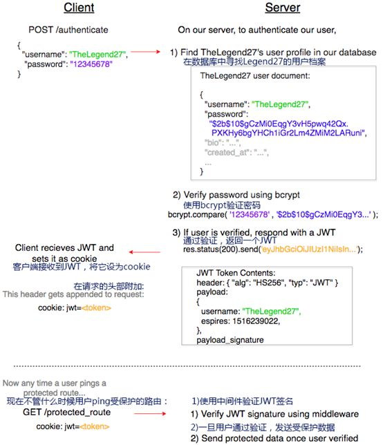

## JWT

## 验证是如何工作的

在我们开始之前，我们需要确定验证的流程看起来是什么样的：

1. 用户使用POST（通过HTTS）传给服务器验证的细节：{ username, password }
2. 服务器确定该用户是否是用户自己声称的身份
3. 如果用户的验证尝试成功通过，接下来服务器发送某种形式的数据（一般是token或者session id），在接下来的每次请求中可以附加上这种数据，这样可以识别用户是否经过验证。

使用sessionless验证，客户端接收到的数据负载是JWT。JWT应该包含编码过的用户标识，它是后端服务器签名过的JSON格式。我们把JWT放到cookie中，因此不必在local-storage中储存它以免受到XSS攻击。以下是名为TheLegend27的用户使用JWT验证的流程：

cookie是一种通过验证后随着每次请求一起发送的特殊头部。它还可以方便的跨过用户session实现持久化。这意味着TheLegend27登录成功后，他在之后的每一次请求中都将他的JWT一起发送。我们所要做的是验证他的身份，检查请求中的cookie并验证JWT。

**需要注意的重要事项：**

- 我们不在服务器跟踪用户的session！这是JWT验证和session验证的明显不同之处。使用sessionless验证我们就少了一个需要担心的数据源。
- 我们的验证流程超级简单！如果你只是想尽可能直观，快速的在Web应用中实现身份验证，那么JWT是不错的方案。

这就是使用JWT实现sessionless验证的原理。

### HTTP Basic Auth

HTTP Basic Auth 简单点说明就是每次请求 API 时都提供用户的 username 和 password，简言之，Basic Auth 是最简单的认证方式，只需提供用户名密码即可，但由于有把用户名密码暴露给第三方客户端的风险，在生产环境下被使用的越来越少。因此，尽量避免采用 HTTP Basic Auth。

### OAuth

OAuth（开放授权）是一个开放的授权标准，允许用户让第三方应用访问该用户在某一web服务上存储的私密的资源（如照片，视频，联系人列表），而无需将用户名和密码提供给第三方应用。

OAuth允许用户提供一个令牌，而不是用户名和密码来访问他们存放在特定服务提供者的数据。每一个令牌授权一个特定的第三方系统（例如，QQ，微信)在特定的时段（例如，接下来的2小时内）内访问特定的资源（例如仅仅是某一相册中的视频）。这样，OAuth让用户可以授权第三方网站访问他们存储在另外服务提供者的某些特定信息，而非所有内容

OAuth2.0的流程：

这种基于OAuth的认证机制适用于个人消费者类的互联网产品，如社交类APP等应用，但是不太适合拥有自有认证权限管理的企业应用。

### Cookie Auth

Cookie认证机制就是为一次请求认证在服务端创建一个Session对象，同时在客户端的浏览器端创建了一个Cookie对象；通过客户端带上来Cookie对象来与服务器端的session对象匹配来实现状态管理的。默认的，当我们关闭浏览器的时候，cookie会被删除。但可以通过修改 cookie 的 expiretime 使cookie在一定时间内有效。

### Token Auth

对于Token认证机制，简单来说，就是每次客户端输入账号密码后向服务端发起登录请求，服务端在通过登录验证后，给客户端返回一个任意字符串，既token（token必须与用户的账户关联，如用userid和token形成键值对，保存在内存中（redis））。客户端拿到这个token后，在之后所有需要验证登录的请求中，或者参数中带上token或者在header中携带token，然后服务端根据接收到的token来验证用户的登录状态是否存在，是否有效。

出于安全考虑，token在每次登录时重新生成，并可以设置有效期，每次有效操作后更新token的时间戳，保证token有效期往后延续。

为了避免token被截获，伪造非法请求，在每次请求时，可以用userid+token+时间戳+密钥+请求参数，进行签名，服务端验证token，同时验证签名，以保证请求的安全性。

#### Token Auth相对于Cookie机制的优点

1. **支持跨域访问**：Cookie是不允许垮域访问的，这一点对Token机制是不存在的，前提是传输的用户认证信息通过HTTP头传输。
2. **无状态(也称服务端可扩展行)**：Token机制在服务端不需要存储session信息，因为Token 自身包含了所有登录用户的信息，只需要在客户端的cookie或本地介质存储状态信息。
3. **更适用 CDN**： 可以通过内容分发网络请求你服务端的所有资料（如：javascript，HTML,图片等），而你的服务端只要提供API即可。
4. **去耦**：不需要绑定到一个特定的身份验证方案。Token可以在任何地方生成，只要在验证登录的API被调用的时候，进行Token生成调用即可。
5. **更适用于移动应用**：当你的客户端是一个原生平台（iOS, Android，Windows 8等）时，Cookie是不被支持的（你需要通过Cookie容器进行处理），这时采用Token认证机制就会简单得多。
6. **CSRF**：因为不再依赖于Cookie，所以你就不需要考虑对CSRF（跨站请求伪造）的防范。
7. **性能**：一次网络往返时间（通过数据库查询session信息）总比做一次 HMACSHA256 计算 的Token验证和解析要费时得多。
8. **不需要为登录页面做特殊处理**：如果你使用Protractor做功能测试的时候，不再需要为登录页面做特殊处理。
9. **基于标准化**：你的API可以采用标准化的 JSON Web Token (JWT)，这个标准已经存在多个后端库（.NET, Ruby, Java,Python, PHP）和多家公司的支持（如：Firebase,Google, Microsoft）。