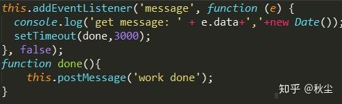
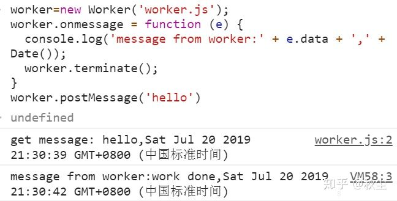
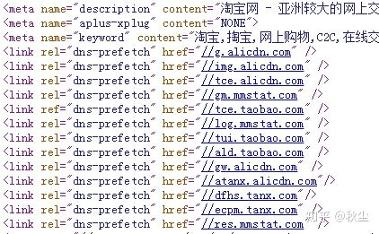

前端页面性能优化技巧

<!--more-->

# 性能优化

---


# 关键渲染路径

1. 处理 HTML 标记并构建 DOM 树。
2. 处理 CSS 标记并构建 CSSOM 树。(CSS 被视为阻塞渲染的资源，这意味着浏览器将不会渲染任何已处理的内容，直至 CSSOM 构建完毕。)
3. 将 DOM 与 CSSOM 合并成一个渲染树。
4. 根据渲染树来布局。
5. 将各个节点绘制到屏幕上。
当DOM或者CSSOM发生变化的时候，浏览器就需要再次执行一次上面的步骤。
6. 当HTML解析过程中遇到一个script标记时，它会暂停DOM构建，将控制权移交给JavaScript引擎，等JavaScript引擎运行完毕，浏览器再从中断的地方恢复DOM构建。也就是说，执行内联的JavaScript会阻塞页面的首次渲染。

## 对JS优化

1. 引用JS方式
async，完全的异步操作，HTML解析遇到该标签后，发出网络请求，但不阻止HTML解析和其后面的渲染操作，当JavaScript请求返回后立刻执行，且不等待HTML解析或其他操作的完成。所以，如果脚本中有DOM操作，就并不适合。
defer，HTML的解析和对JavaScript资源的网络请求是并行的，但它会等待HTML解析完成之后，才执行脚本。

###  [passive 事件修饰符](https://www.cnblogs.com/ziyunfei/p/5545439.html)

- 流水线的执行方式，后面的工作必须等待前面工作执行完成才能处理，无法将相互独立的工作并行处理。
- 内核线程负责的工作太多且耗时，一旦遇上内核在执行耗时较长的工作，用户的输入事件将无法立即得到响应。

很多移动端的页面都会监听 touchstart 等 touch 事件，由于 touchstart 事件对象的 cancelable 属性为 true，也就是说它的默认行为可以被监听器通过 preventDefault() 方法阻止，那它的默认行为是什么呢，通常来说就是滚动当前页面（还可能是缩放页面），如果它的默认行为被阻止了，页面就必须静止不动。但浏览器无法预先知道一个监听器会不会调用 preventDefault()，它能做的只有等监听器执行完后再去执行默认行为，而监听器执行是要耗时的，有些甚至耗时很明显，这样就会导致页面卡顿。

视频里也说了，即便监听器是个空函数，也会产生一定的卡顿，毕竟空函数的执行也会耗时。有 80% 的滚动事件监听器是不会阻止默认行为的，也就是说大部分情况下，浏览器是白等了。所以，passive 监听器诞生了，passive 的意思是“顺从的”，表示它不会对事件的默认行为说 no，浏览器知道了一个监听器是 passive 的，它就可以在两个线程里同时执行监听器中的 JavaScript 代码和浏览器的默认行为了。**passive设置为true可以大幅提高移动端的滑动流畅度**

```text
document.addEventListener(type, listener, {
  capture: false, // 等价于以前的 useCapture 参数
  passive: false, // Firefox 和 Chrome 已经实现
  once: false // 表明该监听器是一次性的，执行一次后就被自动 removeEventListener 掉，还没有浏览器实现它
})
```

### 开启多线程

使用`Web Worker`为`JS`创造多线程环境，主线程创建`Worker`线程，将一些计算密集型或高延迟的任务分配给后者运行





### Web Assembly

Web Assembly特别适合那些需要非常高性能的Web产品，提供了一种转换机制，把高级语言（C、C++、Go）编译为Web Assembly字节码，以便在浏览器中运行，能够大幅提高运行效率。
使用WebAssembly对浏览器API进行任何调用时，目前还需要JS进行交互，用JS作为入口。未来WebAssembly可能被浏览器内置支持，并使其能够直接调用DOM，Web Workers或其他浏览器API等

> 注意事项：同源限制、DOM 限制、不能读取本地文件、使用消息通信、不能使用alert、confirm、prompt


###  Canvas 优化

- 避免浮点数的坐标点，用整数取而代之
- 在离屏canvas上预渲染相似的图形或重复的对象
- 不要在用drawImage时缩放图像
- 使用多层画布去画一个复杂的场景
- 用CSS设置大的背景图
- 不需要透明度时关闭alpha通道
- 渲染画布中的不同点，而非整个新状态
- 谨慎使用大型物理库

## 对CSS优化

1. 尽早和按需的加载CSS
2. 内联CSS来提高渲染性能
3. 写样式尽量使用class和id，保证层级扁平，减少过度层叠
4. 避免使用CSS表达式举个css表达式的例子 font-color: expression( (new Date()).getHours()%3 ? “#FFFFFF" : “#AAAAAA" );这个表达式会持续的在页面上计算样式，影响页面的性能。并且css表达式只被IE支持。
5. 不同浏览器首屏渲染策略不同。chrome等CSS加载完再渲染，Firefox先生成HTML再附上CSS

### (1) 选择器优化

注意优先级，慎用`!important`，样式系统从最右边的选择符开始向左进行匹配规则。只要当前选择符的左边还有其他选择符，样式系统就会继续向左移动，直到找到和规则匹配的元素，或者因为不匹配而退出。
**写法注意点**：

- id选择器肯定是最快，但是不要在ID选择器使用的同时再使用标签或类选择器了
- 不要使用类选择器时用标签选择器

> 特别是`for`循环中js编写html代码时直接定义样式类名到所需要作用的元素，之后尽量用一个选择器写样式，可以大幅提高渲染效率

- 如果明确dom结构，优先使用子选择器，减少后代选择器使用
- 使用类选择器替代后代选择器和子选择器
- 避免使用通配符选择器（*）和属性选择器

### (2) 谨慎使用 CSS3 特性

CSS3一些新特性能带来酷炫的视觉效果，但对设备性能有一定要求

- border-radius
- gradient
- box-shadow
- box-reflect
- text-stroke，text-fill

## 减少HTTP请求

1. 尽量少使用外链的JS和CSS文件以前CSS的@import
2. 雪碧图，尽量合并图片、CSS、JS
3. 渲染必备CSS内联到HTML中
4. 缓存策略
5. 删除重复的JS和CSS重复调用脚本，除了增加额外的HTTP请求外，多次运算也会浪费时间。在IE和Firefox中不管脚本是否可缓存，它们都存在重复运算JavaScript的问题。
6. 可缓存的AJAX异步请求同样的造成用户等待，所以使用ajax请求时，要主动告诉浏览器如果该请求有缓存就去请求缓存内容。如下代码片段,     cache:true就是显式的要求如果当前请求有缓存的话，直接使用缓存
```
$.ajax({
     url : 'url',
     dataType : "json",
     cache: true,
     success : function(son, status){
 }
```
7. 减少Cookie的大小Cookie里面别塞那么多东西，因为每个请求都得带着他跑
8. 使用无cookie的域比如CSS、js、图片等，客户端请求静态文件的时候，减少了 Cookie 的反复传输对主域名的影响。

## 减少资源的大小

1.  压缩、去注释 JavaScript 和 CSS
2. 使用gzip压缩内容gzip能够压缩任何一个文本类型的响应，包括html，xml，json。大大缩小请求返回的数据量。
3. 延迟JavaScript非阻塞资源加载
4. 删除未使用的代码
5. 异步懒加载代码
6. 懒加载屏幕外图片
7. 预先加载关键请求<link rel=preload>
8. HTTP的传输层协议是TCP，TCP协议有一个慢启动的过程，即它在第一次传递数据时，只能同时传递14kb的数据块，所以当数据超多14kb时，TCP协议传递数据实际是多次的往返（roundtrip）。如果能够将渲染所需要的资源控制在14kb之内，那么就能TCP协议启动时，一次完成数据的传递。

## CDN
使用CDN网站上静态资源即css、js、图片全都使用cdn分发

### 使用DNS prefech   **DNS预解析**

使浏览器试图在用户访问链接之前解析域名,在`head`中添加对应属性即可，如下



DNS预解析是浏览器试图在用户访问链接之前解析域名，这是计算机的正常DNS解析机制。

　　域名解析后，如果用户确实访问该域名，那么DNS解析时间将不会有延迟。

　　最明显的例子，DNS预解析在某个页面中包含非常多的域名非常有效，如搜索结果页。遇到网页中的超链接，`DNS prefetching`从中提取域名并将其解析为IP地址，这些工作在用户浏览网页时，使用最少的CPU和网络在后台进行解析。当用户点击这些已经预解析的域名，可以平均减少200毫秒耗时（假设用户最近还未访问过该域名），更重要的是用户不会遇到DNS解析最坏的情况（往往超过1秒）。

　　DNS Prefetch，即DNS预获取，是前端优化的一部分。一般来说，在前端优化中与 DNS 有关的有两点：

　　**一个是减少DNS的请求次数，**

　　**另一个就是进行DNS预获取** 。

　　DNS 作为互联网的基础协议，其解析的速度似乎很容易被网站优化人员忽视。现在大多数新浏览器已经针对DNS解析进行了优化，典型的一次DNS解析需要耗费 20-120 毫秒，减少DNS解析时间和次数是个很好的优化方式。

　　DNS Prefetching 是让具有此属性的域名不需要用户点击链接就在后台解析，而域名解析和内容载入是串行的网络操作，所以这个方式能 **减少用户的等待时间，提升用户体验** 。

DNS Prefetch 应该尽量的放在网页的前面，推荐放在 `<meta charset="UTF-8">` 后面

预解析的实现：

　　1、用meta信息来告知浏览器, 当前页面要做DNS预解析:`<meta http-equiv="x-dns-prefetch-control" content="on" />`

　　2、在页面header中使用link标签来强制对DNS预解析: `<link rel="dns-prefetch" href="http://bdimg.share.baidu.com" />`

　　预解析的实现：

　　1、用meta信息来告知浏览器, 当前页面要做DNS预解析:<meta http-equiv="x-dns-prefetch-control" content="on" />

　　2、在页面header中使用link标签来强制对DNS预解析: <link rel="dns-prefetch" href="http://bdimg.share.baidu.com" />

如果需要禁止隐式的 DNS Prefetch，可以使用以下的标签：

```
<meta http-equiv="x-dns-prefetch-control" content="off">
```

# 图像
## JPG/JPEG
#### 优点
JPG的压缩方式（有损压缩）是一种高质量的压缩方式：当我们把图片体积压缩至原有体积的 50% 以下时，JPG 仍然可以保持住 60% 的品质。此外，JPG 格式以 24 位存储单个图，可以呈现多达 1600 万种颜色，足以应对大多数场景下对色彩的要求

#### 缺陷
处理矢量图形和 Logo 等线条感较强、颜色对比强烈的图像时，人为压缩导致的图片模糊会明显
不支持透明度处理
#### 使用场景
背景图、轮播图或 Banner 图

## PNG
#### 优点
PNG是一种无损压缩的高保真的图片格式。8 位的 PNG 最多支持 256 种颜色，而 24 位的可以呈现约 1600 万种颜色。
PNG 图片具有比 JPG 更强的色彩表现力，对线条的处理更加细腻，对透明度有良好的支持。
#### 缺点　
体积太大。
#### 使用场景
小的 Logo、颜色简单且对比强烈的图片或背景

## SVG
#### 优点
SVG 指可伸缩矢量图形 ，属于对图像的形状描述，本质上是文本文件，体积较小，且不管放大多少倍都不会失真。
#### 缺点
绘制太复杂
#### 使用场景
LOGO

#### 使用方法

1. 直接插入网页，成为 DOM 的一部分
```
<svg
  id="mysvg"
  xmlns="http://www.w3.org/2000/svg"
  viewBox="0 0 800 600"
  preserveAspectRatio="xMidYMid meet"
>
  <circle id="mycircle" cx="400" cy="300" r="50" />
<svg>
```
2. 写在一个独立文件中，然后用、<object>、<embed>、<iframe>等标签插入网页
```

<object id="object" data="circle.svg" type="image/svg+xml"></object>
<embed id="embed" src="icon.svg" type="image/svg+xml">
<iframe id="iframe" src="icon.svg"></iframe>
```
3. 转为 BASE64 编码，然后作为 Data URI 写入网页。
```

```
4. 重要属性
```
fill：填充色
stroke：描边色
stroke-width：边框宽度
```
## WebP
#### 优点
与 PNG 相比，WebP 无损图像的尺寸缩小了 26％。在等效的 SSIM 质量指数下，WebP 有损图像比同类 JPEG 图像小25-34％。 无损 WebP 支持透明度（也称为 alpha 通道），仅需 22％ 的额外字节。对于有损 RGB 压缩可接受的情况，有损 WebP 也支持透明度，与 PNG 相比，通常提供 3 倍的文件大小。
WebP 是谷歌引入的一种相对较新的格式，它的目标是通过以无损和有损格式编码图像来提供更小的文件大小，使其成为 JPEG 和 PNG 的一个很好的替代方案。
WebP 图像的清晰度通常可以与 JPEG 和 PNG相提并论，而且文件大小要小得多。
#### 缺点
浏览器支持度不够

#### 使用方式
一旦有了 WebP 图像，可以使用以下标记将它们提供给可以使用它们的浏览器，同时向不兼容 WebP 的浏览器使用 png 或者 jpeg。

```
<picture>
    <source srcset="sample_image.webp" type="image/webp">
    <source srcset="sample_image.jpg" type="image/jpg">
    
</picture>
```
理解 image/webp 媒体类型的浏览器将下载 Webp 图片并显示它，而其他浏览器将下载 JPEG 图片。
任何不支持 <picture> 的浏览器都将跳过所有 source 标签，并加载底部 img 标签。因此，我们通过提供对所有浏览器类的支持，逐步增强了我们的页面。
*<picture>可以根据不同的条件加载不同的图像，这些条件可以是视窗当前的高度（viewport），宽度（width），方向（orientation），像素密度（dpr）

# 网络字体
在网络加载比较慢的情况下，用户可能会感受到字体或者图形的变化（Icon Font）。其实，浏览器在渲染树构建完成之后，会指示需要哪些字体在网页上渲染指定文本，然后分派字体请求，浏览器执行布局并将内容绘制到屏幕上，如果字体尚不可用，浏览器可能不会渲染任何文本像素，待字体可用之后，再绘制文本像素，当然，不同浏览器之间实际行为有所差异

```
@font-face{
	font-display:wrap;
}
```
Font display 可帮助你根据交换所需的时间来决定网络字体的渲染或退阶方式。


## 其他

1. 避免空的src和href当link标签的href属性为空、script标签的src属性为空的时候，浏览器渲染的时候会把当前页面的URL作为它们的属性值，从而把页面的内容加载进来作为它们的值。

2. 避免跳转有种现象会比较坑爹，看起来没什么差别，其实多次了一次页面跳转。比如当URL本该有斜杠（/）却被忽略掉时。例如，当我们要访问 http://baidu.com 时，实际上返回的是一个包含301代码的跳转，它指向的是 http://baidu.com/（注意末尾的斜杠）。在nginx服务器可以使用rewrite；Apache服务器中可以使用Alias 或者 mod_rewrite或者the DirectorySlash来避免。另一种是不用域名之间的跳转， 比如访问  http://baidu.com/bbs 跳转到http://bbs.baidu.com/。那么可以通过使用Alias或者mod_rewirte建立CNAME（保存一个域名和另外一个域名之间关系的DNS记录）来替代。

3. 减少DOM元素数量就会减少浏览器的解析负担

4. 避免404比如外链的css或者js文件出现问题返回404时，会破坏浏览器对文件的并行加载。并且浏览器会把试图在返回的404响应内容中找到可能有用的部分当作JavaScript代码来执行。


5. 不要使用滤镜IE独有属性AlphaImageLoader用于修正7.0以下版本中显示PNG图片的半透明效果。这个滤镜的问题在于浏览器加载图片时它会终止内容的呈现并且冻结浏览器。在每一个元素（不仅仅是图片）它都会运算一次，增加了内存开支，因此它的问题是多方面的。完全避免使用AlphaImageLoader的最好方法就是使用PNG8格式来代替，这种格式能在IE中很好地工作。如果你确实需要使用AlphaImageLoader，请使用下划线_filter又使之对IE7以上版本的用户无效。


参考资料
https://zhuanlan.zhihu.com/p/58419577
http://www.ruanyifeng.com/blog/2018/08/svg.html
https://zhuanlan.zhihu.com/p/38548289
《高性能网站建设指南（第二版》

https://zhuanlan.zhihu.com/p/81090955